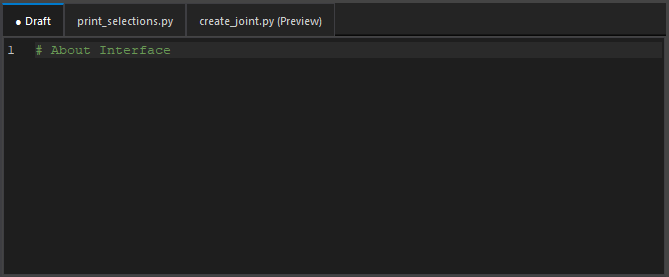

## Overview

The code editor is the main interface for writing code.\
It provides advanced code editing features such as syntax highlighting and error checking.

## Tab Management

### Draft Tab

The Draft tab is a space for saving temporary code notes and snippets.\
This tab is always visible and cannot be closed.

### Persistent Tabs and Preview Tabs

In the code editor, you can open files in persistent tabs or preview tabs.
Both types of tabs are used for actual file editing.

Clicking files in the file explorer opens tabs as follows:

- **Persistent Tab**: **Double-clicking** a file opens it as a persistent tab.\
    Persistent tabs allow you to open and edit multiple files simultaneously.\
    Files with unsaved changes display an asterisk (*) on the tab.

  

- **Preview Tab**: **Single-clicking** a file opens it as a preview tab.\
    Preview tabs allow you to preview multiple files sequentially in a single tab.\
    Previewing a new file overwrites the previous preview content.

  

You can rearrange tabs by dragging and dropping.\
You can also close tabs by middle-clicking on them.

## Find/Replace

The code editor has built-in find and replace functionality.\
Press Ctrl+F/Ctrl+H to open the find/replace dialog.

**Fields**

- **Find:** Enter the string to search for.
- **Replace:** Enter the replacement string.

**Checkboxes**

- **Match case:** When enabled, searches are case-sensitive.
- **Whole words only:** When enabled, only matches complete words.
- **Use regular expression:** When enabled, uses regex for searching.

**Direction**

- **Up:** Searches upward from the cursor position.
- **Down:** Searches downward from the cursor position.

**Buttons**

- **Next:** Moves to the next match.
- **Prev:** Moves to the previous match.
- **Find All:** Selects all matches and enters multi-cursor mode.
- **Replace:** Replaces the current match.
- **Replace All:** Replaces all matches.

## Multi-Cursor

The code editor supports multi-cursor functionality.\
Hold Ctrl and click to place multiple cursors.

Normal editing operations work in multi-cursor mode.\
For example, you can select, copy, paste, and delete.

Main keyboard shortcuts for multi-cursor mode:

| Shortcut                  | Description                    |
|---------------------------|--------------------------------|
| Ctrl+Click                | Add cursor                     |
| Ctrl+Drag                 | Add selection                  |
| Middle-Click+Drag         | Rectangle/column selection     |
| Ctrl+D                    | Next occurrence                |
| Ctrl+Shift+L              | All occurrences                |
| Alt+Shift+I               | Add cursors at line ends       |
| Escape                    | Clear cursors                  |

## Special Context Menu Features

The context menu (right-click menu) has several code editor-specific features.

### Command Help Display

You can display Maya **python (cmds)** and **OpenMaya (om)** command help in the browser from the context menu.

To display documentation, select the function name following `cmds` as shown below:

After selecting, choose **Maya Help: <function_name>** from the context menu.

Supported commands are as follows.\
Help for function names following the corresponding strings will be displayed.

| Module Name          | Corresponding Strings        |
|---------------------|------------------------------|
| maya.cmds           | cmds, mc                     |
| maya.api.OpenMaya   | om, OpenMaya                 |
| maya.api.OpenMayaUI | omui, OpenMayaUI             |
| maya.api.OpenMayaAnim | oma, OpenMayaAnim          |
| maya.api.OpenMayaRender | omr, OpenMayaRender      |

### Inspect Object (Help)

You can inspect Maya objects from the context menu.

Select an object string and execute **Inspect Object: <object_name>** or **Inspect Object Help: <object_name>**.\
The object information will be displayed in the terminal.

**Inspect Object Example**

### Reload

You can reload the selected module from the context menu.

Select a module string and execute **Reload Module: <module_name>**.\
The module will be reloaded.

## Keyboard Shortcuts

Main keyboard shortcuts available in the code editor:

| Shortcut                  | Description                              |
|---------------------------|------------------------------------------|
| Ctrl+N                    | Create new file                          |
| Ctrl+S                    | Save current file                        |
| Ctrl+Shift+S              | Save all open files                      |
| Ctrl+D                    | Select next occurrence (multi-selection) |
| Ctrl+Shift+D              | Duplicate current line                   |
| Ctrl+Shift+K              | Delete current line                      |
| Ctrl+L                    | Select current line (repeat to extend)   |
| Ctrl+Shift+Up/Down        | Move line up/down                        |
| Ctrl+/                    | Toggle line comment                      |
| Tab / Shift+Tab           | Indent/unindent selection                |
| Enter                     | Smart newline with auto-indent           |
| Ctrl+Click                | Add cursor at click position             |
| Ctrl+Drag                 | Add selection (drag to select different code) |
| Middle-Click+Drag         | Rectangle/column selection               |
| Ctrl+D                    | Select word and add next occurrence      |
| Ctrl+Shift+L              | Select all occurrences of current word   |
| Alt+Shift+I               | Add cursors at end of lines in selection |
| Escape                    | Clear all multi-cursors                  |
| Ctrl+F                    | Find dialog                              |
| Ctrl+H                    | Replace dialog                           |
| F3 / Shift+F3             | Find next/previous                       |
| Ctrl+Enter                | Execute current line or selection        |
| Numpad Enter              | Execute current script (same as Run button) |
| Ctrl+Shift+Enter          | Execute entire file                      |
| Ctrl+K                    | Clear terminal output                    |
| Ctrl+MouseWheel           | Adjust font size                         |
