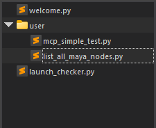
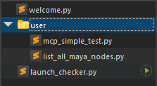

## Overview

The file explorer displays the project directory structure and makes file management easy.

## Features

### Directory Tree Operations

The file explorer displays the project root directory.\
The presentation is tuned to match VSCode: folder open / closed state is rendered as **chevrons (› / ˅) drawn directly into the icon column**, and nesting depth is visualised with **subtle vertical indent guides**.

New directories can be created from the `New Folder` option in the right-click menu.\
You can also move files using drag and drop.

The following operations are available from the right-click menu:

| Operation          | Description                                              |
|--------------------|----------------------------------------------------------|
| **Open**           | Opens the selected file in the editor.                   |
| **New Python File**| Creates a new Python ( `.py` ) file in the selected directory. |
| **New MEL File**   | Creates a new MEL ( `.mel` ) file in the selected directory. |
| **New Folder**     | Creates a new folder in the selected directory.          |
| **Copy**           | Copies the selected file or folder.                      |
| **Cut**            | Cuts the selected file or folder.                        |
| **Paste**          | Pastes the copied or cut file or folder.                 |
| **Rename**         | Renames the selected file or folder.                     |
| **Delete**         | Deletes the selected file or folder.                     |
| **Refresh**        | Refreshes the directory tree.                            |

The "New …" entries are generated from the registered language profiles (currently Python and MEL). Adding a new language profile automatically extends this menu.

### File-Type Glyphs

Common extensions and filenames are decorated with glyphs from VSCode's [Material Icon Theme](https://github.com/material-extensions/vscode-material-icon-theme) (MIT-licensed). Python, MEL, Markdown, JSON, YAML, TOML, C/C++ headers and sources, shell scripts, image formats, log files, and so on each get their own glyph.\
Unrecognised extensions fall back to the OS-registered icon.

### Opening Files in Tabs

Clicking a file in the explorer opens it in a new editor tab.\
Single-clicking opens it in a preview tab, while double-clicking opens it in a persistent tab.

Preview tabs allow you to preview multiple files sequentially in a single tab.

**Preview Tab**

**Persistent Tab**

### Run Without Opening

Hovering over a Python ( `.py` ) or MEL ( `.mel` ) file in the explorer displays a  button on the right side.

Clicking the `Run` button executes the file directly without opening it in the editor. Execution is dispatched to the Python or MEL executer based on the file's extension.

## Keyboard Shortcuts

The following keyboard shortcuts are available in the file explorer:

| Operation | Shortcut      |
|-----------|---------------|
| Copy      | `Ctrl+C`      |
| Cut       | `Ctrl+X`      |
| Paste     | `Ctrl+V`      |
| Rename    | `F2`          |
