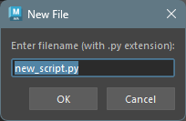

## Overview

The toolbar provides quick access to main actions like creating files, saving, and running code.

## Features

** Toggle File Explorer**

- Toggles the file explorer visibility.

** Refresh File Explorer**

- Manually refreshes the file explorer tree.
- Use this to pick up files created or modified by another Maya instance or external application.
- This button is disabled when the file explorer is hidden.

** Run Code**

- Runs the code in the currently active editor.\
If code is selected, only the selected portion will be executed.

** Create New File**

- Creates a new file.\
Clicking this button opens a dialog to enter the file name.

- Enter a file name and click "OK" to create a new file and open it in a tab.

** Save Current File**

- Saves the contents of the currently active editor.\
If there are unsaved changes, an asterisk (*) appears on the tab.

** Save All Files**

- Saves the contents of all open editors.

** Open Root Directory**

- Opens the workspace root directory in the OS standard file explorer.

** Clear Console**

- Clears the console contents.

** Toggle Echo All Commands**

- Toggles echo mode ON/OFF for the terminal.

** Add to Shelf**

- Adds the currently selected code to the active Maya shelf as a shelf button.
- If no code is selected, a dialog prompts you to select code first.
- The shelf button is created with the `pythonFamily.png` icon and the "Python" label, matching the behavior of Maya's Script Editor.
- This feature is also available from the context menu (right-click) when code is selected.

** Toggle Word Wrap**

- Toggles word wrap ON/OFF for the code editor.
- When ON, long lines wrap at the editor width. When OFF, a horizontal scrollbar appears.
- This setting is persisted across sessions.

** Fold All**

- Folds (collapses) all foldable code blocks in the current editor.

** Unfold All**

- Unfolds (expands) all folded code blocks in the current editor.

** Toggle Autocomplete**

- Toggles the autocomplete feature ON/OFF.
- When OFF, no jedi request is dispatched, eliminating any typing latency — useful on low-end machines.
- This setting is persisted across sessions.
- This button is auto-disabled when jedi is not installed.
- See [Code Editor Autocomplete](code_editor_editor.html) for details.

** Swap Editor/Terminal Position**

- Swaps the vertical positions of the code editor and terminal.

## Keyboard Shortcuts

The following keyboard shortcuts are assigned to toolbar actions.

| Action                | Shortcut                      |
|-----------------------|-------------------------------|
| Create New File       | Ctrl+N                        |
| Run Code              | Ctrl+Shift+Enter, Numpad Enter|
| Save Current File     | Ctrl+S                        |
| Save All Files        | Ctrl+Shift+S                  |
| Fold All              | Ctrl+Alt+[                    |
| Unfold All            | Ctrl+Alt+]                    |
