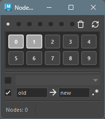
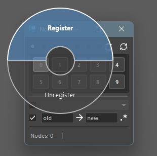
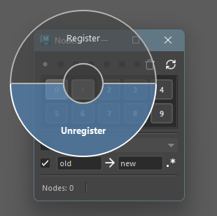
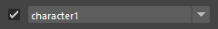
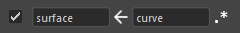
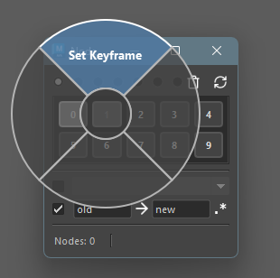

## How to Launch

Launch the tool from the dedicated menu or with the following command.

```python
import faketools.tools.common.node_stocker.ui
faketools.tools.common.node_stocker.ui.show_ui()
```



## Usage

Explains how to save, select, and clear nodes.

### Saving Nodes

1. Select the nodes you want to save.

2. Select the area to save. The area is determined by the radio buttons at the top.

3. Middle-click on a numbered button to display a pie menu.\
    Select `register` to save the currently selected nodes to that button.

    

    When a node is registered to a button, the button's background color changes.


### Selecting Nodes

1. Select the area you want to select from.
2. Click on a button with a changed background color to select the nodes registered to that button.

    **Selection using modifier keys** is also possible. The selection rules are the same as selection in Maya's View.
    Additionally, you can **rectangle select** on the area to call up multiple button's nodes at once.

### Clearing Saved Nodes

To clear saved nodes, middle-click on the button and select `unregister` from the pie menu.



## Options

### Include Namespace When Selecting

You can set whether to include the namespace when calling up nodes.

To select with namespace included, check the checkbox and select the target namespace from the dropdown menu at the bottom.



※ If the registered node does not have a namespace, it will select a node with that namespace added.
※ If the node is registered with full path included, the parent's namespace will also be replaced according to the specification.

### Replace Node Name When Selecting

You can replace the node name when calling up nodes.

To select with node name replaced, check the checkbox and enter the original and replacement node names in the text boxes at the bottom.

**Example: When replacing surface in registered nodes with curve**


To reverse the replacement, click the middle arrow button.


Also, checking the leftmost button will perform replacement using regular expressions.

**Example: When adding curve to the beginning of registered nodes**



※ In non-regular expression mode, the text to be replaced is required.

### Refresh the Tool


To refresh the tool, click the **refresh button** at the top right.
Registered nodes are reloaded from file, and the namespace list is also updated.


### Clear All Registrations in Active Tab


To clear all registrations in the active tab, click the **clear button** at the top right.

## Special Operations on Registered Nodes

Right-clicking on a button displays a pie menu with special operations for registered nodes.



### Set Keyframe

Sets a keyframe for registered nodes.
