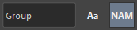
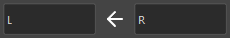
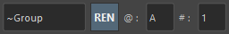
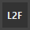

## Overview

A tool to assist in selecting nodes in the scene and replacing names.

Main features include:

- Filter selected nodes by name or node type
- Select parents, children, etc. of selected transform nodes
- Select, rename, duplicate, or duplicate original shapes with replaced node names
- Rename selected nodes


## How to Launch

Launch from the dedicated menu or with the following command.
The launched tool will dock at the bottom of the shelf.

```python
import faketools.tools.common.selecter.ui
faketools.tools.common.selecter.ui.show_ui()
```

## Usage

### Filter Selection by Name

Filters selected nodes by text.
Holding `Ctrl` while selecting will deselect matching nodes.

**Example: Select nodes containing the text "Group"**


When using regular expression strings, filtering is done as regular expressions.

**Example: Select nodes containing "Group" at the end of the node name**


Pressing the `Aa` button performs case-insensitive filtering.


### Filter Selection by Node Type

Filters selected nodes by node type.
Holding `Ctrl` while selecting will deselect matching nodes.


### Select Parents, Children, Siblings of Selected Nodes

Selects parents, children, siblings of selected nodes.


- **PAR**
  - Selects parents of selected nodes.
- **CHI**
  - Selects children of selected nodes.
- **SIB**
  - Selects siblings of selected nodes.
- **ALL**
  - Selects all parents, children, and siblings of selected nodes.
- **BTM**
  - Selects the bottommost nodes in the selected node hierarchy.
- **HIE**
  - Selects all nodes including shape nodes of selected nodes.

All can use modifier keys just like selection in Maya's view.

### Select with Name Replacement (Left/Right)

Selects nodes with replaced names between left and right selected nodes.


All can use modifier keys just like selection in Maya's view.

※ This feature can change the replacement method according to the `LEFT_TO_RIGHT` and `RIGHT_TO_LEFT` settings in settings.json.

### Select, Rename, Duplicate, Duplicate Original Shape with Name Replacement

Selects, renames, duplicates, or duplicates original shapes with replaced names of selected nodes.


Commands are executed by replacing names with strings entered in each text box. Press the **→** button to reverse the replacement direction.



- **SEL**
  - Selects with replaced names of selected nodes.
- **REN**
  - Renames with replaced names of selected nodes.
- **DUP**
  - Duplicates with replaced names of selected nodes. Press **MIR** button to mirror. At that time, **POS** and **ROT** determine whether to mirror position and rotation respectively. If **FRZ** button is pressed, transforms and pivots are frozen after mirroring. For Mesh nodes, components are also frozen.
- **ORG**
  - Duplicates original shapes with replaced names of selected nodes.

### Rename Selected Nodes

Renames selected nodes.



- Strings starting with `@` are converted to alphabets. Assigned from A in selection order. To change the first character, change the string in the @ field.
- Strings starting with `#` are converted to numbers. Assigned from 1 in selection order. To change the first number, change the string in the # field.
- Strings starting with `~` are replaced with the names of selected nodes.

**Examples:**

| Selected Node | Field | Rename Result |
|:---|:---| :---|
| Any | fake@ | fakeA, fakeB, fakeC, ... |
| Any | fake# | fake1, fake2, fake3, ... |
| Any | ~_fake | Any_fake |


### Special Features

You can use special features by pressing each button.



- **L2F**
  - Changes the last selected node to the first selected node.
