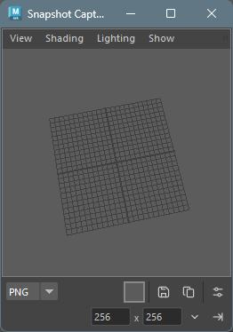
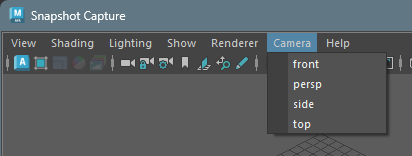
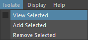
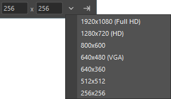
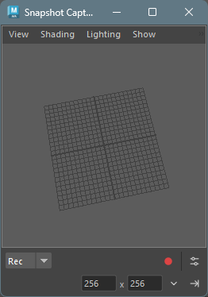
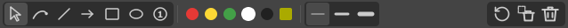
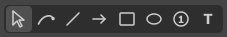
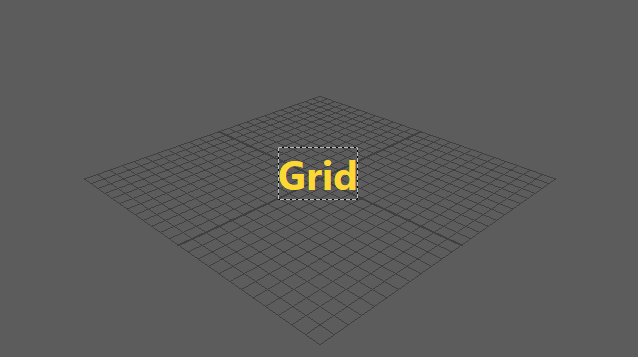
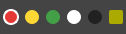
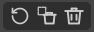

## Overview

Snapshot Capture is a tool for capturing images from Maya's viewport. It features the following three modes:

| Mode | Description |
|------|-------------|
| PNG | Save the current frame as a PNG image or copy to clipboard |
| GIF | Save the timeline range as an animated GIF or MP4 |
| Rec | Record the viewport in real-time and save as GIF or MP4 |

It also includes an **Annotation Editor** feature that allows you to add arrows, shapes, and other annotations to captured images.

## How to Launch

Launch the tool from the dedicated menu or using the following command:

```python
import faketools.tools.common.snapshot_capture.ui
faketools.tools.common.snapshot_capture.ui.show_ui()
```




## Basic Usage

### Viewport Operations

The tool window has an embedded model panel (viewport). You can rotate, pan, and zoom the camera just like a standard Maya viewport.

#### Switching Cameras

You can switch the displayed camera from the **Camera** menu in the menu bar.



#### Isolate Select

You can display only selected objects in the viewport from the **Isolate** menu in the menu bar.



| Menu Item | Description |
|-----------|-------------|
| View Selected | Toggle between showing only selected objects / all objects |
| Add Selected | Add currently selected objects to the Isolate display |
| Remove Selected | Remove currently selected objects from the Isolate display |

> **Note**: Since Maya's standard Show > Isolate Select menu doesn't work in embedded viewports, this custom menu provides equivalent functionality.

#### Display

You can control which elements are displayed in the viewport from the **Display** menu in the menu bar.

| Menu Item | Description |
|-----------|-------------|
| All | Enable all display elements |
| Mesh | Show only polygon meshes |
| Geometry | Show only geometry (NURBS surfaces, polygons, subdivisions) |
| Joint | Show only joints |
| Controller | Show only controllers and NURBS curves |
| HUD | Toggle HUD (Heads-Up Display) visibility |
| Grid | Toggle grid visibility |

> **Note**: Selecting Mesh, Geometry, Joint, or Controller will hide all other display elements and show only the selected elements. HUD and Grid are checkbox-style toggles that can be switched without affecting other display settings.

### Resolution Settings

You can set the output image resolution in the lower toolbar.



1. **Width/Height input fields**: Enter any resolution directly
2. **Preset button** (▼): Select from the following presets:
   - 1920x1080 (Full HD)
   - 1280x720 (HD)
   - 800x600
   - 640x480 (VGA)
   - 640x360
   - 512x512
   - 320x240
   - 256x256
   - 128x128
3. **Set button (→|)**: Apply the entered resolution to the viewport

## PNG Mode

Capture the current frame as a PNG image.


### How to Use

1. Select **PNG** from the mode selector
2. Set the background color if needed (see below)
3. Do one of the following:
   - **Save button** : Opens a file dialog to save as a PNG file
   - **Copy button** : Copies the image to clipboard

### Edit in External App

Right-click the **Copy button** to display a context menu.

- **Edit in External App**: Opens the captured image in the OS default image application

This feature saves the captured image as a temporary file and immediately opens it in an external application (Windows Photos, Paint, etc.). Useful for quick editing or previewing.

> **Note**: This feature is currently available only on Windows.

### Background Color Settings

Click the **BG button** to open a color picker and select a background color.


#### Option Menu

The following settings are available from the option button:

| Option | Description |
|--------|-------------|
| Transparent | Make the background transparent (GIF only) |
| Use Maya Background | Set Maya's global background color as the background |
| Edit Annotations | Open the annotation editor after capture |


## GIF Mode

Capture the timeline playback range as an animated GIF or MP4.


### How to Use

1. Select **GIF** from the mode selector
2. Set the start and end frames in Maya's timeline
3. Set background color and options as needed
4. Click the **Save button**  to save the file

### Options

The following settings are available from the option menu:

| Option | Description |
|--------|-------------|
| Transparent | Make the background transparent (GIF only) |
| Use Maya Background | Use Maya's global background color |
| Loop | Loop the GIF playback (default: on) |
| FPS | Set the frame rate (10, 12, 15, 24, 30, 50, 60) |
| MP4 Quality | MP4 quality setting (High / Medium / Low) |

### Saving as MP4

If FFmpeg is installed, you can select `.mp4` format in the file dialog to save.


#### MP4 Quality Settings

You can select MP4 quality from the **Quality** submenu in the option menu.

| Quality | Description |
|---------|-------------|
| High | High quality (CRF 18, encoding speed: slow) |
| Medium | Standard quality (CRF 23, encoding speed: medium) (default) |
| Low | Low quality (CRF 28, encoding speed: fast) |

> **Note**: MP4 export requires FFmpeg. Add FFmpeg to PATH or place it in a common installation location (e.g., `C:\ffmpeg\bin`).

## Rec Mode

Record the viewport in real-time and save as GIF or MP4. Mouse cursor and keyboard input overlay display is also available.



### How to Use

1. Select **Rec** from the mode selector
2. Configure recording settings from the option menu (see below)
3. Click the **Record button**  to start recording
4. Recording starts after the countdown
5. Click the **Stop button**  to stop recording
6. A file dialog opens to save as GIF or MP4

### Canceling During Countdown

Click the button during the countdown to cancel recording.

### Options

The following settings are available from the option menu:

| Option | Description |
|--------|-------------|
| Loop | Loop the GIF playback |
| FPS | Recording frame rate (10, 12, 15, 24, 30, 50, 60) |
| Quality | MP4 quality (High / Medium / Low) |
| Delay | Countdown seconds before recording starts (0, 1, 2, 3) |
| Trim | Seconds to trim from the end when recording stops (0, 1, 2, 3) |
| Show Cursor | Overlay the mouse cursor |
| Show Clicks | Display click position indicators |
| Show Keys | Overlay pressed keys |

Different indicators are displayed for left-click, right-click, and middle-click.

## Annotation Editor

In PNG mode, you can add annotations (arrows, shapes, etc.) to captured images.


### Launching the Annotation Editor

After capturing an image in PNG mode, enable the **Edit Annotations** option, then click the **Save button** to launch the annotation editor.

### Toolbar

The annotation editor toolbar has the following features:



#### Drawing Tools



| Tool | Icon | Description |
|------|------|-------------|
| Select |  | Select annotations, drag to move, Ctrl+middle wheel to scale |
| Freehand |  | Draw freehand lines |
| Line |  | Draw a straight line |
| Arrow |  | Draw an arrow |
| Rectangle |  | Draw a rectangle |
| Ellipse |  | Draw a circle or ellipse |
| Number |  | Draw a numbered circle (auto-increments) |
| Text |  | Add text |

#### Select Tool

When the select tool is active, click on an annotation to select it.
The following operations are available for selected annotations:

- **Move**: Drag to move position
- **Scale**: Hold Ctrl and scroll middle wheel to enlarge/shrink
- **Multiple selection**: Drag to select multiple items
- **Delete**: Press Delete / Backspace to delete

**Selection state**


#### Text Tool

When the text tool is active, click on the image to display the text input dialog.


Press `Enter` to insert a new line.
Press `Ctrl + Enter` to confirm the text.


#### Color Selection



You can select from 5 preset colors (red, yellow, green, white, black) and a custom color button.

- **Preset colors**: Click to select
- **Custom color (BG)**: Click to select, right-click to open color picker and change color

#### Line Width Selection


Select from 3 presets (thin, medium, thick).

#### Action Buttons



| Button | Icon | Description |
|--------|------|-------------|
| Undo |  | Undo the last action |
| Delete |  | Delete selected annotation |
| Clear All |  | Delete all annotations |

### Footer Buttons


| Button | Icon | Description |
|--------|------|-------------|
| Save |  | Save the annotated image as a PNG file |
| Copy |  | Copy the annotated image to clipboard |
| Cancel |  | Close the annotation editor (without saving or copying) |

### Keyboard Shortcuts

| Key | Description |
|-----|-------------|
| Ctrl + Z | Undo the last action (supports create and move operations) |
| Delete / Backspace | Delete the selected annotation |
| Shift + drag | Snap lines/arrows to 45-degree angles, constrain rectangles/ellipses to squares/circles, snap number radius to 10px increments |

### Settings Persistence

The color and line width selected in the annotation editor are automatically saved and restored on the next launch.

## Settings Persistence

The following settings are automatically saved when closing the window:

- Selected mode
- Resolution (width/height)
- Background color
- Transparency setting
- FPS
- Loop setting
- MP4 quality setting
- Delay/Trim settings
- Cursor/Click/Key display settings
- Annotation editor color/line width settings

These settings are restored on the next launch.

## About Save Location

- On first save, the tool's dedicated data directory is used as the default save location
- Once a file is saved, the last saved directory is remembered within the same session

## Notes

- In GIF mode, up to 500 frames can be captured
- Rec mode recording uses screen capture of the viewport, so other windows overlapping the viewport may be included in the capture
- High resolution and high frame rate recording increases memory usage
- FFmpeg must be installed on your system to save in MP4 format
- This tool requires the PIL (Pillow) library (included by default in Maya 2022 and later)

## Optional Dependencies

The following libraries provide additional features and performance improvements when installed. They are not required, and the tool will automatically fall back to alternative methods if they are not available.

| Library | Purpose | Fallback |
|---------|---------|----------|
| mss | High-speed screen capture for Rec mode (2-3x faster than PIL ImageGrab) | Uses PIL ImageGrab |
| aggdraw | Antialiased drawing for annotations | Uses PIL ImageDraw (no antialiasing) |

### Installation

```bash
pip install mss aggdraw
```

> **Note**: aggdraw may require compilation on environments without pre-built wheels.
