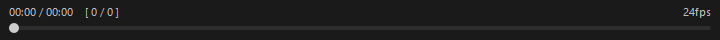
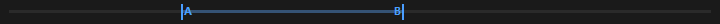
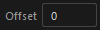

## Overview

Sync Player is a tool for playing video files within Maya. In addition to functioning as a standard video player, it features **Maya timeline synchronization**, allowing you to review reference footage while working on animations.

### Supported Formats

mov, avi, mp4, wmv, jpeg, png, tif/tiff

## How to Launch

Launch the tool from the dedicated menu or using the following command:

```python
import faketools.tools.common.sync_player.ui
faketools.tools.common.sync_player.ui.show_ui()
```


## UI Layout

The window consists of the following elements:

| Area | Description |
|------|-------------|
| Video display area | Displays the video. A placeholder is shown when no video is loaded |
| Time/frame display | Shows the current playback position, total duration, and frame numbers |
| FPS display | Shows the frame rate of the loaded video |
| Seek bar | Slider for controlling the playback position |
| A-B loop bar | Visually displays and adjusts the A-B loop range |
| Control bar | Buttons for playback controls and various settings |

## Basic Usage

### Loading a Video


There are three loading modes, each with a different loading method:

- Video mode
- Video image sequence mode
- Image sequence mode

Each mode is described below.

**Video Mode**

1. Turn off `Image Sequence Mode` in the options menu.
2. Double-click the video display area.
3. Select a video file from the dialog.

This mode plays the video directly. It is the only mode with audio support.

**Video Image Sequence Mode**

1. Turn on `Image Sequence Mode` in the options menu.
2. Double-click the video display area.
3. Select a video file from the dialog.

This mode converts the video into an image sequence before loading. Use this when video playback responsiveness is poor due to RDP or network drive conditions.

> **Note**: This mode requires **ffmpeg**. An error message is displayed if ffmpeg is not found in the system PATH.

**Image Sequence Mode**

1. Turn on `Image Sequence Mode` in the options menu.
2. Double-click the video display area.
3. Select an image file from the dialog.

This mode collects numbered image files from the selected image's directory and loads them as a video. Use this when video playback responsiveness is poor due to RDP or network drive conditions.

> **Note**: Double-click file loading is disabled when Maya Sync is active.

### Playback Controls


Use the center buttons on the control bar for playback operations.

| Button | Description |
|--------|-------------|
| Previous frame | Step back one frame |
| Play / Pause | Toggle between play and pause |
| Next frame | Step forward one frame |

### Seek Bar



Drag the seek bar to jump to any playback position.

- When paused, dragging the seek bar temporarily enters a playback state to update the video frames. Releasing the slider returns to the paused state.

### Time/Frame Display

Playback information is shown above the seek bar.

```
MM:SS / MM:SS    [ current frame / total frames ]
```

When an A-B loop is active, the loop range time and frame numbers are displayed on the right.

```
MM:SS / MM:SS    [ current frame / total frames ]      A-B: MM:SS - MM:SS [ start frame - end frame ]
```

## Control Bar


### A-B Loop

Click the  button to enable the A-B loop feature.

When A-B loop is enabled, the button icon changes to .

#### A-B Loop Behavior



- Enabling A-B loop sets the initial range to the entire video (start to end)
- Use the **A-B loop bar** below the seek bar to drag the A (start) and B (end) markers to adjust the range
- When combined with loop playback, the video loops within the specified A-B range
- Disabling A-B loop clears the range settings

> **Note**: A-B loop is disabled when Maya Sync is active.

### Loop Playback

Click the  button to automatically restart playback from the beginning when the video reaches the end.

When loop is enabled, the button icon changes to .

### Window Opacity

Click the  button to make the entire window (video and controls) semi-transparent. This is useful for overlaying the window on the Maya viewport to reference footage while working.

When opacity is enabled, the button icon changes to .

- The opacity preset value can be adjusted from 10% to 100% using the Opacity slider in the options menu
- While opacity is enabled, changes to the slider are applied immediately
- The window always starts fully opaque (opacity off) on launch

### Maya Sync (Timeline Synchronization)

Click the  button to enable Maya timeline synchronization mode.

When sync is enabled, the button icon changes to .

#### Sync Mode Behavior

- **When sync is enabled**: The video playback position follows Maya's timeline
  - Whenever Maya's current frame changes, the video seeks to the corresponding position
  - This works the same way for both timeline scrubbing (dragging) and playback
- **When sync is disabled**: Operates as a standalone video player

#### Frame Offset



Use the **Offset** field on the left side of the control bar to set a frame-based offset between the Maya timeline and the video sync position.

For example, use this when the video has unwanted frames at the beginning, or when you need to align the Maya timeline start frame with the video start position.

#### Control Restrictions During Sync

While sync mode is active, the following controls are disabled:

- Play / Pause button
- Frame forward / backward buttons
- A-B loop toggle
- Loop toggle
- Seek bar

This is because video playback is fully controlled by Maya's timeline.

#### FPS Mismatch Warning

When enabling sync, a warning message is displayed if the video's FPS differs from the Maya scene's FPS. When FPS values differ, frame stepping and frame number display may not match the video's actual frames.

### Volume Controls


The mute button and volume slider are on the right side.

| Control | Description |
|---------|-------------|
| Mute button | Toggle audio on/off |
| Volume slider | Adjust volume from 0 to 100 |

### Options Menu

Click the  button to the right of the volume slider to open the menu.

#### Image Sequence Mode Toggle

Use the **Image Sequence Mode** checkbox to select the video loading method.

#### Playback Speed

Select the playback speed from the **Speed** submenu.

| Speed | Description |
|-------|-------------|
| 0.25x | Quarter speed |
| 0.5x | Half speed |
| 0.75x | Three-quarter speed |
| 1.0x | Normal speed (default) |
| 1.25x | 1.25x speed |
| 1.5x | 1.5x speed |
| 2.0x | Double speed |

#### Opacity

Use the **Opacity** slider to adjust the window opacity preset value. The range is 10% to 100%. When opacity is enabled, adjusting the slider changes the window opacity in real time.

## Keyboard Shortcuts

| Key | Description |
|-----|-------------|
| Space | Toggle play / pause |
| Right / Up | Step to next frame |
| Left / Down | Step to previous frame |
| Ctrl+T | Toggle window opacity |
| Ctrl+Up | Increase opacity preset by +10% |
| Ctrl+Down | Decrease opacity preset by -10% |
| Ctrl+0 | Reset opacity to 100% and turn off |

> **Note**: Keyboard shortcuts are disabled when Maya Sync is active. However, opacity shortcuts (Ctrl+T / Ctrl+Up / Ctrl+Down / Ctrl+0) remain available during sync.

## Settings Persistence

The following settings are automatically saved when the window is closed and restored on next launch:

- Volume
- Mute state
- Frame offset
- Playback speed
- Opacity preset value

## Extending Supported Formats

Sync Player uses Qt's QMediaPlayer, so the playable formats depend on the OS media backend.

### Windows

On Windows, **Windows Media Foundation (WMF)** is used as the backend. It supports mp4 (H.264), wmv, avi, etc. by default, but you can extend format support by installing additional codecs.

| Codec Pack | Description |
|------------|-------------|
| [K-Lite Codec Pack](https://codecguide.com/) | A popular codec pack with broad format support. The Basic edition is sufficient |
| [LAV Filters](https://github.com/Nevcairiel/LAVFilters) | FFmpeg-based DirectShow filters. Also bundled with K-Lite |

Installing a codec pack enables playback of formats such as WebM (VP9), MKV, and HEVC (H.265) that are not supported by default, via WMF.

> **Note**: Maya must be restarted after installing a codec pack.

## Notes

- Video loading uses the Windows Media Foundation (WMF) backend. In rare cases the backend may become unresponsive, but the tool automatically recreates the player and retries
- If video loading does not complete within 10 seconds, it times out and returns to the placeholder screen
