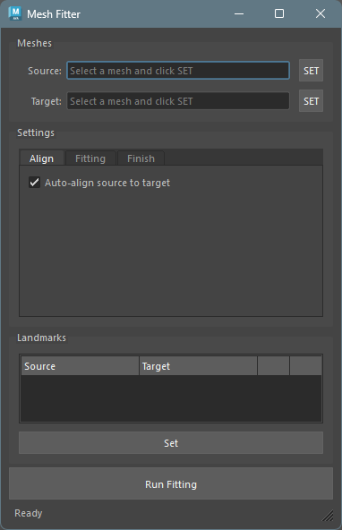
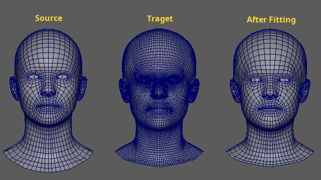
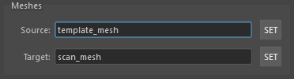
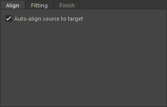
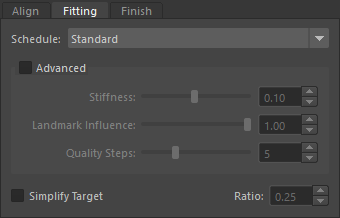
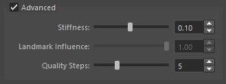
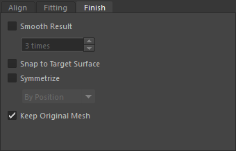
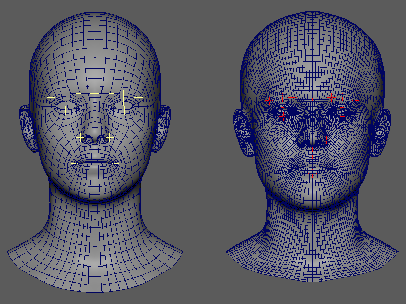
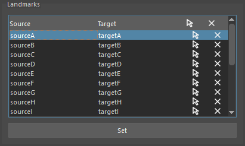

## Overview

A tool that deforms a template mesh (source) to match the shape of scan data (target).
It uses the Non-rigid ICP (nricp_amberg) algorithm and supports landmark-guided fitting.


## How to Launch

Launch the tool from the dedicated menu or with the following command.

```python
import faketools.tools.model.mesh_fitter.ui
faketools.tools.model.mesh_fitter.ui.show_ui()
```




## Usage

### Basic Steps



1. Select a source mesh (template) in the Maya viewport and press the `SET` button under `Source` to register it as the source.

2. Select a target mesh (scan data) and press the `SET` button under `Target` to register it as the target.

3. Adjust fitting parameters in the Settings tabs as needed.

4. Press the `Run Fitting` button to execute the fitting.

5. After fitting is complete, the resulting mesh is automatically selected.


## Meshes Section

This section is used to register the source mesh and target mesh.



- **Source**: The template mesh to be deformed. Select a mesh in the viewport and press the `SET` button to register it.
- **Target**: The scan mesh to fit to. Register it the same way using the `SET` button.


## Settings

Configure fitting parameters across three tabs.

### Align Tab



- **Auto-align source to target**:
  - Automatically aligns the source mesh to the target before fitting. This includes centroid matching, scale normalization, and ICP alignment.
  - Enabled by default.

Note: Although auto-align is available, it is recommended to match the sizes as closely as possible before fitting.
Also, fitting is performed in the mesh's local space. Sizes must be matched with the mesh transforms at zero.

### Fitting Tab



- **Schedule**: Select a fitting intensity preset.
  - `Gentle`: Conservative fitting. Suitable for preserving detail.
  - `Standard`: Balanced fitting.
  - `Strong`: Aggressive fitting. Landmark weights are strongly reflected.
  - `Landmark`: Landmark-driven fitting. Best when landmarks are configured.

- **Simplify Target**: When checked, simplifies the target mesh using quadric decimation before fitting.
  - Reducing the target polygon count improves fitting computation speed.
  - Use the slider to specify the proportion of faces to retain (0.05 ~ 1.0, default: 0.25). For example, 0.25 reduces the face count to 25% of the original.
  - The source mesh is not affected. The original target mesh is also left unchanged.

#### Advanced

Check the `Advanced` group box to manually adjust detailed parameters.\
Unchecking it resets the values to the defaults for the currently selected schedule.



- **Stiffness** (0.01 ~ 0.20): Controls the rigidity of the mesh. Higher values suppress deformation; lower values fit more tightly to the target.
- **Landmark Influence** (0.0 ~ 1.0): Controls the weight of landmark constraints. Only effective when landmarks are registered.
- **Quality Steps** (3 ~ 10): Number of fitting steps. Higher values increase accuracy but also increase computation time.

### Finish Tab



Configure post-processing after fitting.

- **Smooth Result**: Applies smoothing to the fitting result. When checked, you can specify the number of iterations (1 ~ 50).
- **Snap to Target Surface**: Progressively snaps the result mesh vertices to the target surface.
- **Symmetrize**: Symmetrizes the mesh. The following methods are available:
  - `By Position`: Position-based symmetrization
  - `By Topology`: Topology-based symmetrization that traces face connectivity
  - `By Position` is faster to compute, but may fail when vertices are at identical positions. In that case, use `By Topology`.
- **Keep Original Mesh**: When enabled, duplicates the original source mesh before fitting. When disabled, deforms the source mesh directly. Enabled by default.


## Landmarks Section

Landmarks specify corresponding points between the source and target.\
Setting landmarks can improve both fitting accuracy and processing speed.



### Registering Landmarks



1. Select an **even number** of transforms (such as locators) for landmarks in the Maya viewport.\
   The landmark transforms can be any transform node, regardless of how they were created.

2. The first half of the selection order is treated as source-side landmarks, and the second half as target-side landmarks.\
   Example: If you select 4 transforms, the first 2 become source landmarks and the remaining 2 become target landmarks.

3. Press the `Set` button to register the landmarks.

### Landmark Operations

Registered landmarks are displayed in a tree widget. The following operations are available for each pair.

**Header**

Click the header to execute commands for each column.

- **Source**: Selects all landmarks in the Source column.
- **Target**: Selects all landmarks in the Target column.
- **Select icon**: Selects all landmarks.
- **X icon**: Clears the list.

**List Items**

- **Select icon**: Selects the landmark pair in the viewport.
- **Remove icon**: Removes the landmark pair.


## Running via Command

You can also run fitting from a script without using the UI.

### Basic Usage

```python
from faketools.tools.model.mesh_fitter import command

result = command.run_fitting("source_mesh", "target_mesh")
print(result.result_mesh_name)  # "source_mesh_fitted"
```

### Running with Custom Parameters

```python
from faketools.tools.model.mesh_fitter import command
from faketools.tools.model.mesh_fitter.core.pipeline import PipelineConfig

config = PipelineConfig(
    schedule="gentle",
    auto_align_enabled=True,
    smooth_result=True,
    smooth_iterations=5,
    snap_to_target=True,
    target_decimate_ratio=0.25,
    symmetrize=True,
    symmetry_method="position",
)

result = command.run_fitting(
    source_name="source_mesh",
    target_name="target_mesh",
    config=config,
    duplicate_source=True,
    result_name="fitted_result",
)

print(f"Result: {result.result_mesh_name}")
print(f"Time: {result.elapsed_total:.1f}s")
```

### run_fitting() Parameters

| Parameter | Type | Default | Description |
|---|---|---|---|
| `source_name` | str | (required) | Transform name of the source mesh |
| `target_name` | str | (required) | Transform name of the target mesh |
| `config` | PipelineConfig \| None | None | Pipeline configuration. Uses defaults if None |
| `landmarks` | LandmarkData \| None | None | Landmark data |
| `schedule` | str \| None | None | Override config.schedule with a schedule name |
| `duplicate_source` | bool | True | If True, duplicates the source before fitting |
| `result_name` | str \| None | None | Name for the result mesh. Defaults to `"{source_name}_fitted"` |
| `on_progress` | Callable[[str], None] \| None | None | Progress callback function |


## Notes

- Can be used even when the source mesh and target mesh have different topologies.
- Fitting is more likely to fail if the size difference between source and target is too large.
- During fitting, buttons are disabled and progress is shown in the status bar.
- Processing may take time for meshes with a high vertex count.
- Landmarks must be near the mesh surface (within 10% of the bounding box diagonal).

## Third-Party Assets and Licensing

The screenshots in this document were generated using models
modified from third-party 3D meshes.

The original meshes were obtained from the following sources:

1. 3D Scan Store -- Free Base Mesh
   https://www.3dscanstore.com/blog/Free-Base-Mesh

2. FLAME (Faces Learned with an Articulated Model and Expressions)
   https://flame.is.tue.mpg.de/

The original data is not included in this repository.

For the purpose of illustrating the behavior of the ICP algorithm,
the meshes were modified through deformation and transformation,
and only screenshots are included.

Licensing:

- The Free Base Mesh is subject to 3D Scan Store's terms and conditions.
  For details, see:
  https://www.3dscanstore.com/terms-and-conditions-licensing

- The FLAME model is subject to the model license defined by the
  Max Planck Institute for Intelligent Systems.
  https://flame.is.tue.mpg.de/modellicense.html

The MIT license of this repository applies only to
the source code and tools, and does not apply to
the above third-party assets.
