## Overview

A tool for mirroring or flipping mesh vertex positions across the X axis (YZ plane).

Key features:

- **Mirror**: Copy vertex positions from one side to the other (overwrite)
- **Flip**: Exchange left/right vertex pair positions using the symmetry table (asymmetry swaps sides)
- **Single Mesh mode**: Operate on left/right symmetry within a single mesh
- **Dual Mesh mode**: Operate between separate left/right mesh pairs
- **Batch processing**: Mirror / flip multiple targets at once using the same table
- **Asymmetric mesh support**: Two fallback methods for vertices that fail to match in the symmetry table


## How to Launch

Launch the tool from the dedicated menu or with the following command.

```python
import faketools.tools.model.mesh_mirror.ui
faketools.tools.model.mesh_mirror.ui.show_ui()
```

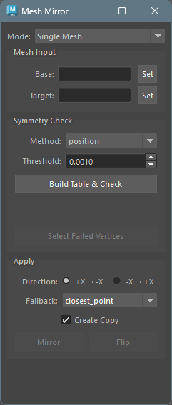


## Usage

### Basic Steps (Single Mesh Mode)

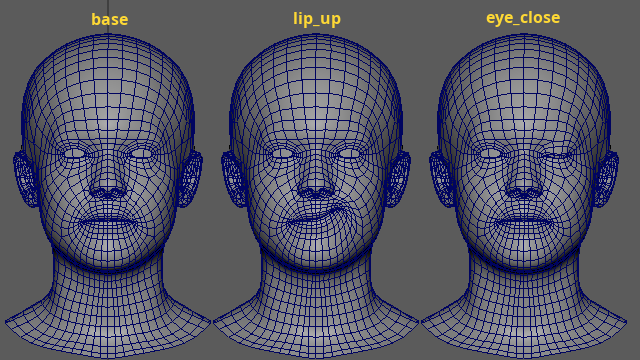

1. Select a symmetric base mesh in the Maya viewport and click the `Set` button next to `Base` to register it.

    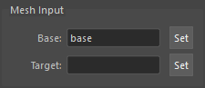

2. Select the target mesh(es) you want to mirror / flip, and click the `Set` button next to `Target` to register them. Multiple targets can be selected at once.

    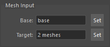

3. In the Symmetry Check section, set `Method` and `Threshold`, then click the `Build Table & Check` button to build the symmetry table.

4. Review the check results. If there are Failed or Asymmetric vertices, click the `Select Failed Vertices` button to inspect them on the base mesh.

    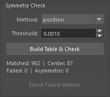

5. In the Apply section, set Direction and Fallback, then click `Mirror` or `Flip` to execute. If the `Create Copy` checkbox is on, the target mesh will be duplicated and the result applied to the copy.

    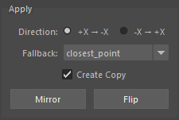

**Flip result**

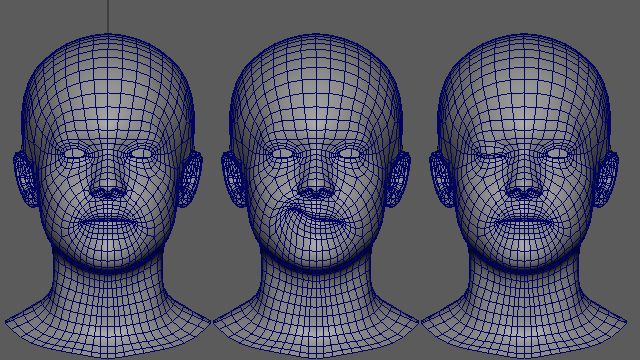

### Basic Steps (Dual Mesh Mode)

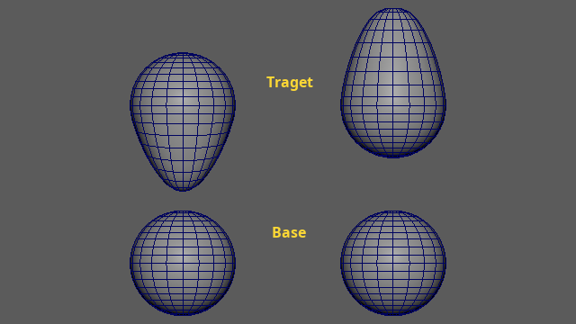

1. Switch Mode to `Dual Mesh`.

2. Register a symmetric base mesh pair in `Base A` / `Base B`.

    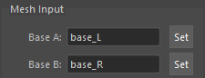

3. Register target mesh pairs in `Target A` / `Target B`. The number of `Target A` and `Target B` meshes must be equal.

    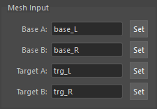

4. In the Symmetry Check section, select `Method` and click the `Build Table & Check` button to build the correspondence table from the base pair.

5. In the Apply section, set Direction and Fallback, then click `Mirror` or `Flip` to execute.

**Flip result**

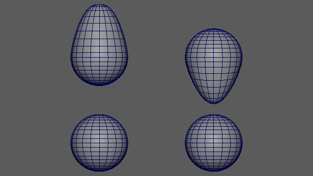


## Mesh Input Section

Register the base mesh and target meshes in this section.

- **Base**: The symmetric mesh used to build the symmetry table. Select a mesh in the viewport and click the `Set` button to register.
- **Target**: The mesh(es) to operate on. Select multiple meshes and click `Set` to register them in batch. A single mesh shows its name; multiple meshes show "N meshes".

In `Dual Mesh` mode, four fields are displayed: `Base A` / `Base B` and `Target A` / `Target B`.

Note: Base and target meshes must have identical topology. If topology differs, an error is displayed when executing Mirror / Flip.


## Symmetry Check Section

Build the symmetry table from the base mesh and verify its quality.

- **Method**: Select the table construction method (see below).
- **Threshold**: Set the distance threshold for vertex matching.

Click the `Build Table & Check` button to build the table. The following information is displayed:

| Item | Description |
|------|-------------|
| Matched | Number of matched pairs |
| Center | Number of vertices on the center axis (`Single Mesh` only) |
| Failed | Number of unmatched vertices |
| Asymmetric | Number of pairs with asymmetric positions |

Click the `Select Failed Vertices` button to select Failed and Asymmetric vertices on the base mesh for inspection.

### Matching Methods

**Single Mesh mode:**

| Method | Description |
|--------|-------------|
| `position` | KDTree position-based matching. Fast. Best for cleanly symmetric meshes |
| `topology` | BFS face-connectivity matching. Handles slightly asymmetric meshes |

**Dual Mesh mode:**

| Method | Description |
|--------|-------------|
| `position` | KDTree mirrored-position matching. For L/R meshes with different vertex order |
| `topology` | BFS face-connectivity matching. For heavily deformed but topologically identical L/R meshes |
| `index` | Direct vertex index correspondence (vtx[i] <-> vtx[i]). For L/R meshes split from the same source |


## Apply Section

Execute mirror or flip operations.

- **Direction**: Select the mirror direction.
  - `Single Mesh`: `+X → -X` (copy +X side to -X side) / `-X → +X` (reverse)
  - `Dual Mesh`: `A → B` (mirror A's shape to B) / `B → A` (reverse)
- **Fallback**: Select the processing method for Failed vertices (see below).
- **Create Copy**: When enabled, the target mesh is duplicated before applying the result. The original target remains unchanged.

### Mirror vs Flip

`Mirror` copies vertex positions from the source side to the destination side in one direction. The source side is not modified.

```
pair(neg=3, pos=58) with +X → -X:
  vtx[3] = mirror_x(vtx[58])   -- -X side overwritten by source
  vtx[58] unchanged              -- +X side stays as-is
center vertices: X snapped to 0
```

`Flip` exchanges vertex positions between left/right pairs. Both sides are modified. Asymmetric shapes swap sides.

```
pair(neg=3, pos=58):
  new_vtx[3]  = mirror_x(old_vtx[58])  -- positions exchanged with X mirror
  new_vtx[58] = mirror_x(old_vtx[3])
center vertices: X multiplied by -1
```

### Fallback Methods

Processing methods for vertices that failed to match in the symmetry table (Failed). Used when left and right sides have different vertex counts.

| Method | Description |
|--------|-------------|
| `closest_point` | Find the closest point on the original mesh surface from the mirrored position. High accuracy, but may reference an incorrect face in concave regions |
| `laplacian` | Iteratively average neighbor vertex positions until convergence. Topologically safe, but slightly less accurate at reproducing curvature |


## Script Execution

The tool can be used directly from scripts without the UI.

### Basic Execution

```python
from faketools.tools.model.mesh_mirror import command

# 1. Build symmetry table
table = command.build_single_table("base_mesh", method="position", threshold=0.001)

# 2. Execute mirror
op = command.SingleMeshOperation(target="target_mesh", base="base_mesh", table=table)
op.mirror(direction="+x", fallback="closest_point")
```

### Running a Check

```python
# Check base mesh symmetry
result = command.get_check_result_single("base_mesh", table, threshold=0.001)
print(f"Matched: {result.matched_count}, Failed: {result.failed_count}, Asymmetric: {result.asymmetric_count}")

# Select Failed + Asymmetric vertices
command.select_failed_vertices("base_mesh", result.failed_indices + result.asymmetric_indices)
```

### Dual Mesh Mode Execution

```python
# Build correspondence table
table = command.build_dual_table("base_L", "base_R", method="position", threshold=0.001)

# Mirror
op = command.DualMeshOperation(
    target_a="target_L", target_b="target_R",
    base_a="base_L", base_b="base_R",
    table=table,
)
op.mirror(direction="a_to_b", fallback="closest_point")

# Flip
op.flip(fallback="laplacian")
```


## Notes

- All calculations are performed in object space. Transform position, rotation, and scale have no effect.
- The symmetry axis is fixed to the X axis (YZ plane).
- Base and target meshes must have identical topology. A mismatch produces an error at execution time.
- Operations are undoable. Batch processing of multiple targets can be reverted with a single undo.
- Only vertex positions are modified. Normals, UVs, and other mesh attributes are not affected.
