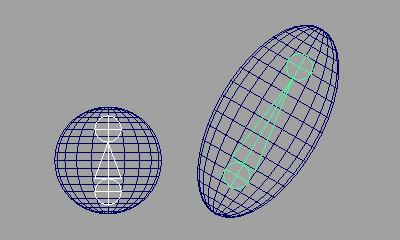
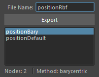
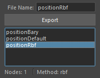
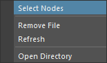

## Overview

This tool allows you to export and import position and rotation information of selected transform nodes to/from files.
There are several methods to obtain and set position information. The methods are as follows:

### Default

Obtains transform node position information in world position and reproduces it in world position.

### Barycentric

Obtains transform node position information as barycentric coordinates of the nearest triangle polygon from that node, and reproduces it using mesh barycentric coordinates.
During reproduction, you need to select a mesh with the same topology.

This method is effective when the transform node is on the surface of the mesh.


### Rbf

Obtains transform node position information from surrounding Vertex positions and reproduces it on a mesh with the same topology.
During reproduction, you need to select a mesh with the same topology.

This method is effective when the transform node is inside the mesh.



## How to Launch

Launch the tool from the dedicated menu or with the following command.

```python
import faketools.tools.model.retarget_transforms.ui
faketools.tools.model.retarget_transforms.ui.show_ui()
```


## Usage

### Export

To export position information, follow these steps:

1. Select an export method from `Method`.
  

1. Select target nodes for exporting position information according to the method.

     - `Default`
       - Select transform nodes to export (multiple selection allowed).
     - `Barycentric`
       - Select mesh (mesh transform node) to export.
       - Additionally select nodes to export (multiple selection allowed).
     - `Rbf`
       - Select mesh (mesh transform node) to export.
        - Additionally select nodes to export (multiple selection allowed).

2. Enter file name to export in `File Name`.
  

1. Press `Export` button.
  When export is complete, the exported file name will be displayed in the list.
  

※ When `Rbf` method is selected, you can set the export radius with the `Rbf Radius` value. If the behavior when reproducing position differs from expectations, increasing this value may provide the expected behavior.

### Import

To import position information, follow these steps:

1. Select a file name to import from the list.
  

2. Select target nodes for importing according to the export method.
     - `Default`
       - No selection needed.
     - `Barycentric`
       - Select mesh with the same topology as when exported.
     - `Rbf`
        - Select mesh with the same topology as when exported.

3. Set options and press `Import` button. With default settings, position information is applied to nodes selected during export.
  

## Import Options

Options that can be set during import.

- `Is Rotation`
  - Sets whether to apply rotation information to transform nodes.
- `Create New`
  - When checkbox is on, creates new transform nodes with the node type selected in `Object Type`. When off, applies position information to nodes selected during export.
  - If even one selected node doesn't exist, an error message is displayed.
- `Object Type`
  - Selects the type of transform node to create when `Create New` is on.
- `Size`
  - Sets the size of transform nodes created when `Create New` is on.

## Context Menu

Right-clicking on the list displays a context menu.



- `Select Nodes`
  - Selects nodes recorded in the file selected in the list.
- `Remove File`
  - Deletes the file selected in the list. (The actual file is also deleted.)
- `Refresh`
  - Updates the list.
- `Open Directory`
  - Opens the folder where exported files are saved.
