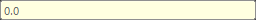

## Overview

A tool to change the state of node attributes.
Mainly, you can change attribute locks, node display state, and attribute values.

## How to Launch

Launch the tool from the dedicated menu or with the following command.

```python
import faketools.tools.rig.attribute_lister_ui
faketools.tools.rig.attribute_lister_ui.show_ui()
```


## Usage

1. Select nodes (multiple selection allowed).
2. Press `Load` button to load selected nodes to upper list. At this time, holding `Shift` key while selecting adds to the list.
3. Select nodes loaded in list (multiple selection allowed). Attributes of selected nodes are displayed in lower list.
4. Select attributes to change state (multiple selection allowed).
5. Enter value in bottom field and press `Enter` key to change selected attribute values.

## About States Where Values Can Be Changed

States where values can be changed are as follows.
When values can be changed, field is displayed as follows:


### Unlocked Attributes

Unlocked attributes. If even one selected node and attribute is locked, values cannot be changed.
When locked, field is grayed out.


### Attributes Without Connections

Attributes without connections. If even one selected node and attribute has a connection, values cannot be changed.
When connected, field is displayed in yellow.



### Same Type Attributes

Same type attributes. If even one selected node and attribute is a different type, values cannot be changed.
When there are different type attributes, field is displayed in red.


## Change Node State

Right-clicking on attribute list displays menu to change node state.


The following operations are possible for attributes of selected nodes:

- **Lock**
  - Locks selected attributes.
- **Unlock**
  - Unlocks selected attributes.
- **Keyable**
  - Displays selected attributes in channel box.
- **Unkeyable**
  - Hides selected attributes from channel box.

## Node List Operations

Right-clicking on node list displays node list operation menu.


- **Select All Nodes**
  - Selects all nodes loaded in list within the list.
- **Select Scene Nodes**
  - Selects nodes selected in list in the scene.
- **Select All Scene Nodes**
  - Selects all nodes loaded in list in the scene.
- **Remove Nodes**
  - Removes nodes selected in list from the list.
