## Overview

Launches **fake-connection-editor**, a support tool for connecting attributes and
copying values in Maya.
It lays out attribute trees side by side and lets you connect, disconnect, and copy
values by dragging between ports or operating on selected pairs.

Key features:

- Connection lines and ports visualized with two side-by-side trees and a central overlay
- Connect by dragging between ports, disconnect by dropping on empty space, batch disconnect by crossing with `Alt+Shift`
- Connect / leaf connect (per child attribute) / value copy (follows the direction toggle) for selected pairs
- Connection that ignores attribute locks (optional)
- Independent left/right filtering by type chips, text, and display options
- Ghost rows for multi-attributes, materialized on connect
- Live tracking of external scene changes (connections, attribute additions, locks, Undo/Redo)

    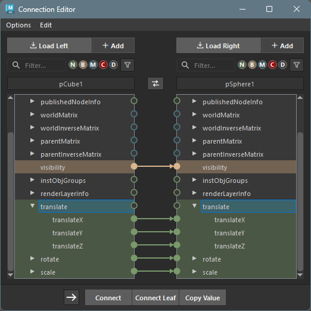

## Additional Installation Required

This tool requires the external package `fake_connection_editor` separately.
If it is not installed, a warning is logged and the tool does not launch.

Download it from the
[fake-connection-editor repository](https://github.com/mitsuaki0321/fake-connection-editor)
and place the `fake_connection_editor` folder in Maya's script path
(e.g. `<user>/Documents/maya/scripts/`).

## How to Launch

Launch the tool from the dedicated menu or with the following command.

```python
import faketools.tools.rig.connection_editor.ui
faketools.tools.rig.connection_editor.ui.show_ui()
```

You can also launch the external tool directly with the following command.

```python
import fake_connection_editor
fake_connection_editor.launch()
```

## Screen Layout

From top to bottom, the window is made up of the following areas. Each area can be
operated independently for the left and right sides.

**Menu bar**

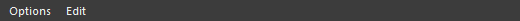

* `Options` : Option box for force connect / force disconnect / scroll to connected, etc. (see "Menus" below).
* `Edit` : Switches attribute sorting and attribute name display (shared by left and right).

**Load / Add buttons**

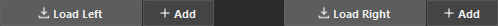

* Available on both sides; load the selected nodes into that tree. `Load` replaces, `Add` appends.

**Filter row**

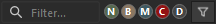

* Narrows down the displayed attributes independently for left and right using text, type chips, and the funnel menu (see "Filters" below).

**Node name header + swap button**

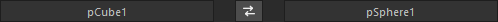

* Shows the name of the loaded node. Clicking it selects that side's node in the scene. The center swap button swaps the entire left and right sides.

**Left/right trees + central connection layer**

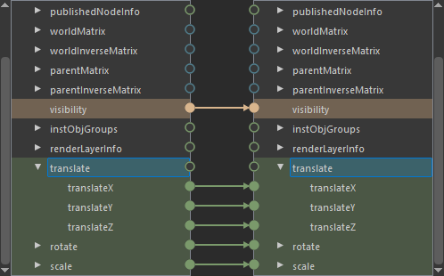

* Draws the attribute tree and connection information for each loaded node.
* The round icon on the left or right of each attribute is the port used for connecting.
* The arrow-shaped line between ports indicates the connection direction between those attributes.

**Action bar**

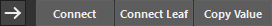

* Runs connect / leaf connect / value copy on the attribute pair selected on the left and right, in the direction of the direction toggle (see "Action Bar" below).

## Basic Usage

1. Select nodes and load them into the attribute trees with the `Load` (replace) / `Add` (append) buttons on each side.

2. Drag from port to port to connect. Drop on empty space to disconnect.

3. To operate on a selected pair, select one attribute on each side, then use the direction toggle and `Connect` / `Connect Leaf` / `Copy Value` in the action bar.

4. Right-clicking an attribute lets you load the connected node or copy the current value to the clipboard (see "Right-click Menu" below).

External scene changes are tracked automatically.

## Connecting and Disconnecting

Connecting and disconnecting are primarily done by dragging ports (direct manipulation). You grab the port itself, regardless of the selection state.

* **Connect**
  * Drag from an output port to an input port. While dragging, a temporary line follows the cursor, and ports / attributes that cannot be connected are grayed out.

    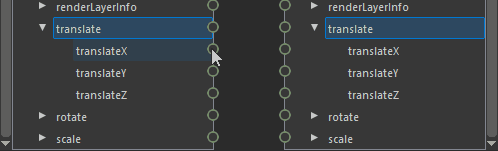
* **Disconnect**
  * Grab an input port and drop it on empty space to disconnect.

    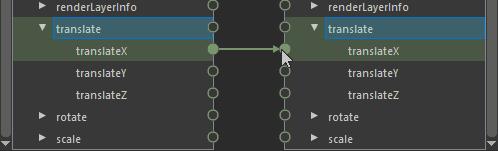
* **Reconnect**
  * Grabbing an already-connected input port detaches the existing line and attaches it to the cursor. Dropping it on another port rewires the connection.

    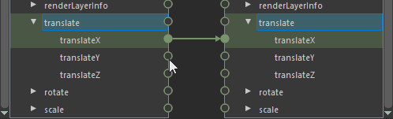
* **Crossing disconnect**
  * Dragging while holding `Alt+Shift` turns the drag into a cut that slices across lines, disconnecting every connection it crosses at once.

    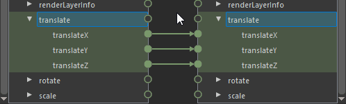

### Reading Ports and Connection Lines

The ports (circles) and connection lines on the central layer represent the connection state of each attribute.

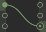

* **Filled port** : A connected attribute.
* **Hollow port** : An unconnected attribute.
* **Double-circle port** : Indicates that a collapsed parent attribute contains hidden child connections. Expanding it reveals the child connection lines.
* **Port and line color** : Represents the attribute's data type (matches the type chip colors). Connection lines inherit the type color of the output side.

## Action Bar (Operating on Selected Pairs)

Instead of dragging, you can operate on the attribute pair selected on the left and right with buttons. Use this when an attribute is off-screen, or when connecting per child attribute.


1. Select one attribute each in the left tree and the right tree.
2. Use the center direction toggle (`→` / `←`) to choose which side is the output (src).
3. Press the desired button.

* **Connect**
  * Connects the selected pair in the direction of the direction toggle.
* **Connect Leaf**
  * Select parent attributes on both sides and connect them per child attribute (e.g. `translate` → `translate` connects `tx→tx, ty→ty, tz→tz`). The number of children must match, and each child must be a compatible scalar type.
* **Copy Value**
  * Copies the value of the selected pair in the direction of the direction toggle.

When only one side is selected or the combination cannot be connected, a warning with the reason is shown at run time.

## Right-click Menu (Context Menu)

Right-clicking an attribute shows an operation menu based on that attribute (the origin). While the action bar targets the pair selected on the left and right, this menu acts on **the single attribute you right-clicked** as its origin. Each item is grayed out when its conditions are not met.

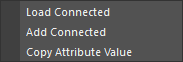

* **Load Connected**
  * Loads the node connected to the origin attribute into the opposite tree (replacing, like `Load`). Enabled only for attributes that have a connection.
* **Add Connected**
  * Appends the node connected to the origin attribute to the opposite tree (adding to the existing load, like `Add`). Enabled only for attributes that have a connection.
* **Copy Attribute Value**
  * Copies the current value of the origin attribute to the clipboard. Enabled only for numeric and matrix types.

Use `Load Connected` / `Add Connected` when you want to follow a connection and quickly line up the partner node on the opposite side. For example, right-clicking an output attribute in the left tree and running `Load Connected` loads the node that output is connected to into the right tree.

## Filters

You can narrow down the displayed attributes of each tree independently for left and right. The filter row is made up of three parts: text, type chips, and the funnel menu.


* **Text filter**
  * Narrows attribute names by the entered string. Ancestors of matching attributes are expanded automatically.
* **Type chips (`N` / `B` / `M` / `C` / `D`)**
  * Filters by data type. The chip colors match the type colors (port colors).
    * `N` : numeric (numbers, double3, etc.)
    * `B` : bool
    * `M` : matrix
    * `C` : color
    * `D` : data / compound
  * A normal click shows only that type (click again to show all); `Ctrl+click` toggles multiple types individually.
* **Funnel menu (display options)**
  * `Show Non-Keyable` : Also shows non-keyable attributes (on by default).
  * `Show Connected Only` : Shows only connected attributes.
  * `Show Extra Attribute Only` : Shows only user-defined (extra) attributes.
  * `Show Hidden` : Also shows hidden attributes (Maya-internal attributes that are rarely used for connections; off by default). Like Maya's standard Connection Editor, these are hidden by default so you can quickly reach the attribute you want.
  * The state of these display options is saved independently for the left and right sides and restored on the next launch.

## Menus

### Options

Toggles that switch the behavior of connecting, copying, and scrolling.

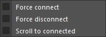

* **Force connect**
  * Temporarily unlocks locked attributes, replaces existing input connections, and forces the connection / overwrite (restoring the original lock state afterward).
* **Force disconnect**
  * Temporarily unlocks locked input attributes to disconnect them.
* **Scroll to connected**
  * When you select an attribute, scrolls and selects the opposite tree to its connection partner.

### Edit

Switches the order and display name of attributes (shared by left and right).

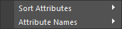

* **Sort Attributes**
  * Choose the sort order from `Scene Order` / `Name (A→Z)` / `Name (Z→A)`.
* **Attribute Names**
  * Switches between `Long Name` and `Short Name`.

## Multi-attributes (Ghost Rows)

For multi (array) attributes, **empty index rows that do not exist in the actual data are shown in advance**. Gap indices and the next empty index after the end are lined up as ghost rows, drawn distinctly from normal rows.

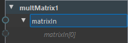

Connecting to a ghost row materializes that element and appends a new ghost row at the end. This lets you connect to the "next empty index"—which is hard to tell in standard Maya—without worrying about index numbers.

## Live Tracking

External scene changes are tracked automatically. When you connect, disconnect, add attributes, change locks, or Undo / Redo outside the Connection Editor, the trees and connection lines are updated immediately.
</content>
</invoke>
