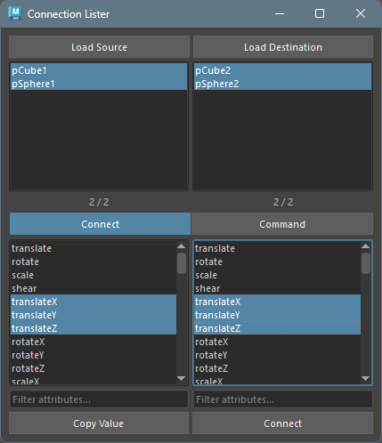
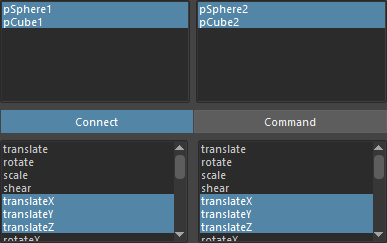

## Overview

This tool is for making connections and copying values between nodes.
Also, by using provided commands, you can perform specific operations between nodes.

## How to Launch

Launch the tool from the dedicated menu or with the following command.

```python
import faketools.tools.rig.connection_lister_ui
faketools.tools.rig.connection_lister_ui.show_ui()
```



## Usage

The method for loading nodes and attributes is the same as **Attribute Lister**.
Select nodes and press load button to display that node's attributes in the list.

For displayed nodes, you can connect and copy values in `Connect` mode.
Also, you can use provided commands in `Command` mode.


## Connect Mode

To copy values, press `Copy Value` button to copy that attribute's value.
To connect attributes, press `Connect` button to connect that attribute.

#### How to Select Nodes and Attributes

Select the same number of lists from left and right for nodes and attributes displayed in the list,



or as shown in the image, one source node/attribute and multiple target nodes/attributes.


## Command Mode

You can use provided commands in `Command` mode.

Commands have the same functionality as **Pair Command** in **Single Command**.
Refer to **[Single Command](../common/singleCommands.html)** documentation.


