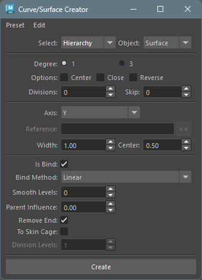
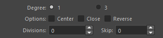
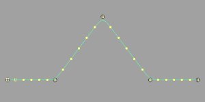
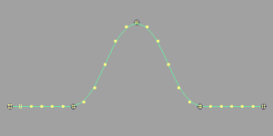
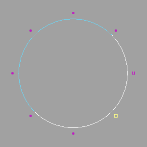

## Overview

Creates NURBS curves (hereinafter, curves) for selected transform nodes, and creates lofted NURBS surfaces (surfaces) or meshes based on those curves.

Also, if joint nodes are selected, created objects can be smooth bound via options.

## How to Launch

Launch the tool from the dedicated menu or with the following command.

```python
import faketools.tools.rig.curveSurface_creator_ui
faketools.tools.rig.curveSurface_creator_ui.show_ui()
```



## Usage

1. Select transform nodes (multiple selection allowed).
2. Select `Select Type` as either `Selected` (create between selected nodes) or `Hierarchy` (create for each hierarchy structure of selected nodes).
3. Select the type of object to create from `Object Type`.
4. Set options that are not grayed out.
5. Press `Create` button to create curves and surfaces.

## Options

Main options are divided into four categories:

* Basic Options
* Curve Options
* Loft Surface Options
* Bind Options

### Basic Options


* **Select Type**
  * Specifies how to select transform nodes for curve creation.
    * `Selected`: Creates between selected nodes.
    * `Hierarchy`: Creates for each hierarchy structure of selected nodes.
* **Object Type**
  * Specifies the type of object to create.
    * `Curve`: Creates curves.
    * `Surface`: Creates lofted surfaces based on curves.
    * `Mesh`: Creates lofted meshes based on curves.


### Curve Options

Options for curve creation.



* **Degree**
  * Specifies the degree of curves to create.
* **Center**
  * Makes curves created at the center of selected nodes.
* **Close**
  * Makes curves closed shape.
* **Reverse**
  * Reverses curve creation direction.
* **Divisions**
  * Specifies curve division count.
* **Skip**
  * Skips selected nodes by this value when creating curves.

### Loft Surface Options

Options for surface and mesh creation. Only valid when objectType is `Surface` or `Mesh`.


* **Axis**
  * Specifies surface creation direction.
    * `X`: Creates surface in X-axis direction of selected nodes.
    * `Y`: Creates surface in Y-axis direction of selected nodes.
    * `Z`: Creates surface in Z-axis direction of selected nodes.
    * `Normal`: Creates surface in normal direction of created curves.
    * `Binormal`: Creates surface in binormal direction of created curves.
    * `Surface Normal`: Creates surface in normal direction of reference surface (must specify NURBS surface as reference object).
    * `Surface Binormal`: Creates surface in binormal direction of reference surface (must specify NURBS surface as reference object).
    * `Mesh Normal`: Creates surface in normal direction of reference mesh (must specify mesh as reference object).
    * `Mesh Binormal`: Creates surface in binormal direction of reference mesh (must specify mesh as reference object).

* **Reference Object**
  * Specifies reference object to use when selecting `Surface Normal`, `Surface Binormal`, `Mesh Normal`, `Mesh Binormal`.
  * Can be set by selecting reference object and pressing `<<` button.
  * For `Surface Normal` / `Surface Binormal`, specify NURBS surface.
  * For `Mesh Normal` / `Mesh Binormal`, specify mesh.
  * From the position of each node creating surface, finds the nearest point on reference object and uses that position's normal direction.

* **Width**
  * Specifies surface width.
* **Width Center**
  * Creates surface centered on this value relative to surface creation direction. At 0.5, surface has same plus-minus width.
  * For example, if Width is 10.0 and Width Center is 0.5, surface ranges from -5.0 to 5.0.


### Bind Options

Options for smooth binding object after creation with selected nodes.
Only valid when selected nodes are joint nodes.


* **Is Bind**
  * When this checkbox is on, smooth binds created object with selected nodes.
* **Bind Method**
  * Specifies smooth bind method.
    * `Linear`: Binds with linear weight.

      

    * `Ease`: Binds with ease in-out weight.

      

    * `Step`: Binds with step weight.

      

* **Smooth Levels**
  * After weight setting by `Bind Method`, specifies level to smooth weights.

* **Parent Influences**
  * When this value is 0, binds based on selected nodes.
  * When value of 1 or more is specified, goes back this value of parent nodes from selected nodes and binds based on those nodes.

* **Remove End**
  * When `close` option is off and this option is on, excludes last node of selected nodes from binding.

* **To Skin Cage**
  * Like **Skin Weights to Mesh** tool, converts smooth bound object to skin cage. Only valid when `objectType` is `Surface`.

* **Division Levels**
  * When `To Skin Cage` is on, specifies skin cage division count.

## Edit Menu

Contains commands used when creating/editing curves.

### Move CVs Positions

* Select one CV for closed curve and execute.
* Moves CV number 0 position to selected CV position.

 

### Create Curve to Vertices

* Select Vertex (mesh vertices) (multiple selection allowed) and execute.
* Creates curve based on selected Vertex.

 

### Create Curve on SurfaceU V

* Select surface (multiple selection allowed) and execute.
* Creates curve at center of each UV value on selected surface.
