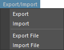
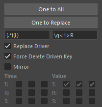
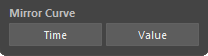
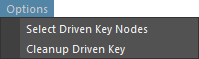

## Overview

A tool to assist in editing set driven keys.

Mainly provides the following features for set driven keys:

- Save and load
- Copy and paste
- Mirror animation curves
- Several utility features


## How to Launch

Launch the tool from the dedicated menu or with the following command.

```python
import faketools.tools.rig.drivenkey_tools_ui
faketools.tools.rig.drivenkey_tools_ui.show_ui()
```


## Save and Load Set Driven Keys

Saves set driven keys to file and reproduces from saved file.



To save set driven keys to file, follow these steps:

1. Select nodes with set driven keys (multiple selection allowed).

2. Select `Export` or `Export File` from `Export/Import` menu.
   - `Export` saves to TEMP folder.
   - `Export File` lets you choose save destination.

To load set driven keys from file, follow these steps:

1. Select `Import` or `Import File` from `Export/Import` menu.
   - `Import` loads from TEMP folder.
   - `Import File` lets you choose file to load.

2. Set driven keys saved in file are reproduced, and target nodes are selected.

## Copy and Paste Set Driven Keys

Copies and pastes set driven keys.
There are two methods: **One to All** and **One to Replace**.



### One to All (From One to All)

Copies set driven keys from one node to multiple nodes.

To copy, follow these steps:

1. Select source node.
2. Add select destination nodes (multiple selection allowed).
3. Press `One to All` button.

### One to Replace (To Replaced Node)

Copies set driven keys from one node to nodes found in scene by replacing that node's name.
For node name replacement, uses field below `One to Replace` button. (Replaced by Python regular expression.)

To copy, follow these steps:

1. Select source node (multiple selection allowed).
2. Press `One to Replace` button. Replaced nodes are searched from scene and copied.

- **Replace Driver**
  - Also uses replaced driver node name.
- **Force Delete Driven Key**
  - If replaced node already has set driven keys, deletes all except the driven keys to apply and copies.
- **Mirror**
   - Mirrors T (Translate) R (Rotate) S (Scale) animation curves in **Time** or **Value** direction for replaced nodes.

## Mirror Animation Curves

Mirrors animation curves.



To mirror, follow these steps:

1. Select driven key animation curves to mirror (multiple selection allowed).
2. Press `Time` or `Value` button.
   - Pressing `Time` button mirrors animation curve in time direction.
   - Pressing `Value` button mirrors animation curve in value direction.


## Option Menu

There are several additional features.



- **Select Driven Key Nodes**
  - Selects nodes with set driven keys.
    - If nodes are already selected in scene, selects nodes with set driven keys within those nodes.
    - If nothing is selected, selects nodes with set driven keys within all nodes in scene.
- **Cleanup Driven Key**
   - Cleans up nodes with set driven keys. Organizes the following situations:
     - Deletes driven keys where driver doesn't exist.
     - Deletes driven keys where all values are the same and all tangent values are 0.0.
     - If after deletion satisfying above conditions, blendWeighted node has no animCurve connected or only one connected, deletes that blendWeighted node.
     - Just cleans everything up.
