## Overview

A tool for flexibly listing, filtering, and managing nodes and their attributes in the Maya scene.
Three-stage filtering (selectFilter → nodeFilter → matchFilter) allows you to quickly narrow down to your target nodes.

## How to Launch

Launch the tool from the dedicated menu or with the following command.

```python
import faketools.tools.rig.node_lister.ui
faketools.tools.rig.node_lister.ui.show_ui()
```

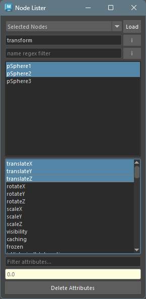

## UI Layout

The window consists of the following elements from top to bottom:

- **selectFilter** (combo box) + **Load** button
- **nodeFilter** (node type filter) + **inherited** toggle
- **matchFilter** (name regex filter) + **ignorecase** toggle
- **Node list**
- **Attribute list**
- **Attribute filter**
- **Value field**
- **Delete Attributes** button

## Usage

### Loading and Filtering Nodes

1. Select a node acquisition method from the combo box.
2. Press the `Load` button to load nodes.
3. Optionally narrow down nodes using the nodeFilter and matchFilter.

### selectFilter Types

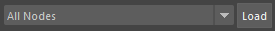

| Filter | Description |
|--------|-------------|
| All Nodes | All nodes in the scene |
| Selected Nodes | Currently selected nodes |
| Shapes of Selected | Shape nodes of the selection |
| Hierarchy of Selected | Selected nodes and all their descendants |
| History of Selected | Construction history of selected nodes |
| Future of Selected | Future history of selected nodes |
| Connections of Selected | Nodes connected to the selection |
| DAG Nodes | All DAG nodes in the scene |

### nodeFilter (Node Type Filter)

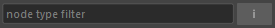

Enter a node type (e.g., `transform`, `joint`, `mesh`) in the text field to display only nodes of that type.

Enable the **i** toggle button on the right to include inherited types in the match.
For example, specifying `transform` with inherited enabled will also show `joint` nodes.

### matchFilter (Name Regex Filter)

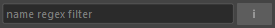

Enter a regular expression pattern in the text field to display only nodes whose names match.

Enable the **i** toggle button on the right for case-insensitive matching.

### Node List Selection

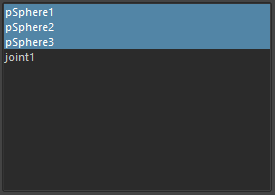

Selecting nodes in the node list also selects them in the Maya scene.
The common attributes of the selected nodes are displayed in the attribute list.

When switching node selection, previously selected attributes are re-selected if they still exist.

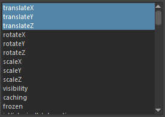

## Changing Attribute Values

1. Select nodes from the node list (multiple selection allowed).
2. Select attributes from the attribute list (multiple selection allowed).
3. Enter a value in the value field and press `Enter` to apply the change.

### Value Field States

When values can be changed, the field is displayed as follows:

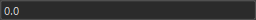

When values cannot be changed, the field color is displayed as follows:

When locked
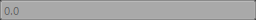

When connected
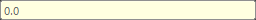

When the node types differ between selected attributes
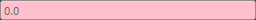


## Changing Attribute State

Right-click on the attribute list to display a context menu.

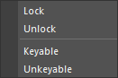

- **Lock** — Lock the selected attributes.
- **Unlock** — Unlock the selected attributes.
- **Keyable** — Show the selected attributes in the channel box.
- **Unkeyable** — Hide the selected attributes from the channel box.

## Deleting Attributes

Press the `Delete Attributes` button to delete the selected attributes from the selected nodes.

## Node List Operations

Right-click on the node list to display a context menu.

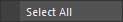

- **Select All** — Select all nodes in the list and in the Maya scene.
