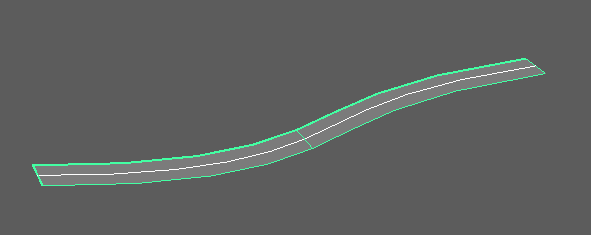

## Overview

This tool creates lofted NURBS surfaces by offsetting the CV positions of selected NURBS curves in specified directions.

You can choose offset directions from arbitrary vectors, curve normals/binormals, or reference mesh/surface normals/binormals.

## How to Launch

Launch the tool from the dedicated menu or use the following command:

```python
import faketools.tools.rig.offset_curve_to_surface.ui
faketools.tools.rig.offset_curve_to_surface.ui.show_ui()
```


## Usage

1. Select NURBS curve(s) (multiple selection supported).
2. Select the offset direction from `Axis`.
3. Configure options as needed.
4. Click the `Create` button to create the surface.



## Options

### Axis (Offset Direction)


Specifies the direction for creating the surface.

* **Vector**
  * Offsets in an arbitrary vector direction.
  * Specify X, Y, Z direction in the `Vector` field.

* **Normal**
  * Offsets in the curve's normal direction.
  * Uses the normal direction at each CV position of the curve.

* **Binormal**
  * Offsets in the curve's binormal direction.
  * Uses the binormal direction (cross product of normal and tangent) at each CV position of the curve.

* **Mesh Normal**
  * Offsets in the reference mesh's normal direction.
  * Requires specifying a mesh in the `Reference` field.
  * Finds the closest point on the reference mesh from each CV position of the curve and uses the normal direction at that point.

* **Mesh Binormal**
  * Offsets in the reference mesh's binormal direction.
  * Requires specifying a mesh in the `Reference` field.
  * Uses the cross product of the mesh's normal direction and the curve's tangent direction.

* **Surface Normal**
  * Offsets in the reference surface's normal direction.
  * Requires specifying a NURBS surface in the `Reference` field.
  * Finds the closest point on the reference surface from each CV position of the curve and uses the normal direction at that point.

* **Surface Binormal**
  * Offsets in the reference surface's binormal direction.
  * Requires specifying a NURBS surface in the `Reference` field.
  * Uses the cross product of the surface's normal direction and the curve's tangent direction.

### Vector (Vector Direction)


Only active when `Axis` is set to `Vector`.

* Specify the offset direction vector using three spinboxes for X, Y, Z.
* The vector is automatically normalized.
* Default value is (0.0, 1.0, 0.0).

### Reference (Reference Object)


Only active when `Axis` is set to `Mesh Normal`, `Mesh Binormal`, `Surface Normal`, or `Surface Binormal`.

* Specify the reference mesh or NURBS surface.
* Select the reference object and click the `<<` button to set it.
* For `Mesh Normal` / `Mesh Binormal`, specify a mesh.
* For `Surface Normal` / `Surface Binormal`, specify a NURBS surface.

### Width (Surface Width)


* **Width**
  * Specifies the width of the surface.
  * Default value is 1.0.
  * Range: 0.001 ~ 10000.0

* **Center**
  * Creates the surface centered at this value relative to the creation direction.
  * At 0.5, the surface has equal width in plus and minus directions.
  * For example, if Width is 10.0 and Center is 0.5, the surface ranges from -5.0 to 5.0.
  * Default value is 0.5.
  * Range: 0.0 ~ 1.0

Image 8: Results with different Width and Center values

## Notes

* Curve degree is automatically obtained from the selected curve.
* Works with both transform nodes and shape nodes selected.
* When multiple curves are selected, surfaces are created for each curve.
* Created surfaces are automatically selected.
* Error occurs if `Vector` is (0, 0, 0).
* When selecting an Axis that requires a reference object, always set an appropriate type of object in the `Reference` field.
