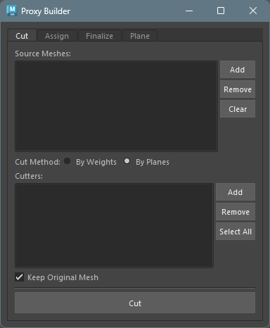
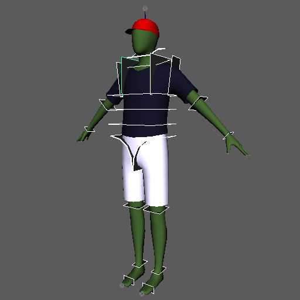
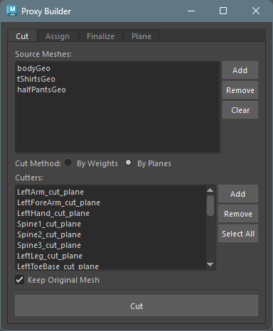
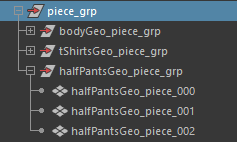
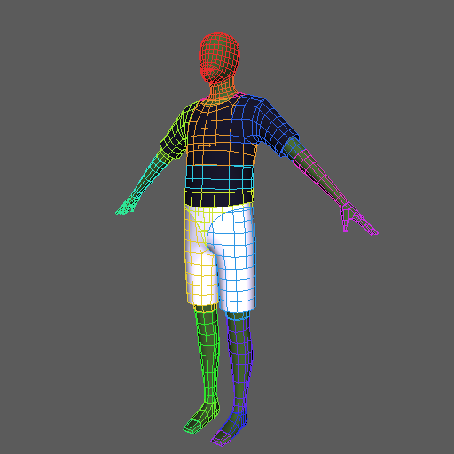
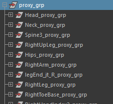
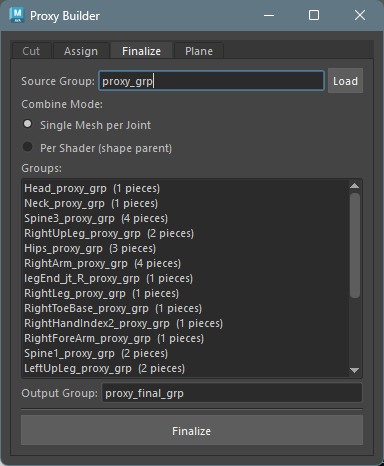
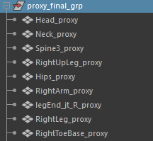
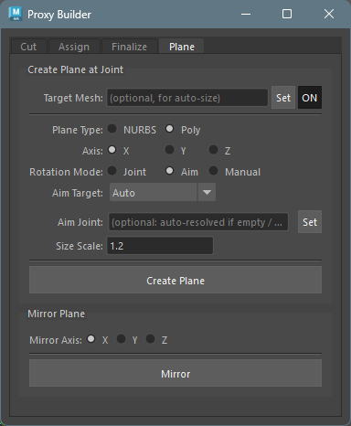
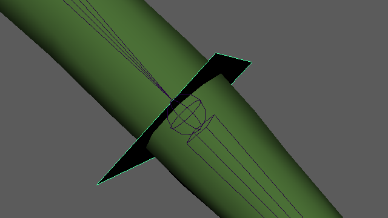

## Overview

Proxy Builder is a tool for splitting a character model into per-bone pieces and assembling proxy geometry that follows each bone. It is used for creating simplified geometry for layout rigs and game engines.

## How to Launch

Launch the tool from the dedicated menu or using the following command:

```python
import faketools.tools.rig.proxy_builder.ui
faketools.tools.rig.proxy_builder.ui.show_ui()
```




## Workflow

The expected basic workflow is as follows:

1. **Cutting the model** --- Split the mesh into per-bone pieces using weight boundaries or cutter planes
2. **Assigning pieces to bones** --- Assign each piece to a bone, generating groups with parentConstraints
3. **Finalizing the model** --- Combine geometry within per-bone groups into the final form

### 1. Cutting the Model



Split the mesh into per-bone pieces using weight boundaries or cutter planes.



1. Activate the `Cut` tab in the tool.

2. Register the model(s) to cut in `Source Meshes`.

3. In `Cut Method`, choose whether to cut by weight boundaries (`By Weights`) or by cutter planes (`By Planes`).
    - `By Weights`: Cuts the mesh at skin weight boundaries. Only works when the meshes registered in `Source Meshes` have skin weights assigned.
    - `By Planes`: Cuts the model using cutter planes (mesh or NURBS surface). Cutter planes can also be created from the `Plane` tab.

4. Click the `Cut` button to cut the model. The cut pieces are generated under **piece_grp**.\
    *To work on a duplicate of the model, enable the `Keep Original Mesh` checkbox before clicking `Cut`.*

    


### 2. Assigning Pieces to Bones



Assign each piece to a bone, generating groups with parentConstraints.\
The purpose is to verify that each piece has been correctly cut to correspond to its skeleton.


1. Activate the `Assign` tab in the tool.

2. List the cut pieces in the upper list. You can bulk-load pieces from the group set in `Piece Group` using `Load`.

3. Next, configure how to distribute the cut pieces to each skeleton. Select the method from `Assign Method`.
    - `By Weights`: Distributes pieces based on the skin weight coverage of the geometry set in `Reference Mesh`.
    - `By Bones`: Distributes pieces based on the distance between each geometry and the bone segments.

4. Register the target bones in the `Joints` list. Required for `By Bones`. For `By Weights`, if the list is empty, bones are automatically determined from the skinCluster node.

5. Click the `Assign & Create Groups` button. Each piece is grouped per bone.

    


### 3. Finalizing the Model

Combine geometry within per-bone groups into the final form.



1. Activate the `Finalize` tab in the tool.

2. Set the groups generated by the `Assign` tab (proxy_grp) in `Source Group` and click `Load`.

3. Select the combine method for each bone's geometry from `Combine Mode`.
    - `Single Mesh per Joint`: Combines pieces into a single mesh as-is.
    - `Per Shader (shape parent)`: Combines only pieces with the same shader, then parents the separate shader shapes under a single transform.
    - *`Per Shader (shape parent)` will produce an error if multiple shaders are assigned within the same shell.*

4. Click the `Finalize` button to generate the combined models.

    

## Plane Tab

A helper tool for creating and mirroring cutter planes used with the `By Planes` option in the `Cut` tab.




### Create Plane at Joint

Creates a cutter plane at a joint's position.\
The plane name is automatically generated from the joint name (e.g., `LeftArm_cut_plane`).

Configure the options, select the joint(s) where you want to create cut planes (multiple selection supported), and execute `Create Plane`.




#### Basic Settings

- **Target Mesh**: Select a reference mesh for automatic size calculation and click `Set` (optional). After setting, use `ON/OFF` to toggle whether to reference it.


#### Plane Type

| Type | Description |
|------|-------------|
| **NURBS** | Creates a NURBS plane |
| **Poly** | Creates a polygon plane |

*For polygons, cutting occurs per face, so use the lowest resolution polygon possible. Polygons with more than 5 faces will produce an error.*


#### Axis

Select the reference axis for the plane's normal direction (X / Y / Z).

#### Rotation Mode

Select how the plane's rotation (normal direction) is determined.

| Mode | Behavior |
|------|----------|
| **Joint** | Uses the joint's world rotation directly |
| **Aim** | Automatically calculates the normal direction based on Aim Target settings |
| **Manual** | Manually enter rotation values |

#### Aim Target (when Rotation Mode is Aim)

| Option | Behavior |
|--------|----------|
| **Auto** | Aims toward the child joint if there is exactly one; otherwise aims away from the parent |
| **Parent** | Aims away from the parent joint (bone progression direction) |
| **Parent > Child** | Aims from the parent joint toward the child joint |

- **Aim Joint**: Explicitly specify a target joint for aiming (optional). When set, the Aim Target selection is ignored.

*When searching for child joints, those with the `io` (intermediateObject) attribute set to `True` are excluded.*

#### Size Scale

When Target Mesh is set, automatic size calculation via raycasting is performed. Size Scale is a multiplier applied to the result.

### Mirror Plane

Mirrors the selected plane(s) along the specified axis. The mirrored name is automatically generated based on left/right patterns (from shared config `mirror_patterns`).

- **Mirror Axis**: Axis to mirror along (X / Y / Z)
- Select the plane(s) and click `Mirror`

## Design Principles

- **Framework-independent**: Uses only standard Maya operations. Does not depend on any specific rig framework's API or naming conventions
- **Verifiable between steps**: Results of each step can be reviewed and adjusted before proceeding to the next
- **Loosely coupled steps**: Minimizes dependencies between steps, allowing you to start from any step
- **Binding without tool API dependency**: The relationship between bones and geometry is readable from the scene structure (naming + parentConstraint)
