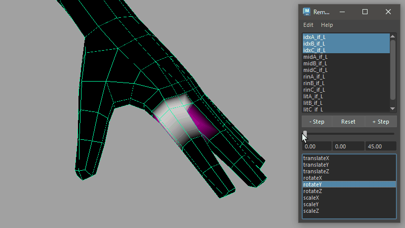
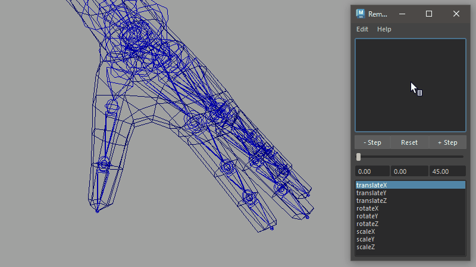
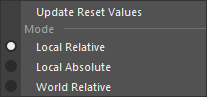
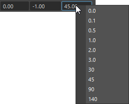

## How to Launch

Launch from the dedicated menu or with the following command.

```python
import faketools.tools.rig.remote_slider_ui
faketools.tools.rig.remote_slider_ui.show_ui()
```

## Usage



1. Select nodes you want to control with the tool. Only transform type nodes are valid.
2. Move cursor to the node list at the top of the tool, right-click **[ Set Items ]** to register nodes to the list.
3. Select registered node name and target attribute from the attribute list at the bottom, and manipulate slider to control values.

## About Each Mode



You can select how to control values with slider from **[ Edit ]** menu. The following modes are available:

- **Local Absolute Mode**
  - In the node's local space, the slider value is directly assigned to that value.
  - At this time, **[ Reset ]** button sets the value to 0 for translate and rotate, or 1 for scale.

- **Local Relative Mode**
  - In the node's local space, the slider value is added to the current value.
  - The current value at this time is recorded in the tool when the node is registered to the list (not accessible by user). This value is also used when **[ Reset ]** button is executed.

- **World Relative Mode**
  - In the node's world space, the slider value is added to the current value.
  - In this mode, only one attribute can be selected, and scale attribute cannot be selected.
  - At this time, **[ Reset ]** button also resets the other three values for that attribute to their original position. For example, when translateX is selected and **[ Reset ]** is executed, translateY and Z values are also reset to the state when the node was registered.

**Values** used for slider behavior and [ Reset ] in Local Relative mode and World Relative mode can be updated with **[ Update Reset Values ]**.


## Options

### **Marking Menu**


Menu that appears when right-clicking the node list. Each has the following functions:

- **Set Items**
  - Registers transform nodes selected in scene to the list.
- **Remove Items**
  - Removes nodes selected in node list from the list.
- **Select All Items**
  - Selects all nodes in the node list.
- **Select Nodes**
  - Actually selects nodes selected in node list in the scene.

### **Step Buttons**

The `+` and `-` **[ Step ]** buttons increase/decrease slider value by a fixed value. The value changes depending on how the button is clicked.

- When clicked without pressing anything
  - Uses value of 1.0.
- When clicked while holding Shift key
  - Uses value of 10.0.
- When clicked while holding Ctrl key
  - Uses value of 0.1.

### Each Numeric Field

Numeric fields aligned at the bottom of slider show slider's minimum value, current value, and maximum value from left. You can directly enter values in each field.



Also, right-clicking minimum and maximum value fields allows you to select commonly used values.
