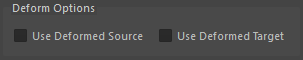
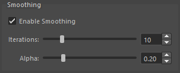
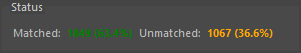

## Overview

Robust Weight Transfer is a skin weight transfer tool based on the SIGGRAPH Asia 2023 paper "Robust Skin Weights Transfer via Weight Inpainting".

Unlike conventional weight transfer tools, it can robustly transfer weights even when the source and target mesh shapes do not perfectly match. For unmatched vertices, the "Weight Inpainting" algorithm estimates appropriate weights from surrounding weight information.

### Basic Operation

1. Find the closest point on the source mesh for each target vertex.
2. Perform matching based on distance and normal angle thresholds. Vertices that don't match due to thresholds become candidates for Weight Inpainting.
3. Transfer source weights directly to matched vertices, and assign Weight Inpainting estimated weights to unmatched vertices.
4. Apply smoothing if needed (optional).
5. Seam vertices normally have separate weights, but you can optionally average weights of vertices at the same position (optional).

## Launch

Launch the tool from the dedicated menu or with the following command.

```python
import faketools.tools.rig.robust_weight_transfer.ui
faketools.tools.rig.robust_weight_transfer.ui.show_ui()
```


## Usage

### 1. Standard Weight Transfer

1. Select the source mesh (with skinCluster) and click `Set`
2. Select the target mesh and click `Add Selected`
3. Click `Transfer`

### 2. Partial Transfer

1. Set the source mesh
2. Select the vertices you want to transfer on the target mesh
3. Click `Add Selected` (displayed in blue in the list)
4. Click `Transfer`

### 3. Matching Verification

1. Set source and target
2. Click `Search` to verify matching results
3. Click `Select Unmatched` to check unmatched vertices
4. Adjust Distance Ratio or Angle as needed
5. Click `Transfer`

※ If all target geometry and vertices are unmatched, weight transfer will not be performed.

### 4. Garment Seam Processing

1. Add all clothing parts (body, collar, sleeves, etc.) to targets
2. Turn on `Average Seam Weights`
3. Click `Transfer`

## Options

### Source

Set the mesh to transfer weights from.


1. Select a mesh with skinCluster
2. Click the `Set` button

### Targets

Set the meshes or vertices to transfer weights to.


- **Add Selected**: Add selected meshes or vertices to the list
- **Remove**: Remove selected items from the list
- **Clear**: Clear all targets
- **Select**: Select the target in the viewport

**About Partial Transfer:**
When you add selected vertices, weights are transferred only to those vertices. They are displayed in blue in the list, with the vertex count shown as `[123 vtx]`.

### Settings

Configure matching parameters.


| Parameter | Description | Default |
|-----------|-------------|---------|
| Distance Ratio | Ratio of distance threshold to bounding box diagonal | 0.05 |
| Angle (degrees) | Normal angle threshold (degrees) | 30.0 |
| Flip Normals | Allow matching with flipped normals | OFF |
| Fast Mode (KDTree) | Fast (slightly less accurate) matching using KDTree | OFF |

**About Distance Ratio:**
Smaller values result in stricter matching. 0.05 means matching within 5% of the diagonal length.

**About Flip Normals:**
Turn this on when normals are flipped between source and target (e.g., clothing lining).

### Deform Options

Options for weight transfer in deformed state.



| Option | Description |
|--------|-------------|
| Use Deformed Source | Evaluate source mesh at current pose |
| Use Deformed Target | Evaluate target mesh at current pose |

Use when transferring weights in a pose other than bind pose. With both enabled, matching is performed based on the current pose shapes.

### Smoothing

Weight smoothing options after transfer.



| Parameter | Description | Default |
|-----------|-------------|---------|
| Enable Smoothing | Enable smoothing | ON |
| Iterations | Number of smoothing iterations | 10 |
| Alpha | Smoothing strength (0.01-1.0) | 0.2 |

Smooths weights estimated by Weight Inpainting for more natural results.

### Seam Averaging

Options for averaging seam vertex weights.


| Parameter | Description | Default |
|-----------|-------------|---------|
| Average Seam Weights | Enable seam averaging | OFF |
| Include Internal Seams | Also average seams within the same mesh | ON |
| Position Tolerance | Distance tolerance for considering vertices at the same position | 0.0001 |

**Use Cases:**
- When clothing collar and body are separate meshes with seam vertices at the same position
- When vertices are split at UV seams but at the same position

**About Include Internal Seams:**
When enabled, vertices at the same position within the same mesh (such as UV seams) are also averaged.

### Status

Displays matching results.



- **Matched**: Number and percentage of matched vertices
- **Unmatched**: Number and percentage of unmatched vertices (estimated by Weight Inpainting)

### Action Buttons

| Button | Description |
|--------|-------------|
| Search | Execute matching search (results displayed in Status) |
| Select Unmatched | Select unmatched vertices in viewport |
| Transfer | Execute weight transfer |

## Basic Workflow


## Preset Menu

Save and load settings as presets.

- **Save Settings...**: Save current settings as a preset
- **Edit Settings...**: Edit or delete presets
- **Reset Settings...**: Reset all settings to defaults
- **Preset name**: Load a saved preset

**Note:** Source and Targets are not included in presets.

## Technical Details

### Weight Inpainting Algorithm

Weights for unmatched vertices are solved as an optimization problem using a Laplacian matrix. This computes smoothly interpolated weights from surrounding weight information.

### Dependencies

- **numpy**: Numerical computation (included in Maya 2022+)
- **scipy**: Sparse matrix operations (included in Maya 2022+)
- **robust-laplacian**: Fast Laplacian computation (optional, fallback implementation available)

If `robust-laplacian` is not installed, the built-in fallback implementation is used.

## Troubleshooting

### Low Match Rate

- Increase Distance Ratio (e.g., 0.05 → 0.1)
- Increase Angle (e.g., 30 → 45)
- Try turning on Flip Normals

### Weights Not Smooth

- Increase Smoothing Iterations
- Increase Smoothing Alpha

### Issues with Deformed State

- Turn on both Use Deformed Source and Use Deformed Target
- Or return to bind pose before transfer

### Seam Averaging Not Working

- Increase Position Tolerance (e.g., 0.0001 → 0.001)
- Verify vertices are actually at the same position
