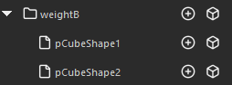

## Overview

Can save skin weights to file and import to other geometry.
However, cannot import to already bound geometry.

## How to Launch

Launch the tool from the dedicated menu or with the following command.

```python
import faketools.tools.rig.skinWeights_import_export_ui
faketools.tools.rig.skinWeights_import_export_ui.show_ui()
```


## Usage

There are **Quick Mode** for temporarily saving skin weights and **Advanced Mode** for saving to file.

### Export

1. Select geometry bound with skinCluster (multiple selection allowed).

- **Quick Mode**: Press `Export` button to save skin weights.
- **Advanced Mode**: Select file format, enter export group name (folder name), and press `Export` button to save skin weights.

### Import

- **Quick Mode**: Press `Import` button to load saved skin weights.
- **Advanced Mode**: Select group or file to import from list and press `Import` button to load saved skin weights.

Import is not performed in the following cases:

- When geometry to import doesn't exist.
- When influences to import don't exist.
- When influences to import are bound.

**How to Select Geometry During Import**

- To import to geometry selected during export, deselect everything before importing. Searches for that name from scene as target geometry.
- To import to geometry with different name from geometry selected during export, select geometry to import before importing.

### Select Weight Data Elements



In `Advanced Mode` weight data list, clicking icon on right side of each data allows you to select that data's elements.

**Select Influences**


**Select Geometry**


## Options

### Context Menu


Right-clicking on each button in `Quick Mode` or on tree view in `Advanced Mode` displays context menu.

- Delete
  - Deletes selected data.
- Open Directory
  - Opens directory where data is saved in Explorer.

## File Format

 

Selects file format when exporting in `Advanced Mode`. Clicking button switches format.\
Select whether to save file in binary format (`pickle`) (left) or text format (`json`) (right).
