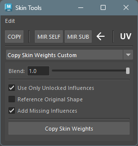
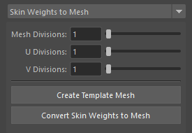
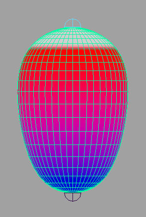
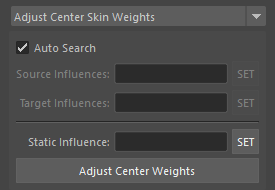

## Notes

SkinCluster operations in this tool are based on several prerequisites:
- Assumes skinCluster method is Classic Linear and does not support other methods.
- Does not support multiple skinCluster support introduced in Maya 2024 and later.

## Usage

Launch the tool from the dedicated menu or with the following command.

```python
import faketools.tools.rig.skin_tools.ui
faketools.tools.rig.skin_tools.ui.show_ui()
```



## Edit Menu


- **Select Influences**
  - When you select geometry and vertices (multiple objects allowed) and execute, selects influences of skinCluster set for them.
  - When vertices are selected, selects only influences with weights of 0 or more for those vertices.
- **Rebind SkinCluster**
  - When you select geometry and vertices (multiple objects allowed) and execute, rebinds skinCluster set for them at the positions of its influences.
- **Prune Small Weights**
  - When you select geometry and execute, sets weights of influences with weights less than 0.005 to 0. Unlike Maya's standard function, ignores locked influences.
- **Remove Unused Influences**
  - When you select geometry (multiple selection allowed) and execute, removes influences with all weights of 0 from that skinCluster.
- **Average Skin Weights**
  - When you select vertices and execute, averages weights of selected vertices.
- **Average Skin Weights Shell**
  - When you select geometry and execute, averages weights of selected geometry per shell.

## Skin Tools Bar

Copies and mirrors weights.\
If destination is not bound, automatically creates skinCluster.


### Copy

Copies and mirrors weights.

Performs weight copy.

1. Select source geometry.
2. Select destination geometry (multiple selection allowed).
3. Press `COPY` button to copy source weights to destination. When referencing UV, check `UV` checkbox.

This tool forcibly adds influences set in source geometry to destination geometry's skinCluster.

### Mirror Self

Mirrors weights.

1. Select geometry.
2. Press `MIR SELF` button to mirror weights of selected geometry. At this time, select mirroring direction with arrow button. For `<-`, mirrors from X to -X, for `->`, mirrors from -X to X.

This tool searches for left and right influences set in selected geometry, and if opposite influences are found, forcibly adds those influences to skinCluster.

### Mirror Sub

Mirrors weights to different geometry.

Usage example: For example, when mirroring weights of left and right shoes of a character wearing shoes.

1. Select left shoe geometry.
2. Press `MIR SUB` button. Steps executed at this time are as follows:
   1. Generates right shoe geometry name from left shoe geometry name.
   2. If right shoe geometry is found, converts influence names set in left shoe geometry from left to right names.
   3. If converted influence names exist in right shoe geometry, forcibly adds those influences to skinCluster or creates new skinCluster and adds them.
   4. Copies weights set in left shoe geometry to right shoe geometry.

※ Method for searching opposite geometry and influences is the same as Mirror Self.


## Copy Skin Weights Custom

Copies weights from mesh to other shapes.


### Usage

To copy weights, follow these steps:

1. Select source geometry.
2. Select destination geometry (multiple selection allowed).
3. Select weight copy method and press `Copy Skin Weights` button.

### Options

- **Blend**
  - Copies weights at specified ratio.
- **Use Only Unlocked Influences**
  - Uses only unlocked influences for copying.
- **Reference Original Shape**
  - References original shape (Intermediate Object) for copying.
- **Add Missing Influence**
  - Automatically adds influences that don't exist in destination during copy.


## Skin Weights to Mesh

Duplicates geometry with skinCluster applied to different mesh while preserving weight information.\
Source geometry must be mesh or NURBS surface.





### Usage

To duplicate, follow these steps:

1. Select geometry with skinCluster set (multiple selection allowed).
2. If selected geometry is mesh, set `Mesh Division`; if NURBS surface, set `U Division` and `V Division`.
3. Press `Convert Skin Weights to Mesh` button.

Pressing `Create Template Mesh` button creates geometry that becomes preview of duplicated mesh. In preview state, you can change each division value from UI.


## Adjust Center Skin Weights

Adjusts weights of vertices with weights applied.



Mainly adjusts weights of vertices at center position. Here, "center position" refers to vertices located on left-right symmetry axis of geometry.

"Adjustment" means making weight values of influences with left-right meaning the same for center position. For example, if center vertex has three influences (spine and left-right shoulders) with weights of 0.4, 0.2, 0.4 respectively, using this tool adjusts them to 0.4, 0.3, 0.3 respectively.

### Usage

#### When Auto Search is Enabled

When `Auto Search` is enabled, automatically searches for paired influences from selected vertices' skin cluster.
Automatic search is performed by regular expression from `ADJUST_CENTER_WEIGHT` described in `settings.json`.

#### When Auto Search is Disabled


1. Select one of left or right influences (multiple allowed) for `Source Influences` and press `SET` button.
2. Select influences paired with `Source Influences` for `Target Influences` and press `SET` button.
3. Press `Adjust Center Weights` button.

When no influence is registered in `Static Influence`, average value of source and target influence pairs is set.

On the other hand, when influence is registered in `Static Influence`, source influence weight value is applied to target influence. If total of all influence weight values exceeds 1.0 as a result, that difference is subtracted from Static Influence.

## Combine Skin Weights

Combines weights from multiple influences to one influence.


### Usage

To combine weights, follow these steps:

1. Select source influences (multiple allowed) for `Source Influences` and press `SET` button.
2. Select destination influence for `Target Influence` and press `SET` button.
3. Press `Combine Skin Weights` button.

## Relax Skin Weights

Smooths and relaxes weights.


### Usage

To smooth and relax weights, follow these steps:

1. Select components.
2. Select smooth type from top menu.
3. Set options.
4. Press `Relax Skin Weights` button.

### Options

- **Iterations**
  - Sets smooth iteration count. More iterations smooth weights more.
- **After Blend**
  - Sets ratio to blend original weights with smoothed weights after smoothing. 0.0 for original weights, 1.0 for smoothed weights.
- **Use Only Unlocked Influences**
  - Smooths using only unlocked influences. Somewhat experimental feature.


## Influence Exchange

Exchanges already bound influences with unbound influences.


### Usage

To exchange influences, follow these steps:

1. Select skin clusters to exchange for `Target SkinClusters` and press `SET` button.
2. Select source influences to exchange for `Binding Influences` and press `SET` button. All influences set here must be bound to skin clusters set in `Target SkinClusters`.
3. Select destination influences to exchange for `Exchange Influences` and press `SET` button. All influences set here must not be bound to skin clusters set in `Target SkinClusters`.
4. Press `Exchange Influences` button.
