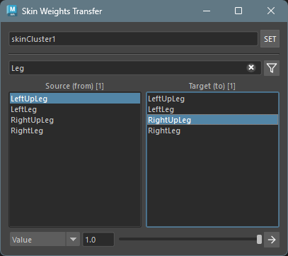

## Overview

Skin Weights Transfer is a tool for moving skin weights from multiple source influences to a single target influence on selected components.

Weights are proportionally removed from source influences and added to the target influence. The transfer amount can be specified as a percentage or an absolute value.

Soft Selection is supported — components in the falloff region are automatically included, and the transfer amount is scaled by each component's soft selection weight.

## Launch

Launch the tool from the dedicated menu or with the following command.

```python
import faketools.tools.rig.skin_weights_transfer.ui
faketools.tools.rig.skin_weights_transfer.ui.show_ui()
```




## Usage

To transfer weights, follow these steps:

1. Select a mesh or components with a skinCluster and click the `SET` button to set the skinCluster.
2. In the left **Source (from)** list, select the influences to take weights from (multi-select: Ctrl+click / Shift+click).
3. In the right **Target (to)** list, select a single influence to receive the weights.
4. Select the target vertices, CVs, or lattice points (when Soft Selection is enabled, components in the falloff region are also included).
5. Select the **transfer mode** (Percentage / Value).
6. Set the transfer amount using the **Amount** slider.
7. Click the execute button to transfer the weights.

## Options

### SkinCluster

Sets the skinCluster to operate on.

- Select a mesh or components and click the `SET` button to automatically detect the skinCluster assigned to the selected object.
- The detected skinCluster name is displayed in the field.

### Influence Filter

Filters the influence list display.

- **Text Filter**: Enter space-separated keywords to show only influences containing any of the keywords (OR search).
- **Affected Only button**: When enabled, only influences with non-zero weights on the currently selected components are shown. Items are sorted by total weight in descending order. The list updates in real-time as the Maya selection changes.

### Source (from) List

Select the influences to take weights from.

- Multiple influences can be selected (Ctrl+click / Shift+click).
- The number of selected influences is shown in the label as `[N]`.
- Selected influences are highlighted in the Maya viewport.

### Target (to) List

Select the influence to receive weights.

- Only one influence can be selected.
- The same influence cannot be set as both source and target (when source is a single influence).

### Transfer Mode (Percentage / Value)

Select the transfer method.

- **Percentage**: Specifies the transfer amount as a percentage (0-100%) of the total source influence weights.
- **Value**: Specifies the transfer amount as an absolute value (0.0-1.0). If the value exceeds the total source weight, it is clamped to the source total.

### Amount

Specifies the transfer amount according to the selected mode.

**Percentage mode (default):**

- **100%**: Transfers all weights from source influences to the target.
- **50%**: Transfers half of the source influence weights to the target.
- **0%**: No weights are transferred.

**Value mode:**

- **1.0**: Transfers up to 1.0 weight to the target (clamped to the source total).
- **0.1**: Transfers up to 0.1 weight to the target.

When multiple source influences are selected, each source's weight is proportionally reduced based on its share of the total.

### Soft Selection Support

When Maya's Soft Selection is enabled, components in the falloff region are automatically included. The transfer amount for each component is multiplied by its Soft Selection weight (0.0-1.0).

- **Weight 1.0** (directly selected): The specified Amount is applied in full.
- **Weight 0.5** (mid-falloff): 50% of the Amount is applied.
- **Weight 0.0** (outside range): No weight is transferred.

When Soft Selection is disabled, transfer is applied equally to all selected components as usual.

**Note:** The Affected Only filter is not affected by Soft Selection and only references directly selected components.

## How Weight Transfer Works

The following calculation is performed for each component:

1. Calculate the total weight of all source influences.
2. Determine the transfer amount based on the mode, then multiply by the Soft Selection weight.
3. Proportionally reduce each source influence based on its share of the total.
4. Add the total reduced amount to the target influence.

**Percentage mode formula:**

```
transfer_amount = source_total × (Amount / 100) × soft_selection_weight
```

**Value mode formula:**

```
transfer_amount = min(Amount × soft_selection_weight, source_total)
```

**Example (Percentage mode):**

- Source A weight: 0.6, Source B weight: 0.3, Amount: 50%, Soft Selection weight: 1.0
- Transfer amount: (0.6 + 0.3) × 0.5 × 1.0 = 0.45
- Reduction from Source A: 0.45 × (0.6 / 0.9) = 0.30 → remaining 0.30
- Reduction from Source B: 0.45 × (0.3 / 0.9) = 0.15 → remaining 0.15
- Added to Target: +0.45

**Example (with Soft Selection):**

- Same conditions with Soft Selection weight of 0.5
- Transfer amount: (0.6 + 0.3) × 0.5 × 0.5 = 0.225
- Reduction from Source A: 0.225 × (0.6 / 0.9) = 0.15 → remaining 0.45
- Reduction from Source B: 0.225 × (0.3 / 0.9) = 0.075 → remaining 0.225
- Added to Target: +0.225

## Supported Components

The following component types are supported:

- Vertices
- CVs (Control Vertices)
- Lattice Points

An error occurs if the selected components do not belong to the skinCluster's geometry.
