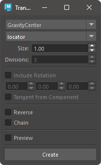

## How to Launch

Launch the tool from the dedicated menu or with the following command.

```python
import faketools.tools.rig.transform_creator_ui
faketools.tools.rig.transform_creator_ui.show_ui()
```



### Basic Usage

1. Select transform creation method from dropdown menu at top.
2. Select transform nodes or components in scene.
3. Set other options. Options that are not grayed out can be set.
4. Press **[ Create ]** button to create transform nodes.

※ Selectable components are: Vertex, Edge, Face, CurveCV, CurveEP, SurfaceCV.

### Options

- **Node Type**
  - Select either locator or transform.
- **Divisions**
  - Only valid when creation method is innerDivide. Sets how many divisions between selected nodes.
- **IncludeRotation**
  - Sets whether to include rotation attribute in created transform nodes.
- **Offset rotation values**
  - Sets values to offset rotation for created transform nodes.
- **Tangent from Component**
  - For Vertex, Edge, obtains tangent vector from components connected to that component and sets rotation.
- **Reverse**
  - When transform nodes are created by duplication, reverses their order.
- **Chain**
  - When transform nodes are created by duplication, makes them chain-like hierarchy structure.

### Creation Methods

- **GravityCenter**
  - Creates transform node at center of gravity of selected nodes.
- **BoundingBoxCenter**
  - Creates transform node at center of bounding box of selected nodes.
- **EachPositions**
  - Creates transform nodes at each position of selected nodes.
- **InnerDivide**
  - Divides between selected nodes and creates transform nodes between them.
