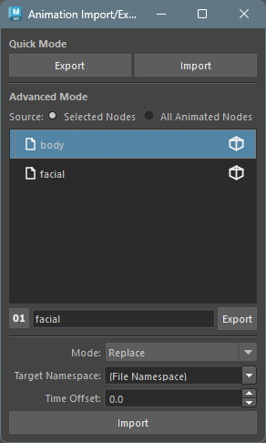

## 概要

時間ベースのキーフレームアニメーションをファイルに保存し、別のシーンやノードにインポートすることができます。
ネームスペースごとに自動的にファイルが分割され、インポート時には別のネームスペースへの適用も可能です。

## 起動方法

専用のメニューか、以下のコマンドでツールを起動します。

```python
from faketools.tools.anim.anim_import_export import ui
ui.show_ui()
```




## 使用方法

一時的にアニメーションを保存する場合の **Quick Mode** と、ファイルに保存する場合の **Advanced Mode** があります。

### エクスポート

1. アニメーションが設定されたノードを選択します（複数選択可）。

- **Quick Mode** : `Export` ボタンを押して、アニメーションをバイナリ形式で一時保存します。
- **Advanced Mode** : ファイルフォーマットを選択し、エクスポートするファイル名を入力して、`Export` ボタンを押してアニメーションを保存します。

`Source` の設定により、エクスポート対象を切り替えることができます。

- **Selected Nodes** : 選択しているノードのアニメーションをエクスポートします。
- **All Animated Nodes** : シーン全体のアニメーションノードをエクスポートします。

ノードに複数のネームスペースが含まれる場合は、ネームスペースごとに自動的にファイルが分割されます。
例えば、ファイル名を `walk` と入力した場合、ネームスペース `char` のノードは `walk.char.json` として保存されます。

### インポート

- **Quick Mode** : `Import` ボタンを押して、一時保存したアニメーションを読み込みます。
- **Advanced Mode** : リストからインポートするファイルを選択し、`Import` ボタンを押してアニメーションを読み込みます。

以下の場合はスキップされ、警告がログに出力されます。

- インポート先のノードがシーンに存在しない場合。
- インポート先のアトリビュートが存在しない場合。

## インポートオプション

### Mode

- **Replace** : 既存のキーフレームをすべて削除してからインポートします。
- **Merge** : 既存のキーフレームを残したままインポートします。同じフレームのキーフレームは上書きされます。

### Target Namespace

インポート先のネームスペースを指定します。

- **(File Namespace)** : ファイルに保存されたネームスペースをそのまま使用します。
- **(No Namespace)** : ネームスペースなしでインポートします。
- **シーン内のネームスペース** : ドロップダウンにシーン内のネームスペースが一覧表示されます。
- **カスタム入力** : 任意のネームスペースを直接入力することもできます。

### Time Offset

インポートするキーフレームのフレームをオフセットします。
例えば `10` を指定すると、すべてのキーフレームが 10 フレーム後ろにずれてインポートされます。マイナス値も指定可能です。

## ノード選択ボタン

ファイルリストの各ファイルの右側にあるアイコンボタンをクリックすると、そのファイルに含まれるアニメーション適用先のノードをシーン内で選択します。
`Target Namespace` の設定に応じて、検索するネームスペースが変わります。

## コンテキストメニュー

`Quick Mode` の各ボタン上と、`Advanced Mode` のリスト上で右クリックすると、コンテキストメニューが表示されます。

- **Delete** : 選択したファイルを削除します（Advanced Mode のみ）。
- **Open Directory** : データが保存されているディレクトリをエクスプローラーで開きます。

## ファイルフォーマット

`Advanced Mode` でエクスポートする際のファイルフォーマットを選択します。トグルボタンで切り替えます。

- **バイナリ形式** (`pickle`) : 高速な読み書きが可能です。大量のアニメーションデータに適しています。
- **テキスト形式** (`json`) : 人間が読める形式で保存されます。デバッグやバージョン管理に適しています。
