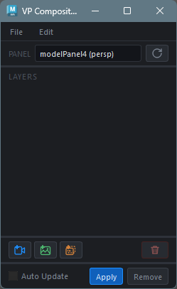
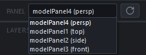
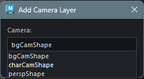
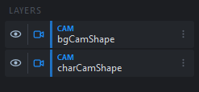
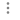
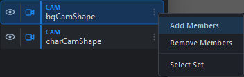
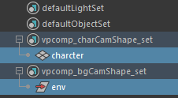
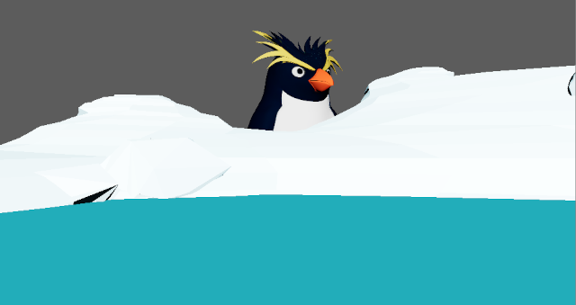
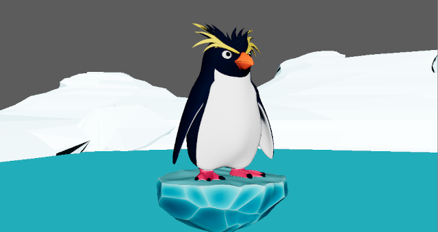
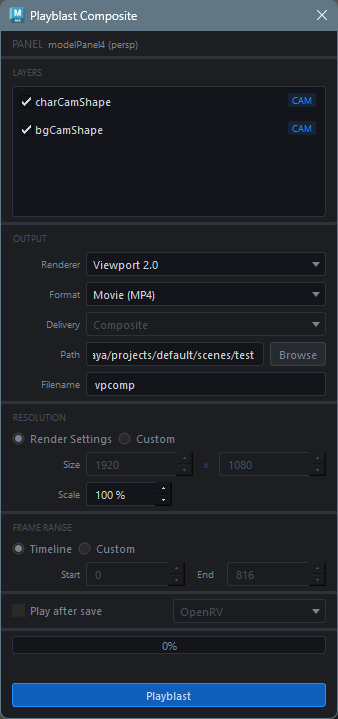

## 概要

VP Compositor は、Maya のビューポート上で **Photoshop 風のレイヤー合成** を行うツールです。VP2 RenderOverride を使用して、複数のカメラ映像・静止画・画像シーケンスをリアルタイムに重ね合わせて表示します。

合成結果は PNG シーケンスや MP4 動画として書き出すことができ、アニメーション作業における **レイアウト確認** や **リファレンス映像のオーバーレイ** に活用できます。

> 現在はプレビュー版であり、最低限の機能を追加しています。

### 主な機能

- リアルタイムのレイヤー合成表示（VP2 RenderOverride）
- ドラッグ＆ドロップによるレイヤー並び替え
- 4 種類のフィッティングモード（ビューポート / フィルムゲート基準）
- Playblast 機能（合成・レイヤー個別・動画出力）
- レイヤー構成の JSON エクスポート / インポート


## 起動方法

専用のメニューか、以下のコマンドでツールを起動します。

```python
import faketools.tools.anim.vpcomp.ui
faketools.tools.anim.vpcomp.ui.show_ui()
```




## UI 構成

メインウィンドウは以下の要素で構成されています。

| 領域 | 説明 |
|------|------|
| パネルセレクター | 合成対象のモデルパネルを選択するドロップダウン |
| レイヤーリスト | 合成レイヤーの一覧（最前面が上、ドラッグで並び替え可能） |
| 追加ボタン群 | Camera / Image / Sequence レイヤーの追加ボタン |
| Auto Update | チェックすると、レイヤー変更時にオーバーライドを自動更新 |

### メニューバー

| メニュー | 内容 |
|----------|------|
| File > Export Layers | 現在のレイヤー構成を JSON ファイルに保存 |
| File > Import Layers | JSON ファイルからレイヤー構成を読み込み |
| Edit > Playblast | Playblast ウィンドウを開く |

## 基本的な使い方例

### 1. パネルセレクターで対象のビューポートを選択

合成に使用するパネルを選択します。 



ここでは、**persp** を選択します。


### 2. レイヤーを追加（Camera / Image / Sequence）

追加したいレイヤーのボタンを選択します。  

 ボタンからカメラレイヤーを追加します。

開いたダイアログからカメラを選択します。  


ここでは、**charCamShape (キャラクター用カメラ)**、**bgCamShape (背景モデル用)** の順でレイヤーを追加します。  



### 3. レイヤーにオブジェクトを登録

Camera レイヤーを追加すると `vpcomp_<カメラ名>_set` という objectSet が自動作成されます。VP2 オーバーライドで特定カメラのオブジェクトのみを表示するには、この objectSet へオブジェクトを追加します。  

オブジェクトを選択し、カメラレイヤーの右側にある  アイコンから追加できます。



それぞれのレイヤーに必要なオブジェクトを追加してください。




### 4. VP2 オーバーライドを適用

`Apply` ボタンをクリックして VP2 オーバーライドを適用すると、以下のように **persp** パネルに **charCam** と **bgCam** が合成表示されます。



上の画像のように合成順に問題がある場合は、レイヤーをドラッグ＆ドロップして順序を入れ替えることができます。
> `Auto Update` のチェックボックスがオンの場合はレイヤーの構成が変更されたタイミングでビューが自動的に更新されます。



### 5. 必要に応じてプレイブラストを作成

必要に応じて `Edit` メニューの `to playblast...` から `Playblast Composite` ウィンドウを起動してプレイブラストを作成します。


## レイヤーについて

### レイヤーの種類

レイヤーには以下の種類があります。

| タイプ | バッジ | 説明 |
|--------|--------|------|
| Camera | CAM | カメラ + objectSet によるシーン描画レイヤー |
| Image | IMG | 静止画オーバーレイレイヤー（PNG / JPG） |
| Sequence | SEQ | 連番画像レイヤー（タイムラインに同期） |


### レイヤーの操作

#### 表示 / 非表示

レイヤーリスト左端の目のアイコンをクリックすると、レイヤーの表示 / 非表示を切り替えます。

#### 並び替え

レイヤーをドラッグ＆ドロップして描画順序を変更できます。リストの上が最前面、下が背面です。

#### コンテキストメニュー

レイヤーリスト右端のメニューアイコンをクリックすると、レイヤーの種類に応じたコンテキストメニューが表示されます。

**Camera レイヤー:**

| 項目 | 説明 |
|------|------|
| Add Members | 選択中のオブジェクトを objectSet に追加 |
| Remove Members | 選択中のオブジェクトを objectSet から削除 |
| Select Set | objectSet のメンバーを選択 |

**Image / Sequence レイヤー:**

| 項目 | 説明 |
|------|------|
| Fit Mode | フィッティングモードの変更 |


### フィッティングモード

Image レイヤーと Sequence レイヤーの配置方法を指定します。

| モード | 説明 |
|--------|------|
| Viewport Height | ビューポートの高さに合わせて表示（幅はアスペクト比に応じてスケール） |
| Viewport Width | ビューポートの幅に合わせて表示（高さはアスペクト比に応じてスケール） |
| Filmgate Height | カメラのフィルムゲートの高さに合わせて表示 |
| Filmgate Width | カメラのフィルムゲートの幅に合わせて表示 |

> **Note**: Filmgate 系のモードは、CameraLayer が存在する場合にのみ正しく動作します。CameraLayer がない場合は Viewport 系にフォールバックします。


### レイヤー構成のエクスポート / インポート

**File > Export Layers** で現在のレイヤー構成を `.vpcomp.json` ファイルとして保存できます。

**File > Import Layers** で保存したレイヤー構成を読み込みます。インポート時にはシーン内のカメラやファイルの存在が検証され、不足がある場合は警告が表示されます。Camera レイヤーの objectSet が存在しない場合は自動作成されます。


## Playblast

**Edit > Playblast** メニューから Playblast ダイアログを開きます。



### 設定項目

#### レイヤー選択

合成に含めるレイヤーをチェックボックスで選択します。最前面のレイヤーがリストの上に表示されます。

#### レンダラー

使用する VP2 レンダラーを選択します。Viewport 2.0 および登録済みの VP2 オーバーライドから選択できます。

#### 出力フォーマット

| フォーマット | 説明 |
|-------------|------|
| Image Sequence | PNG シーケンスとして出力 |
| Movie | H.264 MP4 動画として出力（ffmpeg が必要） |

#### デリバリーモード

Image Sequence 選択時に使用可能です。

| モード | 説明 |
|--------|------|
| Composite | 全レイヤーを合成した単一シーケンスを出力 |
| Per-Layer | レイヤーごとに個別のシーケンスを出力（サブフォルダに分割） |
| Both | Composite と Per-Layer の両方を出力 |

> **Note**: Movie 出力の場合、デリバリーモードは自動的に Composite 固定になります。

#### 出力先

| 項目 | 説明 |
|------|------|
| Path | 出力ディレクトリ |
| Filename | ファイル名プレフィックス（デフォルト: `vpcomp`） |

#### 解像度

| モード | 説明 |
|--------|------|
| Render Settings | Maya シーンの Render Settings（defaultResolution）を使用 |
| Custom | 幅と高さを手動で指定 |

**Scale** スライダーで解像度に対するスケール比率（1〜100%）を設定できます。

#### フレーム範囲

| モード | 説明 |
|--------|------|
| Timeline | Maya タイムラインの再生範囲を使用 |
| Custom | 開始・終了フレームを手動で指定 |

#### Play after save

チェックを入れると、書き出し完了後に指定したプレイヤーで結果を再生します。

| プレイヤー | 説明 |
|-----------|------|
| OpenRV | rvpush 経由で OpenRV に送信（rvpush が PATH に必要） |
| Sync Player | FakeTools の Sync Player で再生 |
| System Default | OS のデフォルトアプリケーションで開く |

> **Note**: プレイヤーのドロップダウンは「Play after save」チェックがオフの場合はグレーアウトされます。

### Playblast の実行

**Apply** ボタンをクリックすると Playblast が開始されます。進行状況はプログレスバーで確認でき、処理中に **Cancel** で中断可能です。

#### 処理の流れ

1. **キャプチャ**: 各 Camera レイヤーの映像を `cmds.playblast()` で取得
2. **合成**: Pillow を使用してフレームごとにレイヤーを重ね合わせ
3. **出力**: PNG シーケンスの保存、または ffmpeg による MP4 エンコード

### 設定の保存

Playblast ダイアログの設定は自動的に保存され、次回起動時に復元されます。

## レイヤーの制限

- 各レイヤータイプの最大値は 5 つまでに制限されています。
- カメラレイヤーで同じカメラを指定することはできません。

## 外部依存

| 依存 | 用途 | 必須 |
|------|------|------|
| Pillow | Playblast 時のレイヤー合成 | Playblast 使用時のみ |
| ffmpeg | MP4 動画エンコード | Movie 出力時のみ |

> **Note**: Pillow がインストールされていない場合、Playblast メニューは無効になります。ffmpeg が PATH に含まれていない場合、Movie フォーマットは選択できません。

## 注意事項

- VP2 RenderOverride はパネル単位で適用されます。合成対象のパネルを変更する場合は、先に現在のオーバーライドを解除してください
- Camera レイヤーの objectSet が空の場合、そのレイヤーには何も描画されません
- Playblast 中はビューポートの状態（カメラ、表示設定、背景など）が一時的に変更され、完了後に元の状態に復元されます
- Image / Sequence レイヤーのフィルムゲートフィッティングは、シーン内に CameraLayer が存在する場合にのみ有効です
