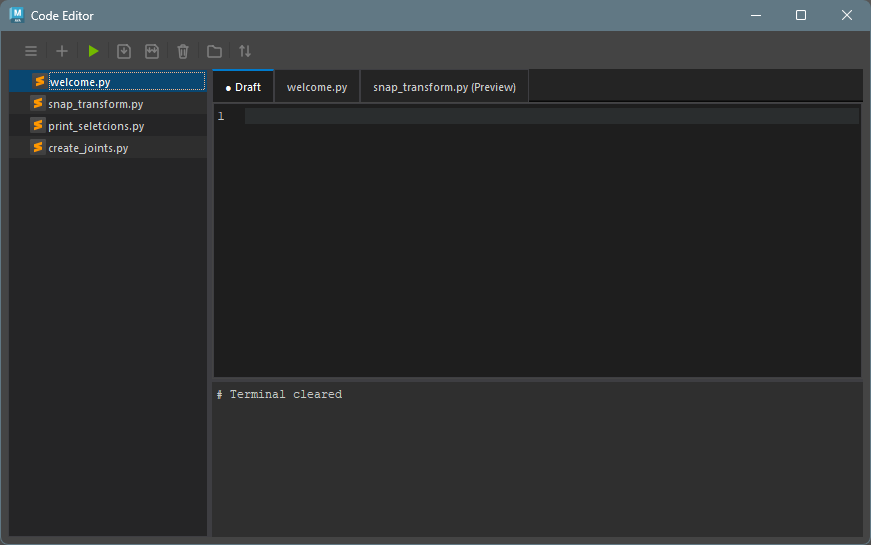

## 概要

Maya 用のカスタム Python コードエディターです。\
シンタックスハイライト、ファイルエクスプローラー、ターミナルなどの機能を備えています。


## 起動方法

専用のメニューか、以下のコマンドでツールを起動します。

```python
import faketools.tools.common.code_editor.ui
faketools.tools.common.code_editor.ui.show_ui()
```

```python
import faketools.tools.common.code_editor.ui
faketools.tools.common.code_editor.ui.show_ui(floating=True)
```

`floating=True` を指定すると、フローティングウィンドウとして起動します。\
`floating=False` (デフォルト) を指定すると、Maya のメインウィンドウにドッキングします。


## インターフェース

ツールのインターフェースは以下の主要なコンポーネントで構成されています。



### ツールバー

ツールバーは、ファイルの作成や保存、コードの実行などの主要なアクションに素早くアクセスできます。\
→ 詳細は [ツールバーのドキュメント](code_editor_toolbar.html) を参照してください。


### ファイルエクスプローラー

ファイルエクスプローラーは、プロジェクトのディレクトリ構造を表示し、ファイルの管理を容易にします。\
→ 詳細は [ファイルエクスプローラーのドキュメント](code_editor_file_explorer.html) を参照してください。


### コードエディター

コードエディターは、シンタックスハイライト、エラーチェックなどの高度なコード編集機能を提供します。\
→ 詳細は [コードエディターのドキュメント](code_editor_editor.html) を参照してください。


### ターミナル

ターミナルは、コードの実行結果やエラーメッセージを表示します。\
→ 詳細は [ターミナルのドキュメント](code_editor_terminal.html) を参照してください。


## コードを実行する

1. ツールバーの ＋ アイコンをクリックして新しいファイルを作成します。
2. コードエディターに Python コードを入力します。
3. ツールバーの ▶ アイコンをクリックしてコードを実行します。
4. アウトプットコンソールに実行結果が表示されます。

## 設定ファイル

ツールは、以下の場所に設定ファイルを保存します。

* ユーザー設定: `%MAYA_APP_DIR%/faketools_workspace/common/code_editor/config/user_settings.json`
* セッション: `%MAYA_APP_DIR%/faketools_workspace/common/code_editor/config/session.json`
* ワークスペース設定: `%MAYA_APP_DIR%/faketools_workspace/common/code_editor/config/workspace.json`
* ワークスペースファイル: `%MAYA_APP_DIR%/faketools_workspace/common/code_editor/workspace/`
* オートセーブ: `%MAYA_APP_DIR%/faketools_workspace/common/code_editor/workspace/.maya_code_editor_backups/`

詳細な設定については、[ユーザー設定](code_editor_settings.html)をご覧ください。
