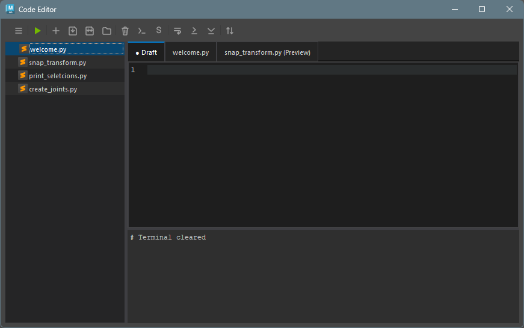
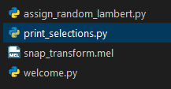
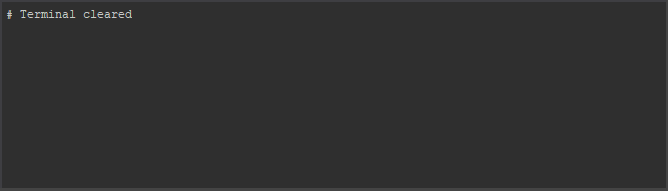

## 概要

Maya 用のカスタムコードエディターです。\
**Python** と **MEL** の両方をサポートしており、シンタックスハイライト、ファイルエクスプローラー、ターミナルなどの機能を備えています。

言語ごとの機能差は内部の言語プロファイルによって制御されており、ハイライト・インデント・コードフォールディング・右クリックメニュー・シェルフ登録などが言語に応じて切り替わります。

- [ツールバー](code_editor_toolbar.html)
- [ファイルエクスプローラー](code_editor_file_explorer.html)
- [コードエディター](code_editor_editor.html)
- [ターミナル](code_editor_terminal.html)
- [ユーザー設定](code_editor_settings.html)


## 起動方法

専用のメニューか、以下のコマンドでツールを起動します。

```python
import faketools.tools.common.code_editor.ui
faketools.tools.common.code_editor.ui.show_ui()
```

```python
import faketools.tools.common.code_editor.ui
faketools.tools.common.code_editor.ui.show_ui(floating=True)
```

`floating=True` を指定すると、フローティングウィンドウとして起動します。\
`floating=False` (デフォルト) を指定すると、Maya のメインウィンドウにドッキングします。


## インターフェース

ツールのインターフェースは以下の主要なコンポーネントで構成されています。



### ツールバー

ツールバーは、ファイルの作成や保存、コードの実行などの主要なアクションに素早くアクセスできます。\
→ 詳細は [ツールバーのドキュメント](code_editor_toolbar.html) を参照してください。


### ファイルエクスプローラー

ファイルエクスプローラーは、プロジェクトのディレクトリ構造を表示し、ファイルの管理を容易にします。\
→ 詳細は [ファイルエクスプローラーのドキュメント](code_editor_file_explorer.html) を参照してください。



### コードエディター

コードエディターは、シンタックスハイライト、エラーチェックなどの高度なコード編集機能を提供します。\
→ 詳細は [コードエディターのドキュメント](code_editor_editor.html) を参照してください。


### ターミナル

ターミナルは、コードの実行結果やエラーメッセージを表示します。\
→ 詳細は [ターミナルのドキュメント](code_editor_terminal.html) を参照してください。



## コードを実行する

1. ツールバーの言語別の ＋ アイコン (Python / MEL) をクリックして新しいファイルを作成します。
2. コードエディターにコードを入力します。
3. ツールバーの ▶ アイコンをクリックしてコードを実行します。
4. アウトプットコンソールに実行結果が表示されます。

実行は、ファイルの拡張子に応じて Python または MEL の executer に自動でルーティングされます。\
ファイルエクスプローラーの Run ボタンや、ファイルを開かずに行うクイック実行も同じく拡張子から言語を判定します。

## 設定ファイル

ツールは、以下の場所に設定ファイルを保存します。

* ユーザー設定: `%MAYA_APP_DIR%/faketools_workspace/common/code_editor/config/user_settings.json`
* セッション: `%MAYA_APP_DIR%/faketools_workspace/common/code_editor/config/session.json`
* ワークスペース設定: `%MAYA_APP_DIR%/faketools_workspace/common/code_editor/config/workspace.json`
* ワークスペースファイル: `%MAYA_APP_DIR%/faketools_workspace/common/code_editor/workspace/`

未保存タブやドラフトの内容は session.json に常時バックアップされるため、別途のオートセーブ機構は廃止されています。

詳細な設定については、[ユーザー設定](code_editor_settings.html)をご覧ください。
