## 概要

コードエディターは実際にコードを書くための主要なインターフェースです。\
シンタックスハイライト、エラーチェックなどの高度なコード編集機能を提供します。

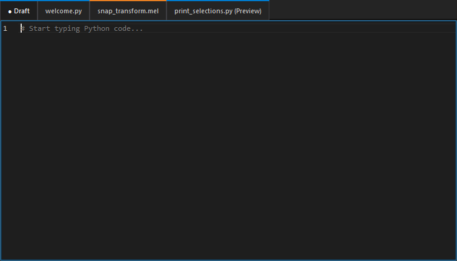

## タブ管理

### Draft タブ

Draft タブは、コードの一時的なメモやスニペットを保存するためのスペースです。\
このタブは、常に表示され閉じることはできません。

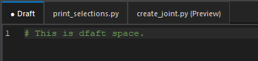

### 永続タブとプレビュータブ

コードエディターでは、ファイルを永続タブまたはプレビュータブで開くことができます。
この二つのタブは、実際にファイルを編集するためのタブです。

ファイルエクスプローラーのファイルをクリックすることで、以下のようにタブが開きます。

- **永続タブ**: ファイルを **ダブルクリック** して開くと、永続タブとして開きます。\
    永続タブは、複数のファイルを同時に開いて編集できます。\
    編集中のファイルは、タブ上にアスタリスク (*) が表示されます。
    
  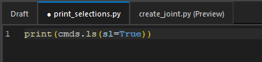

- **プレビュータブ**: ファイルを **シングルクリック** して開くと、プレビュータブとして開きます。\
    プレビュータブは、1 つのタブで複数のファイルを順番にプレビューできます。\
    新しいファイルをプレビューすると、前のプレビュー内容は上書きされます。

  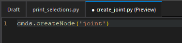

二つのタブは、ドラッグアンドドロップで順番を入れ替えることができます。\
また、タブの上で中クリックすることにより、タブを閉じることができます。

## 検索/置換

コードエディターでは、検索と置換の機能が組み込まれています。\
Ctr+F/Ctrl+H で検索/置換ダイアログが表示されます。

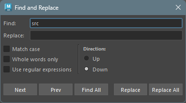

**フィールド**

- **Find:** 検索する文字列を入力します。
- Replace: 置換する文字列を入力します。

**チェックボックス**

- Match case: オンの場合、大文字と小文字を区別して検索します。
- Whole words only: オンの場合、完全一致する単語のみを検索します。
- Use regular expression: オンの場合、正規表現を使用して検索します。

**検索方向 ( Direction )**

- Up: カーソルの上方向に向かって検索します。
- Down: カーソルの下方向に向かって検索します。

**ボタン**

- Next: 次の一致する箇所に移動します。
- Prev: 前の一致する箇所に移動します。
- Find All: 一致するすべてを選択しマルチカーソルモードにします。
- Replace: 現在の一致する箇所を置換します。
- Replace All: 一致するすべての箇所を置換します。

## マルチカーソル

コードエディターでは、マルチカーソル機能をサポートしています。\
Ctrl キーを押しながらクリックすることで、複数のカーソルを配置できます。

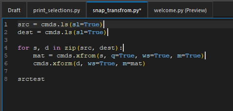

マルチカーソルモード中も、通常の編集操作が可能です。\
例えば、選択やコピー、貼り付け、削除などが行えます。

マルチカーソルモードでの主なショートカットキーは以下の通りです。

| ショートカットキー         | 機能説明                       |
|---------------------------|-------------------------------|
| Ctrl+Click                | カーソルを追加                |
| Ctrl+Drag                 | 選択範囲を追加                |
| Middle-Click+Drag         | 矩形/列選択                   |
| Ctrl+D                    | 次の出現箇所                  |
| Ctrl+Shift+L              | すべての出現箇所              |
| Alt+Shift+I               | 行末にカーソルを追加           |
| Escape                    | カーソルをクリア              |

## コードフォールディング

コードエディターは Python のインデントベースのコードフォールディングをサポートしています。\
折り畳み可能なブロック（`def`、`class`、`if`、`for`、`while`、`try`、`with` など）は、行番号の横のガター領域にシェブロンインジケータが表示されます。

- シェブロンインジケータは折り畳みガター領域にマウスをホバーすると表示され、マウスが離れるとフェードアウトします。
- 折り畳まれたブロックは常に右向きシェブロン（›）とプレースホルダサマリー（例: `... (5 lines)`）が表示されます。

### 折り畳み/展開操作

| 操作 | 方法 |
|------|------|
| ブロックの折り畳み/展開 | ガターのシェブロン（˅/›）をクリック |
| 再帰的に折り畳み/展開 | Shift+クリック |
| 現在のブロックを折り畳み | Ctrl+Shift+[ |
| 現在のブロックを展開 | Ctrl+Shift+] |
| 全て折り畳み | Ctrl+Alt+[ またはツールバーボタン |
| 全て展開 | Ctrl+Alt+] またはツールバーボタン |

### 他の機能との連携

- **検索/置換**: 検索結果が折り畳み領域内にある場合、自動的に展開されます。
- **マルチカーソル**: 追加されたカーソルが折り畳み領域内にある場合、自動的に展開されます。
- **行操作**: 折り畳みヘッダ行の移動・複製・削除時は、自動的に展開されてから操作が実行されます。

## オートコンプリート

コードエディターは [jedi](https://github.com/davidhalter/jedi) ベースのオートコンプリートを搭載しており、Python の標準ライブラリ、ユーザー変数、および Maya API (`maya.cmds` / `maya.api.OpenMaya`) に対して候補を表示します。

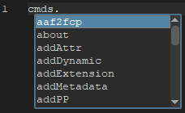

### 起動と確定

| 操作 | 動作 |
|------|------|
| `.` を入力 | 属性補完を起動 (例: `sys.` → `argv`, `exit`, `path`, ...) |
| 識別子文字を入力 | popup が開いている間は絞り込み |
| ↑ / ↓ / PageUp / PageDown / Home / End | 候補の移動 |
| Enter / Tab | ハイライト中の候補で確定 |
| Escape | popup を閉じる |

確定は Tab / Enter のみで、`.` や `(` 等の文字を打ってもそのままテキストとして入力されるので、途中で他の記号を打っても意図しない確定が起きません。ハイライトは常に最上行から始まるので、候補が確定したい形なら Enter / Tab をすぐに押せます。Popup のフォントはコードエディターのフォントとサイズに追従し、Ctrl+マウスホイールでの拡大縮小にも自動で反映されます。

### 候補の並び順

入力プレフィックスに **前方一致する候補が先頭** に並び、それ以外の部分一致（大文字小文字を無視した substring）は後ろに続きます。例えば `get` と入力した場合、`getAttr` や `getPoints` のような前方一致が先に並び、`widgetGet` のような中間一致は後段に並びます。同一カテゴリ内では MRU とアルファベット順で整列されます。

### Maya API への対応

- **ビルトイン stub**: `maya.cmds` と `maya.api.OpenMaya` の `.pyi` stub が各 Maya バージョン向けに同梱されています。利用者側での追加セットアップは不要です。
- **import 不要**: スクラッチバッファで `cmds.polyCube` と書くだけで補完が効きます。エディタ内部で仮想的な import 文を jedi に渡しているためです。
- **対応エイリアス**: `cmds`, `mc`, `maya`, `OpenMaya`, `om`, `om2`。
- **ユーザー変数**: `x = cmds.ls()` のように戻り値を代入した後は、その変数に対しても実行時の `dir()` ベースで補完されます (例: `x.` → `append`, `extend` 等)。

### 数値リテラルの扱い

`0.` や `1.5` のように `.` の直前が数字の場合は浮動小数点リテラルとして扱い、popup は表示しません。

### MRU (Most Recently Used)

同じセッション内で確定した候補は、次回以降の popup で上位に表示されます。セッションを閉じるとリセットされます。

### 無効化

ツールバーの [Toggle Autocomplete](code_editor_toolbar.html) ボタンまたは **Ctrl+Space** で機能全体を ON/OFF できます。OFF 時は jedi への問い合わせが発生しないため、低スペック PC でタイピング速度に影響しません。設定はセッション間で保持されます。jedi が未インストールの場合はボタン・ショートカットともに無反応になります。

### パフォーマンスの特性と注意事項

以下はオートコンプリートの設計上の挙動です。導入時・デバッグ時の参考にしてください。

**初回補完のレイテンシ**

- `cmds.` / `om.` / `OpenMaya.` の **最初の 1 回** は stubs 全件を取り込むため時間がかかります (ローカル配置で約 1 秒、ネットワークドライブ配置で約 2〜6 秒)。
- 2 回目以降の同じルートに対するタイピングはキャッシュヒットで即時 (1〜2 ms)。
- `cmds` と `om` は別キャッシュなので、それぞれ初回に 1 度ずつコストが発生します。

**ネットワークドライブ配置時の挙動**

- ツールや stubs を DFS 等のネットワークドライブに置いた場合、**初回の Maya 起動**のみ populate が数秒かかります。
- jedi は parse 済みの stubs を `%LOCALAPPDATA%\jedi\Jedi\` にキャッシュするため、**2 回目以降の Maya 起動では短縮**されます (概ね 1.5〜2 倍速)。
- キャッシュは stubs の絶対パス + 更新時刻をキーとするため、stubs を更新する or パスを変更すると次回の 1 回だけ再生成が発生します。

**動的モジュール (file-less) の補完順序**

- `__file__` / `__path__` を持たない動的生成モジュール (社内パイプラインの一部など) では、候補を取得する際のカテゴリ分類 (`param` / `keyword` / `function` 等) を省略します。
- このため補完順序は「関数が先」のような区分けが失われ、**純アルファベット順** になります。
- これは、ネットワーク越しの動的モジュールに対してカテゴリ分類を行うとキーストロークあたり数秒のレイテンシが発生するためのトレードオフです (補完候補自体は全て正しく表示されます)。

**プラグインロードで追加されたコマンド**

- Maya の `loadPlugin` で `cmds.*` に新コマンドが追加されても、既にキャッシュ済みの補完リストにはその場では反映されません。
- 新コマンドを候補に出すには、Code Editor を一度閉じて開き直してください。

## ドキュメントポップアップ

**Ctrl+Shift+Space** でキャレット位置（または補完リストでハイライト中）のシンボルの docstring を浮動ウィンドウに表示します。VS Code の hover ポップアップに近い見た目で、シグネチャ、パラメータ、戻り値、Raises、Examples などを色分けして描画します。

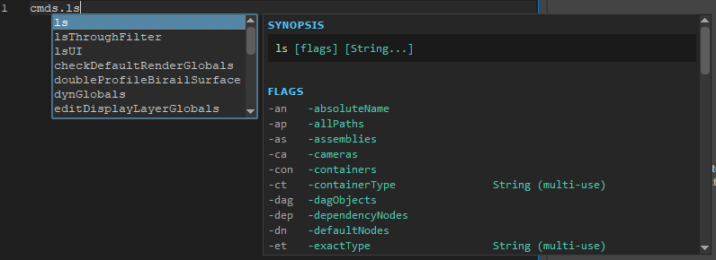

### 表示の起動と対象

| 補完リストの状態 | 表示対象 |
|---|---|
| 開いている | リストで **現在ハイライト中の候補** の docstring |
| 閉じている | キャレット位置の識別子の docstring |

補完リストが開いている間は、↑ / ↓ で選択を動かすとポップアップの内容もそれに追従して更新されます（軽いデバウンス付き）。

### スクロール

長い docstring はポップアップ内部でスクロールできます。マウスホイールに加え、**Ctrl+Shift+↑ / Ctrl+Shift+↓** で数行ずつキーボードスクロールが可能です（ポップアップ表示中のみ有効）。

### 閉じる方法

- **Escape**
- **Ctrl+Shift+Space** をもう一度押す（トグル）
- 補完リストが開閉した場合（コンテキストが変わったと見なして自動で閉じる）
- Code Editor ウィンドウの最小化・非表示

ポップアップ自体はフォーカスを奪わないため、表示中でもキャレット操作や補完リストの操作は通常どおり行えます。

### 描画の特徴

- **シグネチャ行**: 先頭にコードブロックとして切り出し、関数名や引数・デフォルト値を構文ハイライトします。
- **構造化 docstring** (numpydoc / Google / RST): `docstring_parser` でパースし、Parameters / Returns / Raises / Examples などをセクション見出しと色付きラベルで描画します。
- **Maya コマンド** (`cmds.polyCube` 等): 実行時に `maya.cmds.help(name)` の出力を取得して、Synopsis / Flags / Return value / Modes / Examples の各セクションを専用スタイルで描画します。スタブには無い最新の情報が得られます。
- **C 実装オブジェクト** (numpy の ufunc、OpenMaya の MFn* 系メソッド等): スタブに docstring が含まれない場合でも、実行時の `__doc__` をフォールバックとして取得して表示します。

### 依存ライブラリ

リッチ描画には以下のオプション依存を使用します。未インストールでもポップアップは動作しますが、表示が簡素化されます。

- **Pygments**: シンタックスハイライト（未インストール → コードはプレーンテキスト）。
- **docstring_parser**: セクション構造のパース（未インストール → 段落ベースのプレーン描画にフォールバック）。

いずれも [Dependency Installer](dependency_installer.html) からインストールできます。

## 特殊なコンテキストメニューの機能

コンテキストメニュー（右クリックメニュー）には、コードエディター特有の機能がいくつかあります。

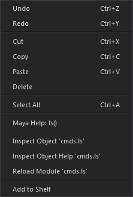

### コマンドヘルプ表示

コンテキストメニューから Maya の **python (cmds)** と **OpenMaya (om)** コマンドのヘルプがブラウザで表示できます。

ドキュメントを表示するには、`cmds` に続く関数名を以下のように選択します。

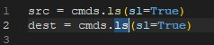

選択後、コンテキストメニューから **Maya Help: <function_name>** を選択します。

対応しているコマンドは以下の通りです。\
対応文字列に続く関数名のヘルプが表示されます。

| モジュール名 |  対応文字列 |
|---|---|
| maya.cmds | cmds, mc |
| maya.api.OpenMaya | om, OpenMaya |
| maya.api.OpenMayaUI | omui, OpenMayaUI |
| maya.api.OpenMayaAnim | oma, OpenMayaAnim |
| maya.api.OpenMayaRender | omr, OpenMayaRender |

### Inspect Object (Help)

コンテキストメニューから Maya のオブジェクトの中身を調べることができます。

オブジェクトの文字列を選択し **Inspect Object: <object_name>** か **Inspect Object Help: <object_name>** を実行します。\
実行するとターミナルにオブジェクトの情報が表示されます。

**Inspect Object の例**

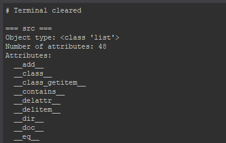

### リロード

コンテキストメニューから選択したモジュールをリロードできます。

モジュールの文字列を選択し **Reload Module: <module_name>** を実行します。\
実行するとそのモジュールがリロードされます。

### Add to Shelf

コンテキストメニューから選択中のコードをアクティブな Maya シェルフに追加できます。

登録したいコードを選択し、コンテキストメニューから **Add to Shelf** を選択します。\
現在アクティブなシェルフタブにシェルフボタンが作成されます。\
ツールバーの Add to Shelf ボタンと同じ機能です。

## ショートカットキー

コードエディターで使用できる主なショートカットキーは以下の通りです。

| ショートカットキー         | 機能説明                       |
|---------------------------|-------------------------------|
| Ctrl+N                    | 新規ファイル作成               |
| Ctrl+S                    | 現在のファイルを保存           |
| Ctrl+Shift+S              | すべての開いているファイルを保存 |
| Ctrl+D                    | 次の出現箇所を選択（マルチセレクション） |
| Ctrl+Shift+D              | 現在の行を複製                 |
| Ctrl+Shift+K              | 現在の行を削除                 |
| Ctrl+L                    | 現在の行を選択（繰り返しで拡張） |
| Ctrl+Shift+Up/Down        | 行を上下に移動                 |
| Ctrl+/                    | 行コメントの切り替え           |
| Tab / Shift+Tab           | 選択のインデント/インデント解除  |
| Enter                     | 自動インデント付きのスマート改行 |
| Ctrl+Click                | クリック位置にカーソルを追加     |
| Ctrl+Drag                 | 選択範囲を追加（ドラッグして異なるコードを選択） |
| Middle-Click+Drag         | 矩形/列選択（矩形エリア内のテキストを選択） |
| Ctrl+D                    | 単語を選択して次の出現箇所を追加  |
| Ctrl+Shift+L              | 現在の単語のすべての出現箇所を選択 |
| Alt+Shift+I               | 選択内の行末にカーソルを追加     |
| Escape                    | すべてのマルチカーソルをクリア   |
| Ctrl+F                    | 検索ダイアログ                 |
| Ctrl+H                    | 置換ダイアログ                 |
| F3 / Shift+F3            | 次/前を検索                    |
| Ctrl+Enter                | 現在の行または選択を実行       |
| Numpad Enter              | 現在のスクリプトを実行（実行ボタンと同じ） |
| Ctrl+Shift+Enter          | ファイル全体を実行             |
| Ctrl+Shift+[              | 現在のブロックを折り畳み       |
| Ctrl+Shift+]              | 現在のブロックを展開           |
| Ctrl+Alt+[                | 全て折り畳み                   |
| Ctrl+Alt+]                | 全て展開                       |
| Ctrl+Space                | オートコンプリートの ON/OFF    |
| Ctrl+Shift+Space          | ドキュメントポップアップの表示/非表示 |
| Ctrl+Shift+↑ / ↓          | ドキュメントポップアップのスクロール（表示中のみ） |
| Ctrl+K                    | ターミナル出力をクリア         |
| Ctrl+MouseWheel           | フォントサイズの調整           |
