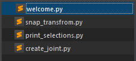
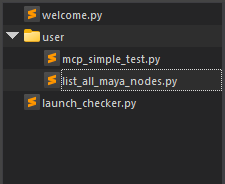
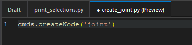
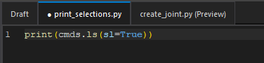

## 概要

ファイルエクスプローラーは、プロジェクトのディレクトリ構造を表示し、ファイルの管理を容易にします。

## 機能説明

### ディレクトリツリー操作

ファイルエクスプローラーには、プロジェクトのルートディレクトリが表示されます。

新規のディレクトリは、右クリックメニューの `New Folder` から作成できます。\
また、ファイルを Drag & Drop で移動することも可能です。

そのほかにも、右クリックメニューから以下の操作が可能です。

| 操作             | 説明                                                         |
|------------------|--------------------------------------------------------------|
| **Open**         | 選択したファイルをエディタで開きます。                        |
| **New Python File** | 選択したディレクトリに新しい Python ファイルを作成します。   |
| **New Folder**   | 選択したディレクトリに新しいフォルダを作成します。            |
| **Copy**         | 選択したファイルまたはフォルダをコピーします。                |
| **Cut**          | 選択したファイルまたはフォルダを切り取ります。                |
| **Paste**        | コピーまたは切り取ったファイルまたはフォルダを貼り付けます。  |
| **Rename**       | 選択したファイルまたはフォルダの名前を変更します。            |
| **Delete**       | 選択したファイルまたはフォルダを削除します。                  |
| **Refresh**      | ディレクトリツリーを更新します。                              |

### ファイルをタブで開く

エクスプローラー上のファイルをクリックすると、そのファイルがエディタの新しいタブで開きます。\
それぞれ、クリックするとプレビュータブで開き、ダブルクリックすると永続タブで開きます。

プレビュータブは、1 つのタブで複数のファイルを順番にプレビューできます。

**プレビュータブ**

**永続タブ**

### ファイルを開かず実行

python ファイルをエクスプローラーでホバーすることにより、右端に  ボタンが表示されます。

`Run` ボタンをクリックすると、そのファイルをエディタで開かずに直接実行できます。

## ショートカットキー

ファイルエクスプローラーには、以下のショートカットキーが割り当てられています。

| 操作               | ショートカットキー          |
|--------------------|-----------------------------|
| Copy              | `Ctrl + C`                  |
| Cut               | `Ctrl + X`                  |
| Paste             | `Ctrl + V`                  |
| Rename            | `F2`                        |
