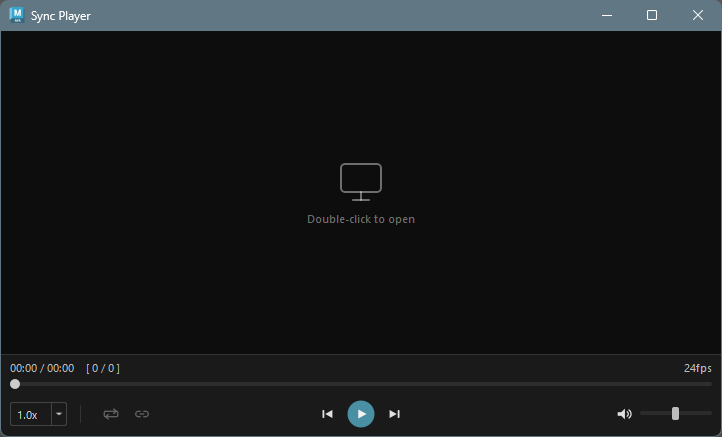
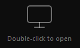
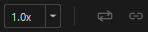

## 概要

Sync Player は、Maya 内でビデオファイルを再生するためのツールです。通常のビデオプレイヤーとして使用できるほか、**Maya タイムラインとの同期機能**を搭載しており、リファレンス映像を確認しながらアニメーション作業を行うことができます。

### 対応フォーマット

mov, avi, mp4, wmv

## 起動方法

専用のメニューか、以下のコマンドでツールを起動します。

```python
import faketools.tools.common.sync_player.ui
faketools.tools.common.sync_player.ui.show_ui()
```



## UI 構成

ウィンドウは以下の要素で構成されています。

| 領域 | 説明 |
|------|------|
| ビデオ表示エリア | ビデオの映像が表示される領域。未読み込み時はプレースホルダーが表示される |
| 時間/フレーム表示 | 現在の再生位置と総時間、フレーム番号を表示 |
| FPS 表示 | 読み込んだビデオのフレームレートを表示 |
| シークバー | 再生位置を操作するスライダー |
| コントロールバー | 再生操作、各種設定のボタン群 |

## 基本的な使い方

### ビデオファイルの読み込み



以下のいずれかの方法でビデオファイルを開きます。

- ビデオ表示エリアを**ダブルクリック**するとファイルダイアログが開きます
- ビデオ再生中はダブルクリックによるファイル読み込みはブロックされます

> **Note**: Maya Sync が有効な場合、ダブルクリックによるファイル読み込みは無効になります。

### 再生コントロール


コントロールバー中央のボタンで再生操作を行います。

| ボタン | 説明 |
|--------|------|
| 前のフレーム | 1フレーム戻る |
| 再生 / 一時停止 | 再生と一時停止を切り替え |
| 次のフレーム | 1フレーム進む |

### シークバー

シークバーをドラッグして、任意の再生位置にジャンプできます。

- 一時停止中にシークバーをドラッグすると、ドラッグ中は内部的に再生状態になり映像が更新されます。ドラッグを離すと一時停止状態に戻ります。

### 時間/フレーム表示

シークバーの上に現在の再生情報が表示されます。

```
MM:SS / MM:SS    [ 現在フレーム / 総フレーム数 ]
```

## コントロールバー



### 再生速度

左側のドロップダウンから再生速度を選択できます。

| 速度 | 説明 |
|------|------|
| 0.25x | 4分の1速度 |
| 0.5x | 半分の速度 |
| 0.75x | 4分の3速度 |
| 1.0x | 通常速度（デフォルト） |
| 1.25x | 1.25倍速 |
| 1.5x | 1.5倍速 |
| 2.0x | 2倍速 |

### ループ再生

 ボタンをクリックすると、ビデオの終端に達した際に自動的に先頭から再生を繰り返します。

ループがオンの場合は、ボタンアイコンが、 に変更されます。

### Maya Sync（タイムライン同期）

 ボタンをクリックすると、Maya タイムラインとの同期モードが有効になります。

Sync がオンの場合は、ボタンアイコンが、 に変更されます。

#### 同期モードの動作

- **同期有効時**: ビデオの再生位置が Maya のタイムラインに連動します
  - Maya でタイムラインを再生すると、ビデオも同時に再生されます
  - Maya の再生を停止すると、ビデオも一時停止します
  - タイムラインをスクラブ（ドラッグ）すると、ビデオが対応するフレームにシークします
- **同期無効時**: 通常のビデオプレイヤーとして独立して動作します

#### 同期中のコントロール制限

同期モードが有効な間は、以下のコントロールが無効になります。

- 再生 / 一時停止ボタン
- フレーム送り / 戻しボタン
- 再生速度の変更
- ループ再生の切り替え
- シークバーの操作

これは、ビデオの再生が Maya のタイムラインに完全に制御されるためです。

#### FPS の不一致に関する警告

同期を有効にした際、ビデオの FPS と Maya シーンの FPS が異なる場合、警告メッセージが表示されます。FPS が異なると、フレーム送りやフレーム番号の表示がビデオの実際のフレームと一致しない場合があります。

### 音量コントロール


右側にミュートボタンと音量スライダーがあります。

| コントロール | 説明 |
|-------------|------|
| ミュートボタン | 音声のオン/オフを切り替え |
| 音量スライダー | 音量を 0〜100 の範囲で調整 |

## キーボードショートカット

| キー | 説明 |
|------|------|
| Space | 再生 / 一時停止の切り替え |
| Right / Up | 次のフレームに進む |
| Left / Down | 前のフレームに戻る |

> **Note**: Maya Sync が有効な場合、キーボードショートカットは無効になります。

## 設定の保存

ウィンドウを閉じる際、以下の設定が自動的に保存され、次回起動時に復元されます。

- 音量
- ミュート状態
- ループ再生の有効/無効
- 再生速度

## 対応フォーマットの拡張

Sync Player は Qt の QMediaPlayer を使用しており、再生可能なフォーマットは OS のメディアバックエンドに依存します。

### Windows

Windows では **Windows Media Foundation (WMF)** がバックエンドとして使用されます。標準で mp4 (H.264)、wmv、avi などに対応していますが、追加のコーデックをインストールすることで対応フォーマットを増やすことができます。

| コーデックパック | 説明 |
|-----------------|------|
| [K-Lite Codec Pack](https://codecguide.com/) | 幅広いフォーマットに対応する定番コーデックパック。Basic 版で十分です |
| [LAV Filters](https://github.com/Nevcairiel/LAVFilters) | FFmpeg ベースの DirectShow フィルター。K-Lite にも同梱されています |

コーデックパックをインストールすると、WebM (VP9)、MKV、HEVC (H.265) など、標準では再生できないフォーマットも WMF 経由で再生可能になります。

> **Note**: コーデックパックのインストール後、Maya の再起動が必要です。

## 注意事項

- ビデオの読み込みには Windows Media Foundation (WMF) バックエンドが使用されます。まれにバックエンドが応答しなくなる場合がありますが、ツールが自動的にプレイヤーを再作成してリトライします
- ビデオの読み込みが 10 秒以内に完了しない場合、タイムアウトとなりプレースホルダー画面に戻ります
