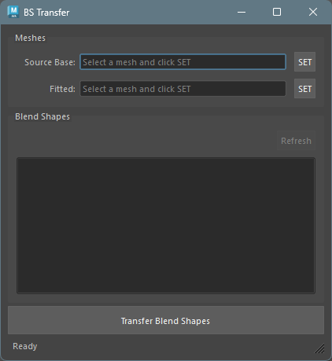

## 概要

ソースベースメッシュのブレンドシェイプを、フィッティング済みメッシュに転送するツールです。\
デルタ（頂点の差分）ベースの転送を行い、同一トポロジーのメッシュ間で動作します。


## 起動方法

専用のメニューか、以下のコマンドでツールを起動します。

```python
import faketools.tools.model.blendshape_transfer.ui
faketools.tools.model.blendshape_transfer.ui.show_ui()
```



## 使用方法

1. ブレンドシェイプを持つ元のメッシュをビューポートで選択し、`SET` ボタンで **Source Base** に登録します。\
   登録すると、ブレンドシェイプのリストが自動的に読み込まれます。

   [Source Base を設定した状態の画像]

2. 転送先のメッシュ（Mesh Fitter でフィッティング済みのメッシュなど）を選択し、`SET` ボタンで **Fitted** に登録します。

3. ブレンドシェイプリストから転送したいブレンドシェイプを選択します（複数選択可能）。

   [ブレンドシェイプを選択した状態の画像]

4. `Transfer Blend Shapes` ボタンを押して転送を実行します。

5. 転送結果のメッシュが自動的に作成・選択されます。作成されるメッシュの名前は `{元の名前}_transfer` になります。


## Meshes セクション

[Meshes セクションの画像]

- **Source Base**: ブレンドシェイプを持つ元のメッシュ。ビューポートでメッシュを選択し `SET` ボタンで登録します。
- **Fitted**: 転送先のメッシュ。同様に `SET` ボタンで登録します。


## Blend Shapes セクション

[Blend Shapes セクションの画像]

Source Base メッシュに接続されているブレンドシェイプの一覧が表示されます。

- **Refresh ボタン**: ブレンドシェイプリストを再読み込みします。Source Base が登録されている場合のみ有効です。
- **リスト**: 利用可能なブレンドシェイプが表示されます。`Shift` キーや `Ctrl` キーを使って複数選択が可能です。


## 転送の仕組み

転送はデルタベースの方式で行われます。

1. ブレンドシェイプの頂点位置からソースベースの頂点位置を引いて、差分（デルタ）を計算します。
2. 計算されたデルタをフィッティング済みメッシュの頂点位置に加算します。
3. 結果をフィッティング済みメッシュの複製に適用します。

※ ソースベースメッシュとフィッティング済みメッシュのトポロジー（頂点数）が一致している必要があります。


## 注意事項

- ソースベースとフィッティング済みメッシュの頂点数が異なる場合、転送はスキップされます。
- 転送できなかったブレンドシェイプがある場合、ステータスバーにスキップ数が表示されます。
- `Transfer Blend Shapes` ボタンは、両方のメッシュが登録され、かつブレンドシェイプが選択されている場合のみ有効になります。
