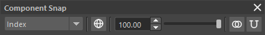

## 概要

ソースのコンポーネント（頂点、CV、ラティスポイント）をターゲットメッシュの位置にスナップするツールです。

主な機能:

- **複数のマッチング方式**: インデックス一致、最近接サーフェス位置、最近接頂点の3種類
- **ブレンド**: スナップ率を 0〜100% で調整可能
- **Soft Selection 対応**: Maya の Soft Selection ウェイトに従ったグラデーションスナップ
- **複数コンポーネントタイプ**: メッシュ頂点（`.vtx`）、カーブ/サーフェス CV（`.cv`）、ラティスポイント（`.pt`）に対応
- **空間モード**: ワールド空間 / ローカル空間の切り替え

## 起動方法

専用のメニューか、以下のコマンドでツールを起動します。

```python
import faketools.tools.model.component_snap.ui
faketools.tools.model.component_snap.ui.show_ui()
```



## 使用方法

### 基本操作

1. ソースメッシュのコンポーネント（頂点など）を**コンポーネントモード**で選択します。
2. ターゲットメッシュを **Ctrl + クリック** でオブジェクトとして追加選択します。
3. マッチング方式を選択し、**Snap** ボタンまたは **Blend** ボタンをクリックします。

### マッチング方式

| 方式 | 説明 |
|------|------|
| Index | ソースとターゲットの頂点インデックスが同じコンポーネント同士を対応付けます。同一トポロジのメッシュ間で使用します。 |
| Closest Pos | ターゲットメッシュのサーフェス上で最も近い点にスナップします。フェース上の任意の位置（頂点以外の位置を含む）に対応します。 |
| Nearest Comp | ターゲットメッシュの最も近い頂点にスナップします。 |

### ブレンド

スライダーまたはスピンボックスでスナップ率を設定し、**Blend** ボタンで実行します。

- **100%**: ターゲット位置に完全にスナップ（Snap ボタンと同じ）
- **50%**: ソースとターゲットの中間位置に移動
- **0%**: 移動なし

### Soft Selection

Maya の Soft Selection がオンの状態でコンポーネントを選択すると、各コンポーネントの Soft Selection ウェイトがスナップ率に乗算されます。

- 選択中心に近いコンポーネントほど強くスナップ
- 周辺に向かってフォールオフに従い徐々に減衰

計算式: `最終位置 = 現在位置 + (ターゲット位置 - 現在位置) × スナップ率 × Soft Selection ウェイト`

### 空間モード

ツールバーのトグルボタンで切り替えます。

| モード | 説明 |
|--------|------|
| World | ワールド空間で位置を計算します（デフォルト） |
| Local | オブジェクトのローカル空間で位置を計算します |

### 対応コンポーネントタイプ

ソースとして以下のコンポーネントタイプを選択できます。ターゲットは常にメッシュです。

| コンポーネント | 説明 |
|---------------|------|
| メッシュ頂点（`.vtx`） | ポリゴンメッシュの頂点 |
| カーブ CV（`.cv`） | NURBS カーブのコントロール頂点 |
| サーフェス CV（`.cv`） | NURBS サーフェスのコントロール頂点 |
| ラティスポイント（`.pt`） | ラティスデフォーマのポイント |

## コマンドによる実行

UI を使用せずにスクリプトから直接実行できます。

```python
from faketools.tools.model.component_snap import command

# 選択データの取得（Soft Selection ウェイト含む）
source_data = command.get_selection_data()
# 戻り値: {ノード名: {コンポーネント文字列: ウェイト}}

# スナップの実行
command.snap(
    components=source_data["pSphere1"],
    target_mesh="pSphere2",
    method="closest_position",  # "index", "closest_position", "nearest_component"
    space="world",              # "world", "local"
    blend=1.0,                  # 0.0 ~ 1.0
)
```

## 注意事項

- Index マッチングは単一インデックスのコンポーネント（`.vtx[N]`、カーブ `.cv[N]`）に対応しています。多重インデックス（サーフェス `.cv[U][V]`、`.pt[S][T][U]`）では使用できません。
- 操作は Undo 可能です。
