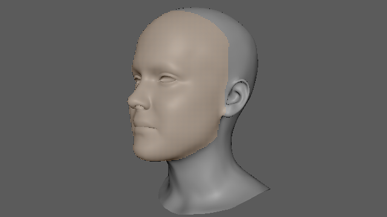
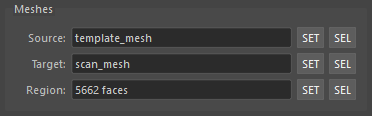

## 概要

テンプレートメッシュ（ソース）をスキャンデータ（ターゲット）の形状に合わせて変形するツールです。
Non-rigid ICP（nricp_amberg）アルゴリズムを使用し、ランドマークによるガイド付きフィッティングにも対応しています。


## 起動方法

専用のメニューか、以下のコマンドでツールを起動します。

```python
import faketools.tools.model.mesh_fitter.ui
faketools.tools.model.mesh_fitter.ui.show_ui()
```


## 使用方法

### 基本的な手順


1. Maya のビューポートでソースメッシュ（テンプレート）を選択し、`Source` の `SET` ボタンを押してソースに登録します。

2. ターゲットメッシュ（スキャンデータ）を選択し、`Target` の `SET` ボタンを押してターゲットに登録します。

3. 必要に応じて、Settings タブでフィッティングのパラメータを調整します。
  
4. `Run Fitting` ボタンを押してフィッティングを実行します。

5. フィッティング完了後、結果のメッシュが自動的に選択されます。


## Meshes セクション

ソースメッシュとターゲットメッシュを登録するセクションです。


- **Source**: 変形させるテンプレートメッシュ。ビューポートでメッシュを選択し `SET` ボタンで登録します。
- **Target**: フィッティング先のスキャンメッシュ。同様に `SET` ボタンで登録します。
- **Region**: ターゲットメッシュのうちの選択したフェースのみをフィッティングのターゲット対象に指定します。ターゲット内のフェースを選択して `SET` でフェースを登録します。

  

  

※ それぞれ `SEL` ボタンで登録したオブジェクトを選択することが可能です。


## Settings

フィッティングのパラメータを 3 つのタブで設定します。

### Align タブ


- **Auto-align source to target**: 
  - フィッティング前にソースメッシュを自動でターゲットに位置合わせします。重心の一致、スケールの正規化、ICP アライメントが行われます。
  - デフォルトでオンです。

※ Auto-align の機能はありますが、フィッティング前にできるだけ大きさを合わせておくことを推奨します。  
また、フィッティングはメッシュのローカル空間で行われます。大きさは、メッシュのトランスフォームが 0 の状態で合わしておく必要があります。

### Fitting タブ


- **Schedule**: フィッティングの強度プリセットを選択します。
  - `Gentle`: 控えめなフィッティング。ディテールの保持に向いています。
  - `Standard`: バランスの取れたフィッティング。
  - `Strong`: 強いフィッティング。ランドマーク重みが大きく反映されます。
  - `Landmark`: ランドマーク主導のフィッティング。ランドマークが設定されている場合に最適です。

- **Simplify Target**: チェックすると、フィッティング前にターゲットメッシュを四角面デシメーション（Quadric Decimation）で簡略化します。
  - ターゲットのポリゴン数を削減することで、フィッティングの計算速度が向上します。
  - スライダーで保持するフェースの割合を指定します（0.05 ～ 1.0、デフォルト: 0.25）。例えば 0.25 の場合、フェース数を元の 25% に削減します。
  - ソースメッシュには影響しません。また、元のターゲットメッシュも変更されません。

#### Advanced

`Advanced` グループボックスをチェックすると、詳細なパラメータを手動で調整できます。\
チェックを外すと、選択中のスケジュールのデフォルト値にリセットされます。


- **Stiffness** (0.01 ～ 0.20): メッシュの剛性を制御します。値が大きいほど変形が抑えられ、値が小さいほどターゲットに強くフィットします。
- **Landmark Influence** (0.0 ～ 1.0): ランドマーク制約の重みを制御します。ランドマークが登録されている場合のみ有効です。
- **Quality Steps** (3 ～ 10): フィッティングのステップ数です。値が大きいほど精度は上がりますが、計算時間が長くなります。

### Finish タブ


フィッティング後の後処理を設定します。

- **Output Space**: フィッティング結果のメッシュをソースとターゲットのどちらのスペース内で生成するかを指定します。
  - `Source`: ソースメッシュの空間でメッシュを生成します。
  - `Target`: ターゲットメッシュの空間でメッシュを生成します。
- **Keep Original Mesh**: オンの場合、元のソースメッシュを複製してからフィッティングを行います。オフの場合、ソースメッシュを直接変形します。デフォルトでオンです。
- **Smooth Result**: フィッティング結果にスムージングを適用します。チェック時に回数（1 ～ 50）を指定できます。
- **Snap to Target Surface**: 結果メッシュの頂点をターゲットサーフェスに段階的にスナップします。
- **Symmetrize**: メッシュの対称化を行います。以下の方式を選択できます。
  - `By Position`: 位置ベースの対称化
  - `By Topology`: フェース接続性を辿るトポロジーベースの対称化
  - `By Position` のほうが計算が高速ですが、頂点位置が同位置の場合は失敗することがあるためその場合は、`By Topology` を使用します。


## Landmarks セクション

ランドマークはソースとターゲットの対応点を指定する機能です。\
ランドマークを設定することで、フィッティングの精度を処理速度を向上させることができます。


### ランドマークを登録する


1. Maya のビューポートでランドマーク用のトランスフォーム（ロケーターなど）を **偶数個** 選択します。\
   ランドマーク用のトランスフォームは、トランスフォームノードであればどのように作成しても構いません。

2. 選択順の前半がソース側、後半がターゲット側のランドマークとして扱われます。\
   例：4 つ選択した場合、最初の 2 つがソース、残りの 2 つがターゲットになります。

3. `Set` ボタンを押してランドマークを登録します。

### ランドマークの操作

登録されたランドマークはツリーウィジェットに表示されます。各ペアに対して以下の操作が可能です。

**ヘッダー部分**

ヘッダーをクリックすることによりそれぞれの列に対するコマンドが実行できます。

- **Source**: Source 列のランドマークをすべて選択します。
- **Target**: Target 列のランドマークをすべて選択します。
- **選択 アイコン**: すべてのランドマークを選択します。
- **☓ アイコン**: リストをクリアします。

**リスト内**

- **Select アイコン**: ランドマークペアをビューポートで選択します。
- **Remove アイコン**: ランドマークペアを削除します。


## コマンドによる実行

UI を使わずにスクリプトからフィッティングを実行することもできます。

### 基本的な実行

```python
from faketools.tools.model.mesh_fitter import command

result = command.run_fitting("source_mesh", "target_mesh")
print(result.result_mesh_name)  # "source_mesh_fitted"
```

### パラメータを指定して実行

```python
from faketools.tools.model.mesh_fitter import command
from faketools.tools.model.mesh_fitter.core.pipeline import PipelineConfig

config = PipelineConfig(
    schedule="gentle",
    auto_align_enabled=True,
    smooth_result=True,
    smooth_iterations=5,
    snap_to_target=True,
    target_decimate_ratio=0.25,
    symmetrize=True,
    symmetry_method="position",
)

result = command.run_fitting(
    source_name="source_mesh",
    target_name="target_mesh",
    config=config,
    duplicate_source=True,
    result_name="fitted_result",
)

print(f"Result: {result.result_mesh_name}")
print(f"Time: {result.elapsed_total:.1f}s")
```

### run_fitting() のパラメータ

| パラメータ | 型 | デフォルト | 説明 |
|---|---|---|---|
| `source_name` | str | （必須） | ソースメッシュのトランスフォーム名 |
| `target_name` | str | （必須） | ターゲットメッシュのトランスフォーム名 |
| `config` | PipelineConfig \| None | None | パイプライン設定。None の場合はデフォルト値を使用 |
| `landmarks` | LandmarkData \| None | None | ランドマークデータ |
| `schedule` | str \| None | None | スケジュール名で config.schedule を上書き |
| `duplicate_source` | bool | True | True の場合、ソースを複製してからフィッティング |
| `result_name` | str \| None | None | 結果メッシュの名前。None の場合は `"{source_name}_fitted"` |
| `on_progress` | Callable[[str], None] \| None | None | 進捗コールバック関数 |


## 注意事項

- ソースメッシュとターゲットメッシュのトポロジーが異なっていても使用できます。
- ソースとターゲットの大きさの差異が大きすぎると失敗する可能性が高くなります。
- フィッティング中はボタンが無効化され、プログレスバーに進捗が表示されます。エラー発生時は Maya のコマンドライン及びスクリプトエディタに警告が表示されます。
- 頂点数が多いメッシュの場合、処理に時間がかかることがあります。
- ランドマークはメッシュサーフェスの近傍にある必要があります（バウンディングボックス対角線の 10% 以内）。

## サードパーティ製アセットおよびライセンスについて

本ドキュメント内のスクリーンショットは、
サードパーティ製の3Dメッシュを改変したモデルを用いて生成されています。

元のメッシュは以下のサイトから取得しました。

1. 3D Scan Store – Free Base Mesh  
   https://www.3dscanstore.com/blog/Free-Base-Mesh

2. FLAME (Faces Learned with an Articulated Model and Expressions)  
   https://flame.is.tue.mpg.de/

これらの元データは本リポジトリには含まれていません。

ICPアルゴリズムの挙動を説明する目的で、
メッシュに変形・変換などの改変を加えた上で、
スクリーンショットのみを掲載しています。

ライセンスについて：

- Free Base Mesh は 3D Scan Store の利用規約に従います。
  詳細は以下をご確認ください。
  https://www.3dscanstore.com/terms-and-conditions-licensing

- FLAME モデルは Max Planck Institute for Intelligent Systems が定める
  モデルライセンスに従います。
  https://flame.is.tue.mpg.de/modellicense.html

本リポジトリの MIT ライセンスは、
ソースコードおよびツールにのみ適用され、
上記のサードパーティ製アセットには適用されません。
