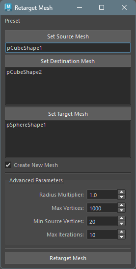
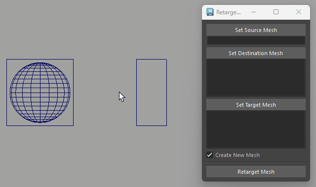

## 起動方法

専用のメニューか、以下のコマンドでツールを起動します。

```python
import faketools.tools.model.retarget_mesh.ui
faketools.tools.model.retarget_mesh.ui.show_ui()
```

 


## 使用方法

ツールを使用するには、以下の手順を行います。

1. 変形に使用する元のジオメトリを選択し、`Set Source Mesh` ボタンを押します。
2. 変形に使用する先のジオメトリを選択し、`Set Destination Mesh` ボタンを押します ( 複数選択可能 )。
3. 変形するジオメトリを選択し、`Set Target Mesh` ボタンを押します。
4. 新しいジオメトリを作成する場合は、`Create New Mesh` チェックボックスをオンにします。
5. `Retarget Mesh` ボタンを押します。

 


## Advanced Parameters

高度な設定パラメーターを調整することで、より正確な転送結果を得ることができます。

### Radius Multiplier（半径倍率）

- **デフォルト値**: 1.0
- **範囲**: 0.5 ～ 10.0
- **説明**: ソースメッシュの頂点を検索する際の半径倍率です。
- **使い方**:
  - メッシュが小さい場合や離れている場合は、値を **大きく** してください（例: 2.0 ～ 5.0）
  - 変形がうまくいかない場合、この値を調整することで改善されることがあります
  - 値が大きすぎると、影響範囲が広すぎて意図しない変形になる可能性があります

### Max Vertices（最大頂点数）

- **デフォルト値**: 1000
- **範囲**: 100 ～ 10000
- **説明**: ターゲットメッシュを処理する際の、1グループあたりの最大頂点数です。
- **使い方**:
  - ターゲットメッシュの頂点数がこの値を超えると、自動的に複数のグループに分割して処理されます
  - 値を **小さく** すると、大きなメッシュがより細かく分割されます（処理は遅くなりますが、精度が向上する場合があります）
  - 値を **大きく** すると、処理が速くなりますが、メモリ使用量が増えます

### Min Source Vertices（最小ソース頂点数）

- **デフォルト値**: 10
- **範囲**: 4 ～ 100
- **説明**: 変形計算に使用する最小のソースメッシュ頂点数です。
- **使い方**:
  - 値を **大きく** すると、変形の精度が向上しますが、処理時間が長くなります（例: 20 ～ 50）
  - 値を **小さく** すると、処理が速くなりますが、精度が低下する可能性があります
  - 最低でも4頂点は必要です（4頂点未満では正しく計算できません）

### Max Iterations（最大反復回数）

- **デフォルト値**: 10
- **範囲**: 1 ～ 20
- **説明**: 十分なソース頂点が見つからない場合に、検索半径を自動調整する最大試行回数です。
- **使い方**:
  - 通常はデフォルト値（10）で問題ありません
  - 値を **大きく** すると、より多くの試行で適切な頂点を見つけようとします
  - エラーが発生する場合は、この値を増やすよりも Radius Multiplier を調整することをお勧めします


## 注意事項

- ソースメッシュ と デスティネーションメッシュ のトポロジーは同じである必要があります。
- `Create New Mesh` がオフで デスティネーションメッシュ が複数の場合は、作成されません。
- ターゲットメッシュの頂点数が多い場合の処理は、時間がかかる可能性があります。
