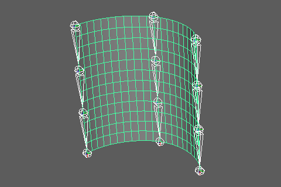
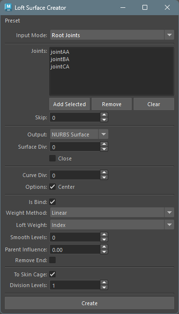
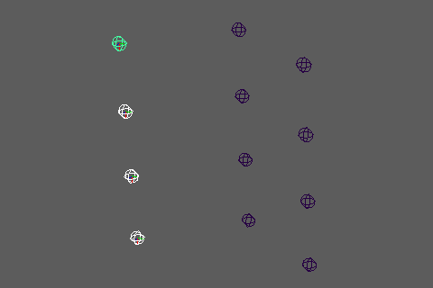

## 概要

複数のジョイントチェーンから カーブを作成しそのカーブを NURBS サーフェスまたはメッシュをロフトで作成します。スカートやベルトなど、複数のジョイントチェーンで構成される部位のウェイト転送元を作成するのに適しています。

作成されたオブジェクトには、オプションによりスキンクラスターを自動で設定できます。



## 起動方法

専用のメニューか、以下のコマンドでツールを起動します。

```python
from faketools.tools.rig.loft_surface_creator import ui
ui.show_ui()
```



## 使用方法

サーフェースは、登録したジョイントチェーンの順序でロフトされます。ジョイントチェーンの登録方法には、以下の2つのモードがあります。
登録するジョイントチェーンの各ジョイント数は、すべて同じである必要があります。

### Root Joints モード


1. `Input Mode` で `Root Joints` を選択します。
2. 各ジョイントチェーンのルートジョイントを選択し、`Add Selected` ボタンで追加します。
3. オプションを設定します。
4. `Create` ボタンを押すとサーフェスまたはメッシュが作成されます。

### Direct Chains モード



1. `Input Mode` で `Direct Chains` を選択します。
2. チェーンを構成するジョイントを選択し、`Add Chain` ボタンで追加します。
3. 同じジョイント数で2つ目以降のチェーンを追加します。
4. オプションを設定します。
5. `Create` ボタンを押すとサーフェスまたはメッシュが作成されます。


## オプション

主なオプションは、以下の項目に分かれます。

* 入力モードオプション
* サーフェースオプション
* カーブオプション
* バインドオプション
* スキンケージオプション

### 入力モードオプション

* **Input Mode**
  * ジョイントの入力方法を指定します。
    * `Root Joints` : ルートジョイントを指定し、自動でジョイントチェーンを展開します。
    * `Direct Chains` : 各チェーンのジョイントを直接指定します。

* **Joints**
  * 登録されたジョイントのリストを表示します。
  * `Add Selected` / `Add Chain` : 選択したジョイントを追加します。
  * `Remove` : 選択した項目をリストから削除します。
  * `Clear` : すべての項目をクリアします。

* **Skip** (Root Joints モードのみ)
  * ジョイントチェーン内でスキップするジョイント数を指定します。
  * 例: `Skip=1` の場合、1つおきにジョイントを使用します。

### サーフェースオプション

* **Output**
  * 作成するオブジェクトの種類を指定します。
    * `NURBS Surface` : NURBSサーフェスを作成します。
    * `Mesh` : メッシュを作成します。

* **Surface Div**
  * ロフト方向（チェーン間）の追加分割数を指定します。
  * 0 の場合、追加分割なしでチェーン数に基づいた最小限の分割になります。

* **Close**
  * オンの場合、最後のチェーンと最初のチェーンを接続して閉じた形状を作成します。
  * スカートなど環状の形状を作成する際に使用します。
  * 3本以上のチェーンが必要です。

### カーブオプション

各ジョイントチェーンからカーブを作成する際のオプションです。

* **Curve Div**
  * ジョイント間に挿入する追加CVの数を指定します。
  * カーブをより滑らかにする場合に使用します。

* **Center**
  * オンの場合、カーブの中心位置をジョイントの中心をとおるように作成します。

### バインドオプション

作成したオブジェクトにスキンクラスターを設定する際のオプションです。

* **Is Bind**
  * オンの場合、作成されたオブジェクトにスキンクラスターを設定します。

* **Weight Method**
  * ウェイト計算の方法を指定します。
    * `Linear` : リニア補間でウェイトを設定します。
    * `Ease` : イーズイン/アウト補間でウェイトを設定します。
    * `Step` : 最も近いジョイントに100%のウェイトを設定します。

* **Loft Weight**
  * ロフト方向（チェーン間）のウェイト分配方法を指定します。
    * `Index` : インデックスベースの線形補間。均等なCV配置に適しています。
    * `Distance` : U=0のCV列に沿った累積距離に基づく補間。CV間の距離が不均等な場合に有効です。
    * `Projection` : 点をAB線分に投影して補間係数を計算。ジオメトリの形状に基づいた自然な補間が可能です。

* **Smooth Levels**
  * ウェイトスムージングの反復回数を指定します。
  * カーブ方向（ジョイント間）のみに適用されます。

* **Parent Influence**
  * 親ジョイントへの影響比率を指定します（0.0〜1.0）。
  * 値が大きいほど親ジョイントの影響が強くなります。

* **Remove End**
  * オンの場合、末端ジョイントのウェイトを親ジョイントにマージします。
  * `Close` がオフの場合のみ有効です。

### スキンケージオプション

NURBSサーフェスをスキンケージメッシュに変換する際のオプションです。
`Output` が `NURBS Surface` かつ `Is Bind` がオンの場合のみ有効です。

* **To Skin Cage**
  * オンの場合、作成されたNURBSサーフェスをスキンケージメッシュに変換します。
  * 元のNURBSサーフェスは削除されます。

* **Division Levels**
  * スキンケージの分割レベルを指定します。
  * 値が大きいほど細かいメッシュになります。
