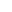
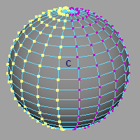

# 概要

デフォーマーのメンバーシップを編集します。コンポーネントタグ設定が有効な場合のみ利用可能です。

WeightGeometryFilter タイプのデフォーマーのみが対象です。

## 起動方法

専用のメニューか、以下のコマンドでツールを起動します。

```python
import faketools.tools.rig.membership_handler_ui
faketools.tools.rig.membership_handler_ui.show_ui()
```


### 起動する条件

このツールは、コンポーネントタグが有効な場合のみ利用可能です。

以下の設定でコンポーネントタグを有効にします。

1. `Preferences` > `Settings` > `Animation` に移動する。
2. `Rigging` セクションの 以下三つの設定をそれぞれ設定する。
    - `Use component tags for deformation component subsets` にチェックを入れる。
    - `Create component tags on deformer creation` にチェックを入れる。
    - `Add tweak nodes on deformer creation` のチェックを外す。

## 使用方法

1. 編集対象のデフォーマーを選択し、 ボタンを押します。  
  
※ 画像では、cluster デフォーマーのハンドルを選択していますが、実際はデフォーマー自体を選択してボタンを押してください。

1. 真ん中のフィールドに選択したデフォーマーの名前が表示されます。  


1.  ボタンを押して、そのデフォーマーに登録されれているメンバーシップを選択します。  


1. 更新したいコンポーネントを選択肢、 ボタンを押すことで、メンバーシップが更新されます。  



