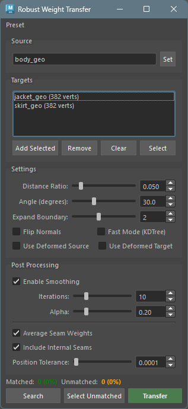
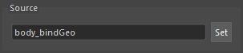
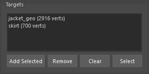
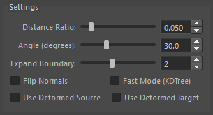
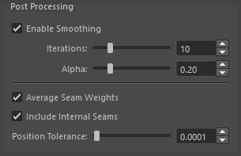
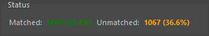

## 概要

Robust Weight Transfer は、SIGGRAPH Asia 2023 の論文「Robust Skin Weights Transfer via Weight Inpainting」に基づいたスキンウェイト転送ツールです。

従来のウェイト転送ツールとは異なり、ソースメッシュとターゲットメッシュの形状が完全に一致していなくても、ロバストにウェイトを転送できます。マッチしない頂点には「Weight Inpainting」アルゴリズムにより、周囲のウェイト情報から適切なウェイトが推定されます。

### 基本的な動作

1. ターゲット頂点ごとのソースメッシュの最近点を探します。
2. 距離と法線角度の閾値に基づいてマッチングを行います。閾値によりマッチしなかった頂点は Weight Inpainting の対象となります。
3. マッチした頂点にはソースのウェイトを直接転送し、マッチしなかった頂点には Weight Inpainting により推定されたウェイトを割り当てます。
4. 必要に応じてスムージングを行います (オプション)。
5. シーム（縫い目）部分の頂点ウェイトは本来別々のウエイトが割り当てられますが、同じ位置にある頂点のウェイトを平均化することも可能です (オプション)。

## 起動方法

専用のメニューか、以下のコマンドでツールを起動します。

```python
import faketools.tools.rig.robust_weight_transfer.ui
faketools.tools.rig.robust_weight_transfer.ui.show_ui()
```



## 使用方法

### 1. 標準的なウェイト転送

1. ソースメッシュ（skinCluster 付き）を選択し、`Set` をクリック
2. ターゲットメッシュを選択し、`Add Selected` をクリック
3. `Transfer` をクリック

### 2. 部分転送

1. ソースメッシュを設定
2. ターゲットメッシュの転送したい頂点を選択
3. `Add Selected` をクリック（リストに青色で表示される）
4. `Transfer` をクリック

### 3. マッチング確認

1. ソースとターゲットを設定
2. `Search` をクリックしてマッチング結果を確認
3. `Select Unmatched` でマッチしなかった頂点を確認
4. 必要に応じて Distance Ratio や Angle を調整
5. `Transfer` をクリック

※ 対象のジオメトリ及び頂点がすべて unmatched（マッチしなかった）場合、ウエイト転送は行われません。

### 4. 衣服のシーム処理

1. 服のパーツ（本体、襟、袖など）をすべてターゲットに追加
2. `Average Seam Weights` をオン
3. `Transfer` をクリック

## オプション

### Source

ウェイトの転送元となるメッシュを設定します。



1. skinCluster が設定されたメッシュを選択
2. `Set` ボタンをクリック

### Targets

ウェイトの転送先となるメッシュまたは頂点を設定します。



- **Add Selected**: 選択中のメッシュまたは頂点をリストに追加
- **Remove**: リストで選択したアイテムを削除
- **Clear**: すべてのターゲットをクリア
- **Select**: リストで選択したターゲットをビューポートで選択

**部分転送について:**
頂点を選択して追加すると、その頂点のみにウェイトが転送されます。リスト内で青色で表示され、頂点数が `[123 vtx]` の形式で表示されます。

### Settings

マッチングのパラメータを設定します。



| パラメータ | 説明 | デフォルト |
|-----------|------|-----------|
| Distance Ratio | バウンディングボックス対角線に対する距離閾値の比率 | 0.05 |
| Angle (degrees) | 法線角度の閾値（度） | 30.0 |
| Expand Boundary | マッチしなかった頂点の周囲を拡張するエッジリング数 | 0 |
| Flip Normals | 反転した法線でのマッチングを許可 | OFF |
| Fast Mode (KDTree) | KDTree による高速（やや低精度）なマッチング | OFF |
| Use Deformed Source | ソースメッシュを現在のポーズで評価 | OFF |
| Use Deformed Target | ターゲットメッシュを現在のポーズで評価 | OFF |


**Distance Ratio について:**  
値が小さいほど厳密なマッチングになります。0.05 は対角線の 5% 以内の距離でマッチングすることを意味します。

**Expand Boundary について:**  
マッチした頂点とマッチしなかった頂点の境界部分では、閾値ギリギリでマッチした頂点のウェイトがノイズとなる場合があります。  
この値を 1 以上に設定すると、マッチしなかった頂点の周囲 N エッジリング分の頂点も「マッチしなかった」として扱い、Weight Inpainting による補間対象にします。  
これにより、境界部分のノイズを除去し、よりスムーズなウェイト遷移が得られます。

- **0**: 拡張なし（デフォルト、従来の動作）
- **1-5**: 指定したエッジリング数だけ境界を拡張

※ 拡張により全ての頂点がマッチしなくなった場合はエラーとなります。

**Flip Normals について:**  
ソースとターゲットで法線が反転している場合（例：服の裏地）にオンにします。

**Use Deformed Source / Use Deformed Target について:**
バインドポーズ以外のポーズでウェイトを転送する場合に使用します。  
両方をオンにすることで、現在のポーズでの形状に基づいてマッチングが行われます。

### Post Processing

転送後にウェイトに対して行う処理を設定します。




| パラメータ | 説明 | デフォルト |
|-----------|------|-----------|
| Enable Smoothing | スムージングを有効化 | ON |
| Iterations | スムージングの反復回数 | 10 |
| Alpha | スムージングの強度（0.01-1.0） | 0.2 |
| Average Seam Weights | シーム平均化を有効化 | OFF |
| Include Internal Seams | 同一メッシュ内のシームも平均化 | ON |
| Position Tolerance | 同一位置とみなす距離の許容値 | 0.0001 |


**Smoothing について:**  
転送後のウェイトスムージングオプションです。  
Weight Inpainting で推定されたウェイトをスムージングして、より自然な結果を得ます。

**Seam Weights について:**  
シーム（縫い目）の頂点ウェイト平均化オプションです。  
このオプションは、メッシュが複数パーツに分かれている場合に便利です。  
同じ位置にある頂点のウェイトを平均化して、一貫したウェイトを得ます。

**使用例:**
- 服の襟と本体が別メッシュで、縫い目部分の頂点が同じ位置にある場合
- UV シームで頂点が分割されているが、同じ位置にある場合

### Status

マッチング結果を表示します。



- **Matched**: マッチした頂点数と割合
- **Unmatched**: マッチしなかった頂点数と割合（Weight Inpainting で推定される）

### Action Buttons

| ボタン | 説明 |
|-------|------|
| Search | マッチング検索を実行（結果を Status に表示） |
| Select Unmatched | マッチしなかった頂点をビューポートで選択 |
| Transfer | ウェイト転送を実行 |

## 基本的なワークフロー


## Preset メニュー

設定をプリセットとして保存・読み込みできます。

- **Save Settings...**: 現在の設定をプリセットとして保存
- **Edit Settings...**: プリセットの編集・削除
- **Reset Settings...**: すべての設定をデフォルトにリセット
- **プリセット名**: 保存したプリセットを読み込み

**注意:** Source と Targets はプリセットに含まれません。

## 技術的な詳細

### Weight Inpainting アルゴリズム

マッチしなかった頂点のウェイトは、ラプラシアン行列を使用した最適化問題として解かれます。  
これにより、周囲のウェイト情報から滑らかに補間されたウェイトが計算されます。

### 依存ライブラリ

- **numpy**: 数値計算
- **scipy**: 疎行列演算
- **robust-laplacian**: 高速なラプラシアン計算（オプション、フォールバック実装あり）

`robust-laplacian` がインストールされていない場合でも、内蔵のフォールバック実装が使用されます。

## トラブルシューティング

### マッチ率が低い場合

- Distance Ratio を大きくする（例: 0.05 → 0.1）
- Angle を大きくする（例: 30 → 45）
- Flip Normals をオンにしてみる

### ウェイトが滑らかでない場合

- Smoothing の Iterations を増やす
- Smoothing の Alpha を大きくする

### 変形状態でうまくいかない場合

- Use Deformed Source と Use Deformed Target の両方をオンにする
- または、バインドポーズに戻してから転送する

### シーム平均化が効かない場合

- Position Tolerance を大きくする（例: 0.0001 → 0.001）
- 頂点が本当に同じ位置にあるか確認する
